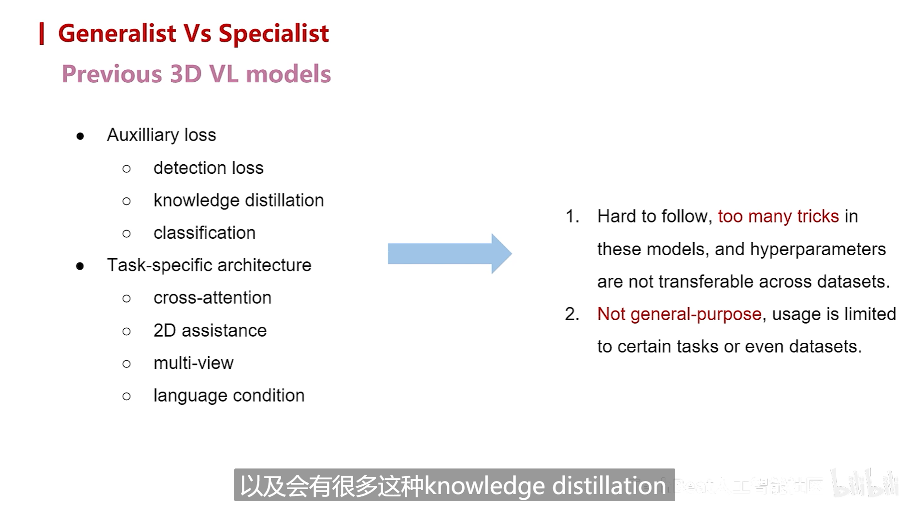
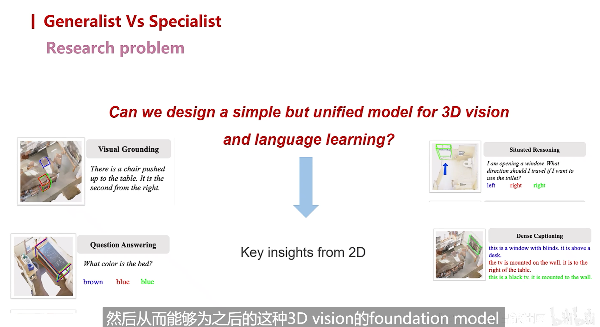
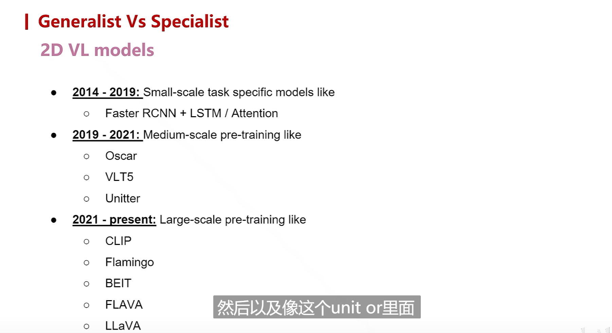
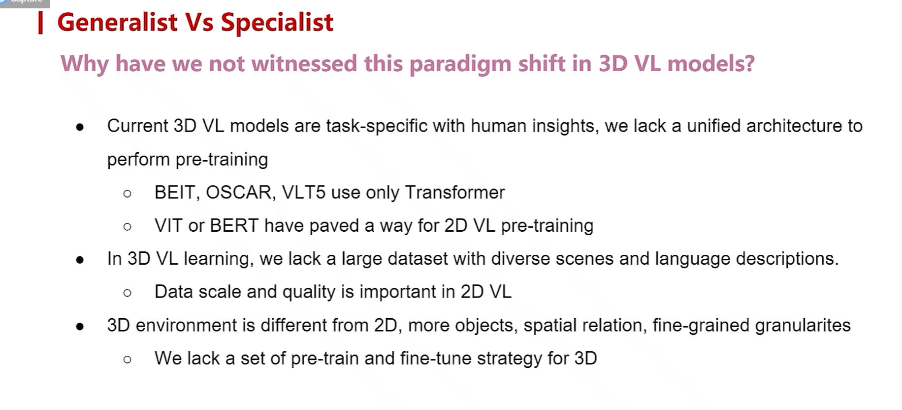
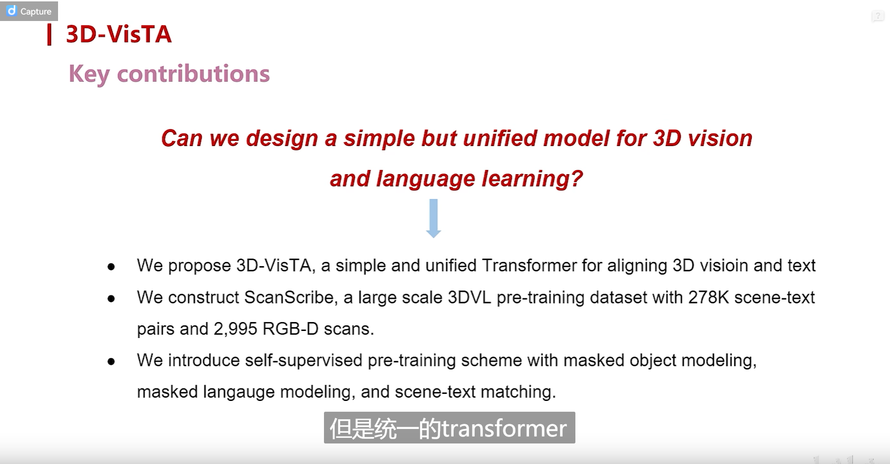
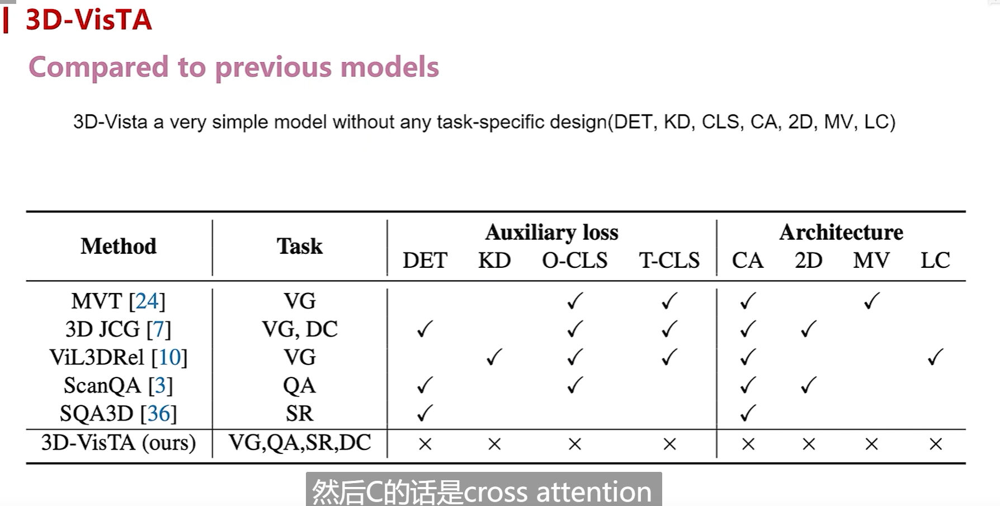
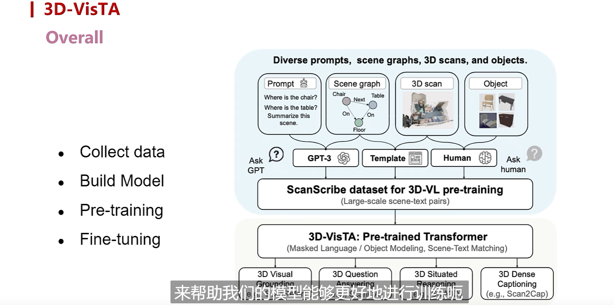
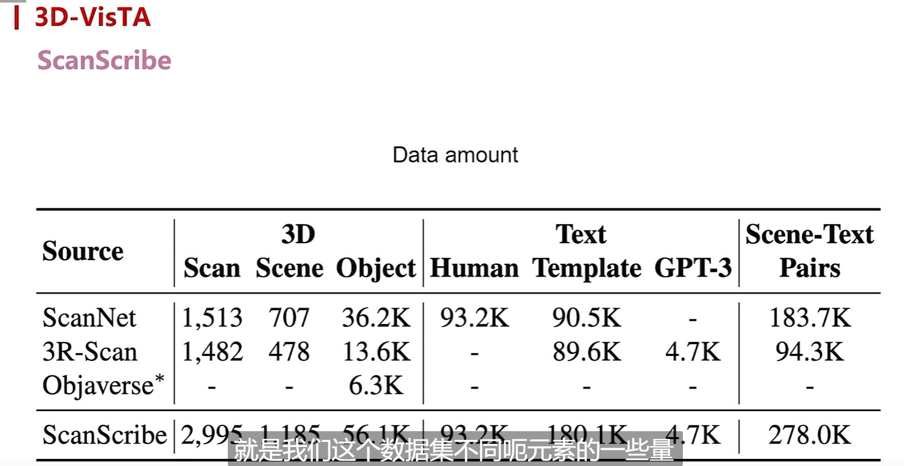
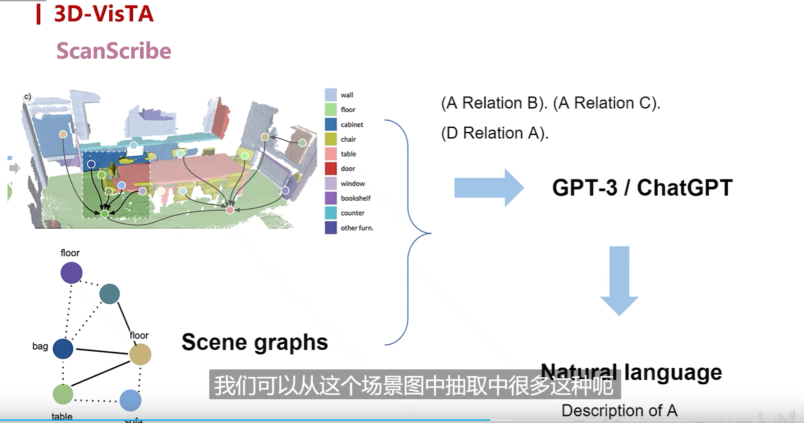
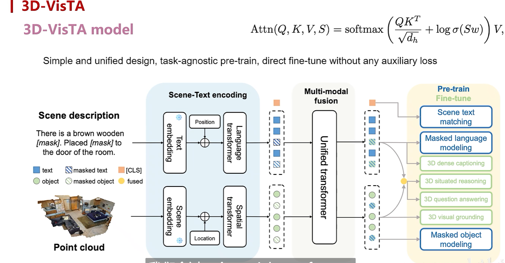

  

之前的3D VL models都是关注特定任务的，无法作为一个general model来处理多种任务。

---

  

---

  

这里的发展脉络还是总结的很清晰的。

  

1、没有一个统一的3D VL model

2、没有大规模的数据集

3、3D environment和2D图像存在很大的差异

  

  

他这个工作还是比较简单的、统一的，通用的。

  

  
  

他这个自己提出的数据集，体量还挺大。

  

利用第三方的媒介，作为信号，调用LLM得到一些文本，这个想法还是比较通用的。

  
虽然这个架构很简单，但是我现在的一个想法就是，只有在大数据加持下，你的模型才有可能搞得简洁。不然就需要用各种loss来辅助学习。
