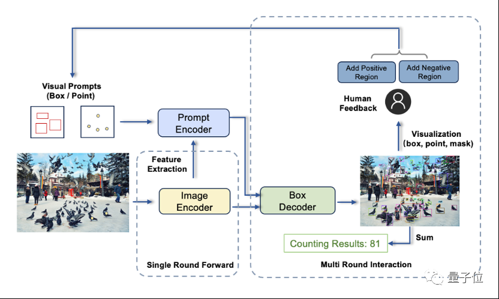
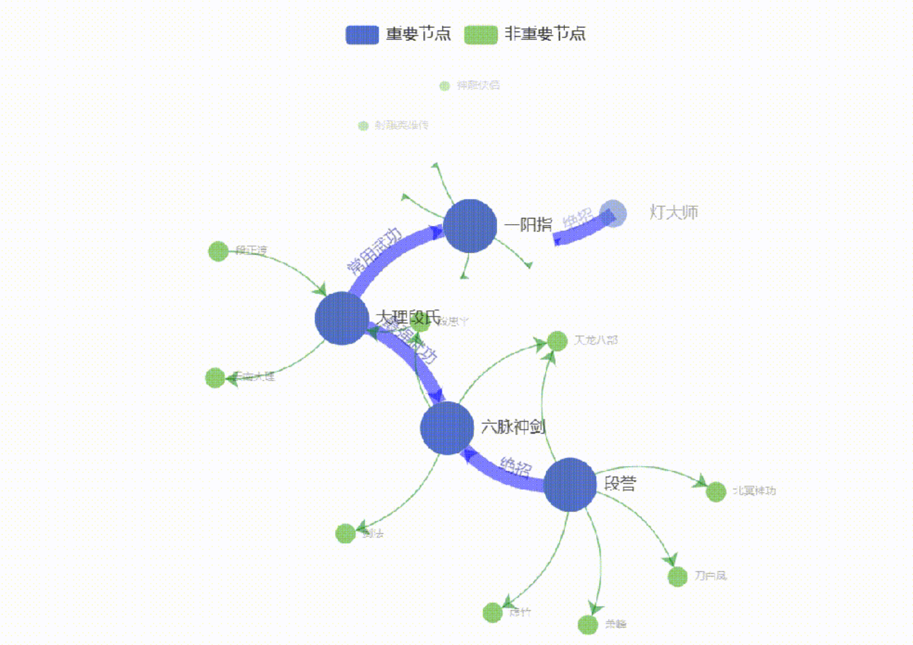

原文章链接：https://mp.weixin.qq.com/s/ggU9Vopzt67g3XmtdAjfig

IDEA大会上，沈向洋展示了T-Rex计数大模型。
  

可以看到，这个提示数据是真的视觉prompt，比如bbox。**使用视觉prompt的好处是能够从容应对复杂场景，比如密集分布。如果是文本的话，确实不太好处理。**

此外还发布了**Think-on-Graph知识驱动大模型**。大模型擅长意图理解和自主学习，而知识图谱因其结构化的知识存储方式，更擅长逻辑链条推理。

Think-on-Graph通过驱动大模型agent在知识图谱上“思考”，逐步搜索推理出最优答案（在知识图谱的关联实体上一步一步搜索推理）。每一步推理中，大模型都亲自参与，与知识图谱相互取长补短。

  

### Tags
#news 
#Visual_Prompt
#IDEA