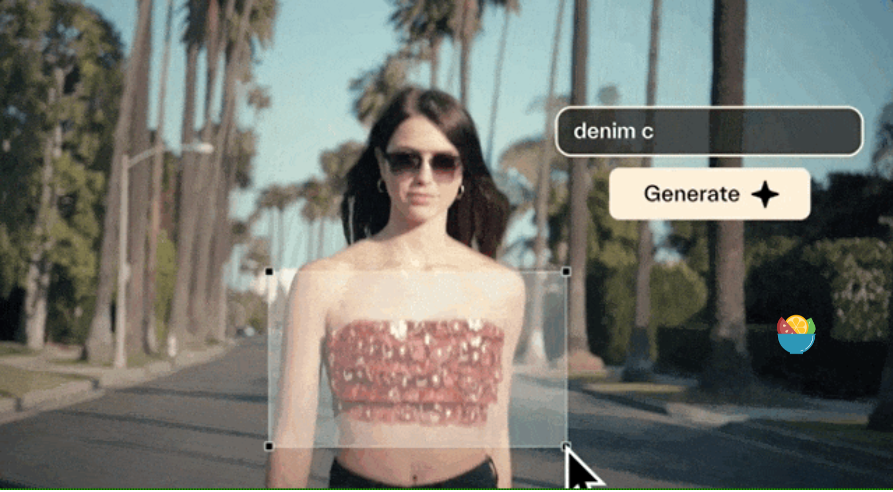
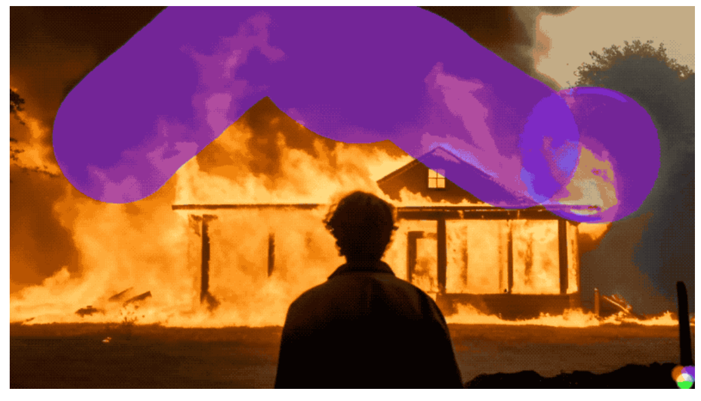

原链接：https://mp.weixin.qq.com/s/LqkSDKcbVhOsVpaIY3nVcw

斯坦福华人博士休学搞创业，直接火爆AI圈！
新产品瞄准**AI视频生成**，刚出道就成行业顶流，引来一众大佬围观评价。
该团队发布了Pika1.0 网页版。支持文本和图像引导的视频生成。同时还支持局部的视频编辑。

  

同时也支持修改视频的风格，比如**3D、动漫、电影等各式各样的风格滤镜**。
更具网页版，放出的demo，来看，生成速度在半分钟左右。不过生成的视频的长度基本都是在3s左右。

**总结来看：Pika1.0支持文本和图像引导的视频生成，支持视频风格的变换，支持局部区域的视频编辑。总体生成视频的时长在3s左右，生成所需时间在半分钟左右。**

此外，最近大厂都在AI视频生成领域进行军备竞赛：

据不完全统计，从11月至今，短短一个月的时间就已经有5家AI视频生成产品发布或迎来大更新：
* 首先就是11月3日，**Runway的Gen-2**发布里程碑式更新，支持**4K超逼真**的清晰度作品。
* 11月16日，**Meta发布Emu Video**，在用户评估中号称打败Gen-2、Pika等对手
* 11月18日，字节发布PixelDance，生成视频的动态性很丰富，同时画面中得元素的动作幅度也都很大，不会变形。
* 11月21日，AIGC领域的佼佼者**Stable AI**也终于推出了自家的视频工具 **：Stable Video Diffusion。**
* 同一天，**Gen-2**又没闲着，“横插一脚”**上线“涂哪动哪”的运动笔刷新功能**，直接标志出生成模型可控性上的一个重要里程碑。

  

期待未来更多的产品和工作出现！