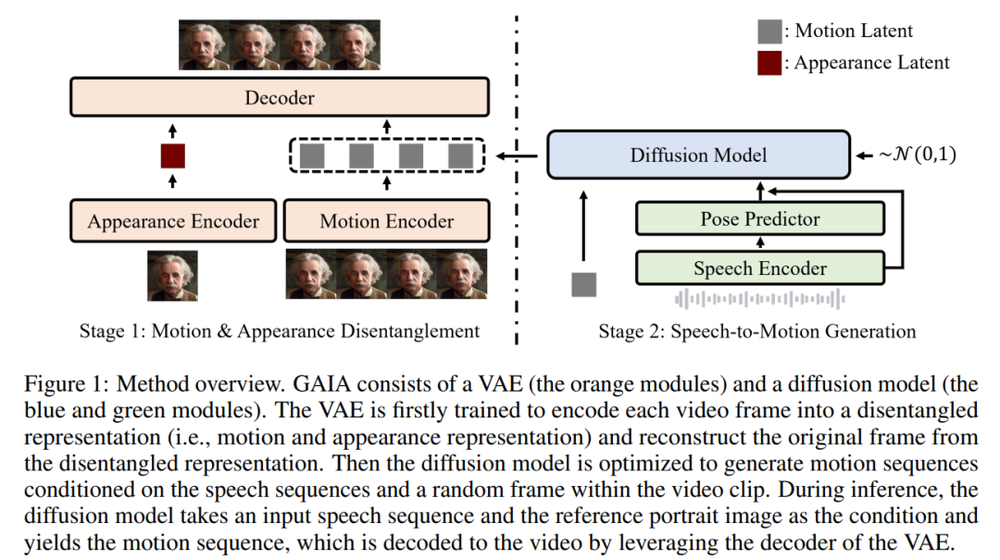
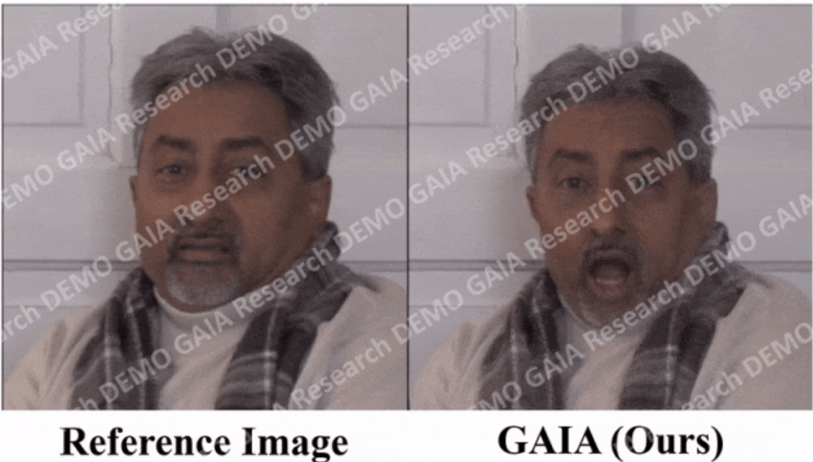
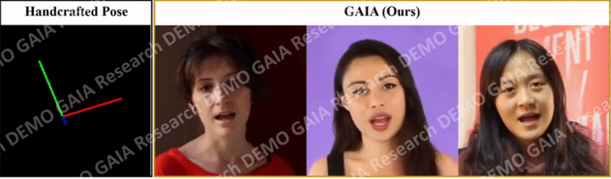

项目地址：https://microsoft.github.io/GAIA/

论文地址：https://arxiv.org/pdf/2311.15230.pdf

## 微软的GAIA：生成会说话虚拟人物视频

微软最新研究提出了一项名为**GAIA（Generative AI for Avatar）的技术，能够从单张照片和文字指令中生成虚拟人物的视频**，实现口型同步、头部动作等控制。该技术的创新点包括：

  

- **语音驱动虚拟人物运动：** GAIA利用语音驱动虚拟人物的口型、头部姿势等动作，从语音内容预测运动，并根据训练数据生成自然的视频。

- **分解外貌和运动表示：** 通过变分自编码器（VAE），GAIA将外貌和运动表示分解开来，使外貌在视频中保持不变，而运动对每一帧都是唯一的，实现了在零样本情况下的说话虚拟人物生成。

- **大规模多样化数据集：** 研究团队收集了高质量的说话虚拟人物数据集，包含多种年龄、性别、皮肤类型和说话风格的独特说话者，确保生成结果的自然性和多样性。

该技术的实验表明：

- **高质量的生成结果：** GAIA在自然度、口型同步、多样性和视觉质量方面表现出色，超越了多个基线方法，特别是在语音驱动虚拟人物生成方面具有显著优势。

- **可扩展性与通用性：** GAIA展现了可扩展性，模型大小从150M到2B不等，大模型产生更好结果。此外，该技术具备通用性，适用于不同应用场景，包括控制式说话虚拟人物生成和文本指令虚拟人物生成。

在数据方面，研究采用自动过滤策略确保训练数据质量，并提出了几种自动过滤策略，保证嘴唇运动可见且稳定性，以确保生成高质量的视频结果。GAIA的出色表现展示了其在虚拟形象生成领域的前沿地位，但也引发了对技术持续发展对网络视频真实性和安全性的影响的担忧。

  

  
