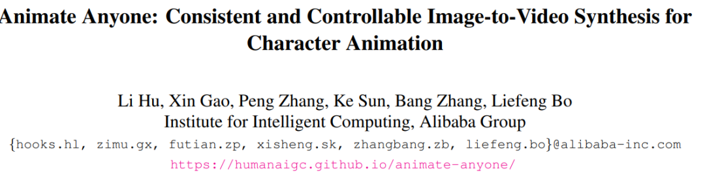
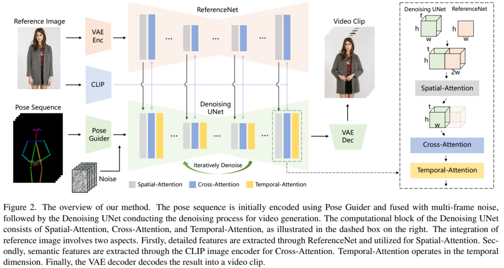

原文链接：https://mp.weixin.qq.com/s/BlSJkKOJqdMuWZmkweI7uQ

  

这篇文章介绍了阿里研究团队开发的一种名为"Animate Anyone"的新技术，旨在**将静态人物图像转化为连贯的、高质量的动画视频**。这项技术的**关键在于利用图像和动画导引来实现视频生成**。作者指出了现有角色动画化技术中存在的问题，并详细描述了他们提出的解决方法。

  

该技术的核心在于一个由几个关键组成部分构成的网络结构。首先是**ReferenceNet**，它**负责提取并编码参考图像的外观特征**，然后**通过一个姿态引导器将动作控制信号集成到去噪的UNet网络中**。为了**确保时间上的连续性，引入了时间层，用于建模多个帧之间的关系**。

作者提出的训练策略分为两个阶段，首先是单帧训练阶段，其次是引入时间层进行模型的二阶段训练。通过在UBC时尚视频数据集和TikTok数据集上进行实验，作者展示了"Animate Anyone"技术在时尚视频合成和人类舞蹈生成方面的卓越性能，并通过定量和定性的比较结果证明了这项技术的优势。

下面主要是他的效果：

  

