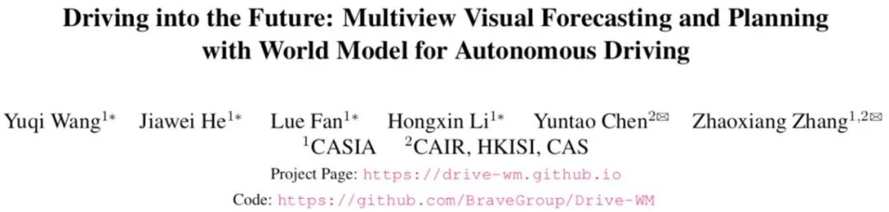
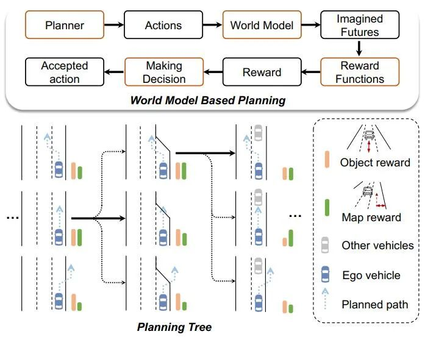
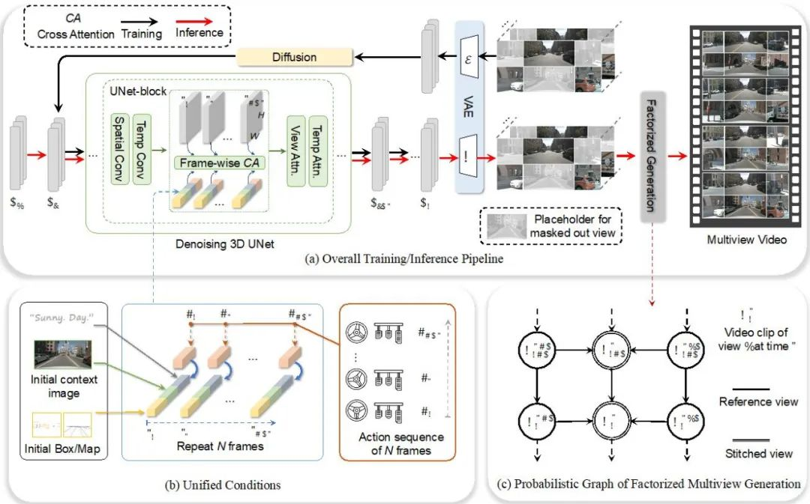
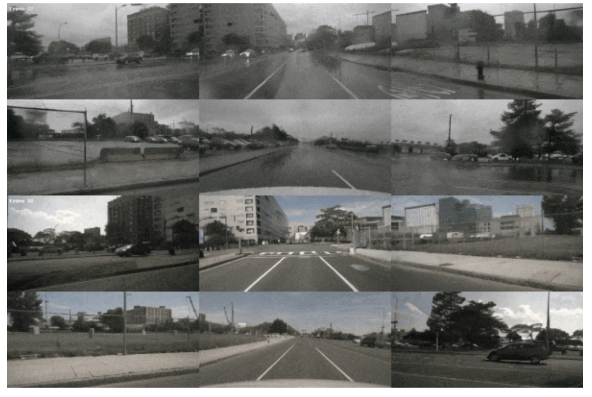
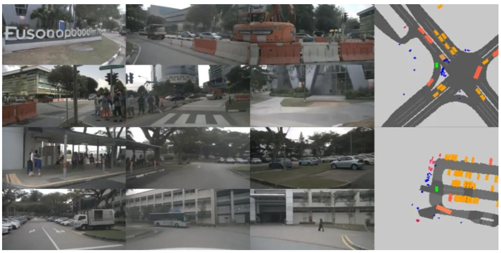
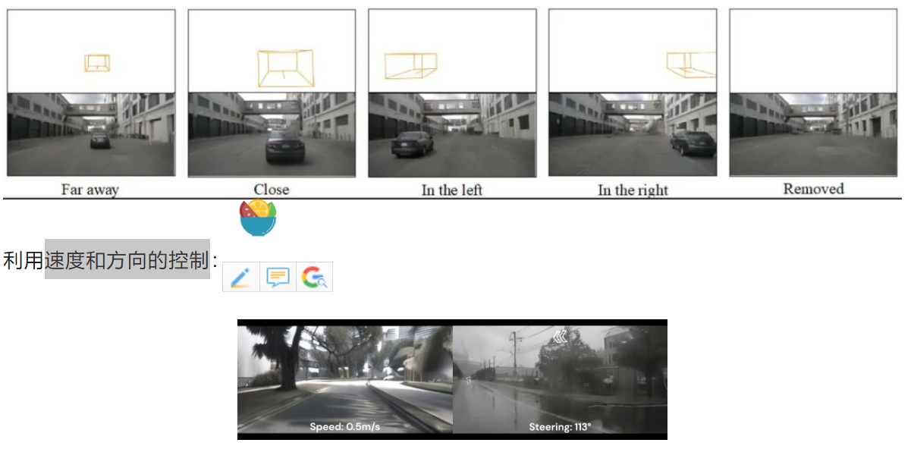
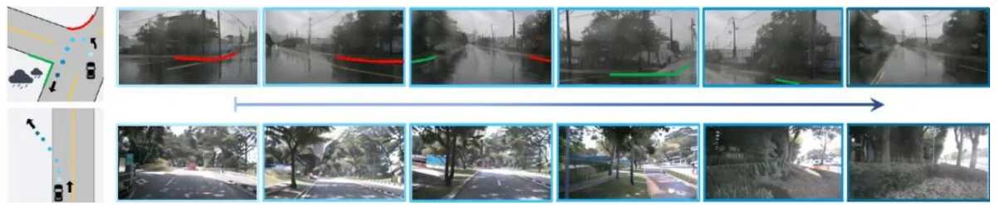

> Drive-WM 模型通过多视图世界模型，能够想象不同规划路线的未来情景，并根据视觉预测获取相应的奖惩反馈，从而优化当前的路线选择，为自动驾驶系统的安全提供了保障。

来自中科院自动化所的团队，首次提出了一种名为 Drive-WM 的全新多视图世界模型，旨在增强端到端自动驾驶规划的安全性。

  

* 网站：https://drive-wm.github.io

* 论文链接：https://arxiv.org/abs/2311.17918

**Drive-WM 利用了 Diffusion 模型的强大生成能力，能够生成逼真的视频场景。**

想象一下，你正在开车，而你的车载系统正在根据你的驾驶习惯和路况预测未来的发展，并生成相应的视觉反馈来指导轨迹路线的选择。这种预见未来的能力和规划器相结合，将极大地提高自动驾驶的安全性！

Drive-WM 模型首次将世界模型与端到端规划相结合，为端到端自动驾驶的发展打开了新的篇章。在每个时间步上，规划器可以借助世界模型预测未来可能发生的情景，再利用图像奖励函数全面评估。

  

  

Drive-WM 不仅实现了高质量的多视图视频生成，而且具有**出色的可控性**。Drive-WM 还提供了多种控制选项，可以**通过文本、场景布局、运动信息来控制多视图视频的生成**，也为将来的神经仿真器提供了新的可能性。

**文本来改变天气和光照：**

  

**行人的生成和前景的编辑**

  

**速度和方向的控制**

  

**稀有事件的生成，例如路口掉头和开进侧方草丛：**

  
