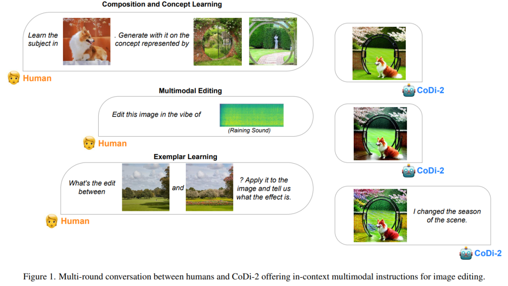

> 研究者表示，CoDi-2 标志着在开发全面的多模态基础模型领域取得了重大突破。

## 背景

今年 5 月，北卡罗来纳大学教堂山分校、微软提出一种可组合扩散（Composable Diffusion，简称 CoDi）模型，让一种模型统一多种模态成为可能。**CoDi 不仅支持从单模态到单模态的生成**，还能**接收多个条件输入以及多模态联合生成**。

    
## 详情
CoDi 升级到了 CoDi-2。

  

* 论文地址：https://arxiv.org/pdf/2311.18775.pdf
* 项目地址：https://codi-2.github.io/

论文一作 Zineng Tang 表示，「**CoDi-2 遵循复杂的多模态交错上下文指令，以零样本或少样本交互的方式生成任何模态（文本、视觉和音频）。**」

  

作为一种多功能、交互式的多模态大语言模型（MLLM），CoDi-2 能够以 any-to-any 输入-输出模态范式进行上下文学习、推理、聊天、编辑等任务。通过对齐编码与生成时的模态与语言，CoDi-2 使 LLM 不仅可以理解复杂的模态交错指令和上下文示例， 还能在连续的特征空间内自回归地生成合理和连贯的多模态输出。

  

**从上图可以看到，作者巧妙的通过文本prompt，将多种模态串联起来了！**
对于串连起来的这些多模态指令，需要有一个强大的基础引擎来支撑理解。这里用了Llama2。

和扩散模型配合：

  
