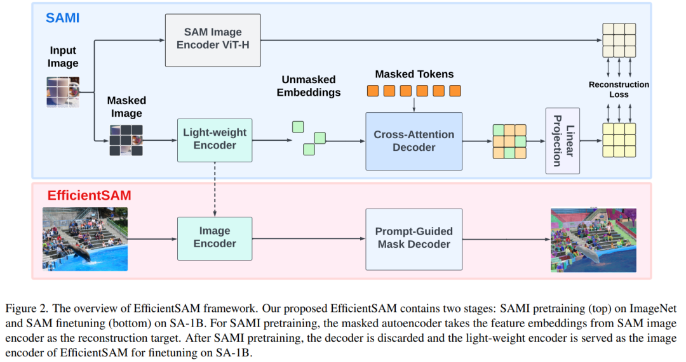

## 总体概括

该篇文章介绍了 Meta 公司改进的「分割一切模型」（SAM），**使其参数仅为原版的 5%**，同时保持着出色的性能。SAM 是基于提示的视觉 Transformer 模型，利用**掩码图像预训练（SAMI）**策略，通过预训练和微调实现了高效的图像分割。这项改进极大地降低了模型的复杂性和计算成本，同时在图像分类、目标检测、实例分割和语义分割等任务中取得了优异的成果。

## 细化内容

### 1. SAMI（掩码图像预训练）方法简介
- **SAMI利用MAE预训练方法结合SAM模型，提供高质量的预训练ViT编码器。**
- **通过使用SAM的ViT-H编码器生成特征嵌入，并用轻量级编码器训练掩码图像模型，以生成通用ViT骨干，可用于多种下游任务。**

  

### 2. EfficientSAM 方法组成
- **交叉注意力解码器**：针对SAM特征，利用掩码token重建、合并特征，并进行MAE输出嵌入。
- **线性投影头**：解决SAM编码器和MAE输出特征维度不匹配问题。
- **重建损失**：利用SAM图像编码器和MAE线性投影头的输出进行比较，计算重建损失。

### 3. 实验结果
- **图像分类**：SAMI-B在ImageNet-1K上的top1准确率达到84.8%，优于多种预训练基线模型。
- **目标检测和实例分割**：SAMI预训练模型在这些任务中表现优异，优于其他基线。
- **语义分割**：SAMI预训练主干网在ImageNet-1K上实现了更好的mIoU。

### 4. EfficientSAM性能对比
- 在COCO数据集上，EfficientSAM-S与SAM相比，参数减少20倍，性能相近；EfficientSAM-Ti在轻量级模型中也表现优异。

### 5. 结论与展望
- EfficientSAM的改进大幅降低了模型复杂性和计算成本，同时在多种任务中取得了优异性能，展示了在小型模型上的显著收益。
- 这一研究成果对图像分割及其他计算机视觉任务的未来发展具有潜在推动作用。

以上是对文章的整体概括及细化内容，提供了改进的SAM模型以及其在不同任务上的性能评估和实验结果。