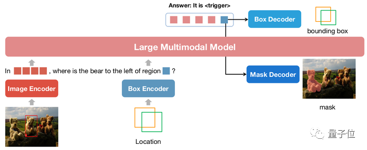

如果给大语言模型加上检测和分割模块，那是否能够实现自然语言描述需求下的物体标注功能呢？

答案是肯定的，清华和NUS就做了这样一个工作：

  

从上图可以看到，给定图像，和描述文本，该模型可以实现物体的识别，bbox标定，mask的分割。这个模型是Next-Chat：

  

Next-Chat是一个集对话，检测，分割于一身的多模态视觉语言模型。

核心的思想就是对视觉输入提出了新的编码方式，利用视觉输入的embedding作为LLM的输入。LLM输出的embedding，则采用对应的视觉模块解码器去解码。

传统的模型主要通过pix2seq的方式进行LLM相关的位置建模。比如Kosmos-2将图像划分成32x32的区块，用每个区块的id来代表点的坐标；Shikra将物体框的坐标转化为纯文本的形式从而使得LLM可以理解坐标。但使用pix2seq方法的模型输出主要局限在框和点这样的简单格式，而很难泛化到其他更密集的位置表示格式，比如segmentation mask。

  

而对于上图所示的Next-Chat来说，采用了Pix2emb的形式，进一步解放了模态利用的多样性。其好处如下：

* 模型的输出格式可以非常方便的扩展到更多复杂形式，比如segmentation mask。
* 模型可以非常容易的定位任务中已有的实践方式，比如本文的detection loss采用L1 Loss和GIoU Loss (pix2seq则只能使用文本生成loss)，本文的mask decoder借助了已有的SAM来做初始化。

下面是具体的效果，可以感受一下：

即使是复杂的定位问题，也能迎刃而解：

除了物体定位，NExT-Chat还可以对图片或其中的某个部分进行描述：

  
分析完图像的内容之后，NExT-Chat可以利用得到的信息进行推理：

