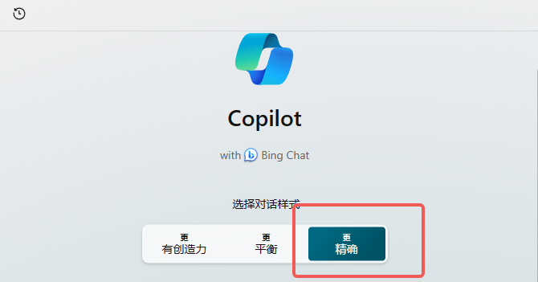

## New bing Copilot 读论文

  

使用**精确模式**。

假如我是五年级的小学生，你是非常专业的人工智能专业的教授，我希望你可以向我介绍左侧这篇论文，不要联网搜索，仅从左侧这篇文章阅读分析。主要从以下几点回答：研究背景，研究动机，研究方法，贡献和创新点，相关工作。并分点作答。请以markdown格式输出，要求子标题加粗，重点加粗。 (专业学术术语可以直接使用英文，无需翻译)。

## 使用ChatGPT 总结微信公众号文章

这是一篇微信公众号的文章, 假如你是公众号文章阅读理解专家。我需要帮我总结一下这篇文章的内容。总结分成两部分，第一部分是总体的概括，要求精简，清晰。第二部分是对第一部分的细化，要求详细，知识丰富。请以Markdown格式输出。

## ChatGPT 润色文章
假如你是我的教授，我是你的博士生，我希望你帮助我写英文的科研论文。我这边写中文，您帮我翻译润色成英文。要求学术风，简洁，逻辑清晰。可以吗？
