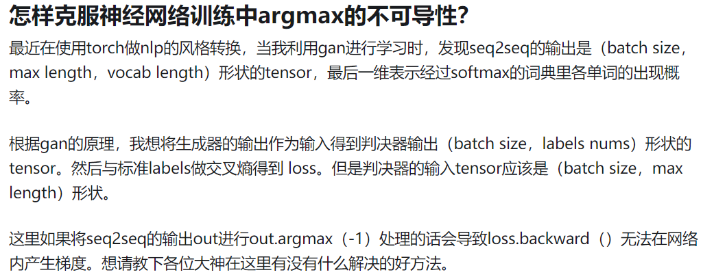
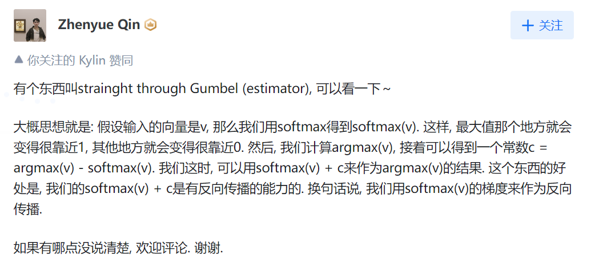
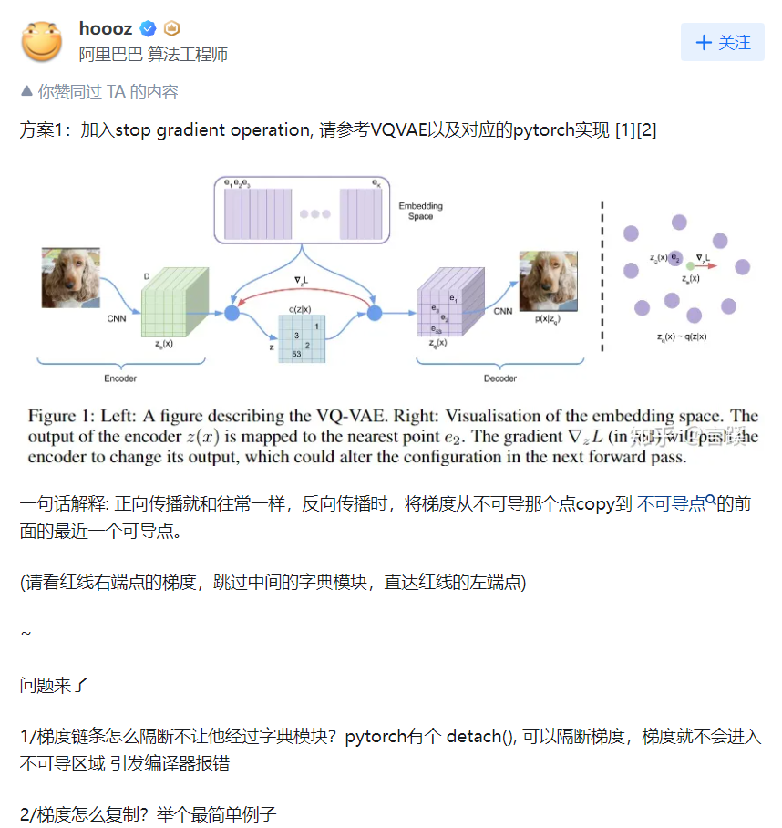
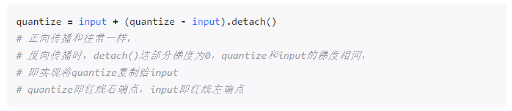

这是我在知乎上看到的一个问题。如下所示：

  

总结来说，就是在网络的前向传播中，argmax作为一个成员参与了进来。但是argmax本身并不可导。那如何解决这个问题？

看了一下回答，发现了一些解法。**总结来看，就是把argmax用一个可导的形式来代替**，这样就可以了。在所有的回答中，我发现了两个回答比较好，特总结如此：

  

上述回答的核心思想是：利用softmax的梯度来模拟argmax的梯度，但是有个小问题是，c这一项也应该需要detach，不然的话，还是梯度还是会回流到argmax，可能还是不对的。

  
  

这个解法也比较巧妙，他是参考了VQVAE中的做法，对于不可导的点，直接选择不可导点前一个最近的可导点作为梯度替代，然后差值使用detach。利用截断梯度的做法，跳过这个不可导点。

此外，我看有人还提到了：
* Gumbel Softmax
* Reparameterization 

原文链接：https://www.zhihu.com/question/422373907