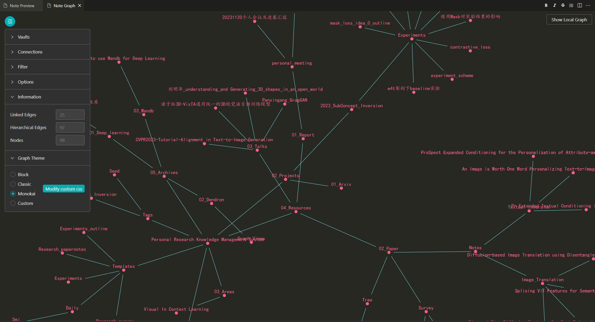

## **Graph View（图表视图）**
> 允许你通过图表探索你的工作空间

  

### **功能**：
* 点击节点可打开相应的笔记或模式（schema）。
* 悬停在节点上可以看到完整的名称。
* 可以通过过滤器查看特定的数据。

### **类型**：
* 笔记图（Note Graph）：显示所有笔记的图表。可以使用“显示笔记图”命令激活此视图。
* 本地笔记图（Local Note Graph）：显示当前笔记及其直接关联的节点的图表。运行“显示笔记图”命令即可默认展示此视图。

### **使用**：
* 显示笔记图：打开命令面板并搜索**“Dendron: Show Note Graph”**。
* 显示模式图：打开命令面板并搜索“Dendron: Show Schema Graph”。
* Show Local Graph（仅显示本地图表）：选中后，在图表中仅显示当前打开笔记为中心的本地图表。否则，显示整个工作空间的笔记图。

### **信息**：
* Linked Edges（链接边缘）：节点之间的链接数。
* Hierarchical Edges（层次边缘）：节点之间的层次连接数。
* Nodes（节点）：图表中的节点数量。

### **主题**：
* Dendron提供了三种内置图表主题：Block、Classic、Monokai。还可以自定义图表样式。
