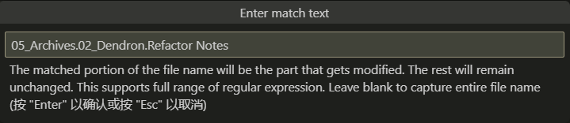
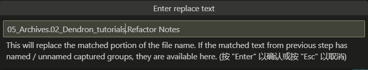
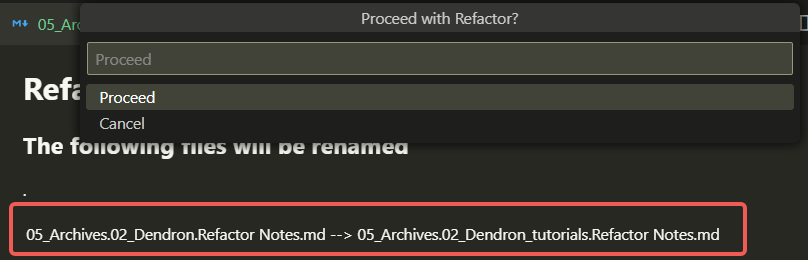

## Refactor Notes

> Refactor Notes 能够通过命令，控制批量修改笔记的路径。


### 命令

```bash
选中你要修改的notes
cmd+Shift+P 后, 输入 Dendron: Refactor Hierarchy

```

下图是当前notes的路径信息：


  

输入你想修改的路径信息:

  

  

核对无误后，Enter修改完成。

**注意：Refactor可成批量修改，同时也是Hierarchy修改**

