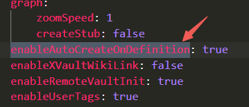

## Tags
> 这篇笔记将记录在Dendron中如何使用Tags。


### 效果

  

按住ctrl，鼠标点击上图右侧红色box，将得到**标记为这个tag的所有notes**，这些笔记将显示于**左侧边栏Dendron的BACKLINKS区域**。如下图所示：

  


### 如何使用？

* 首先先按照如下，进行VSCODE设置中的参数配置：

```yaml
"editor.suggest.snippetsPreventQuickSuggestions": false,
"editor.suggest.showSnippets": true,
"editor.tabCompletion": "on",
```
这一步是确保tag name可以自动补全。

* 然后在dendron.yml 中配置：**enableAutoCreateOnDefinition为True**

  

这一步是确保自动创建tag note 文件。


* 直接使用，我个人喜欢hashtag的方式。
  * 直接在note的文末，输入 #tag-name
  * 如下图所示：
  *   

* 最后按住ctrl，鼠标悬停到tag上，Dendron会自动为你创建以该tag name命名的文件。此时，大功告成。


<font color="red">本质上，tag和反向link的底层都是note，二者只是在preview上形式不同</font>