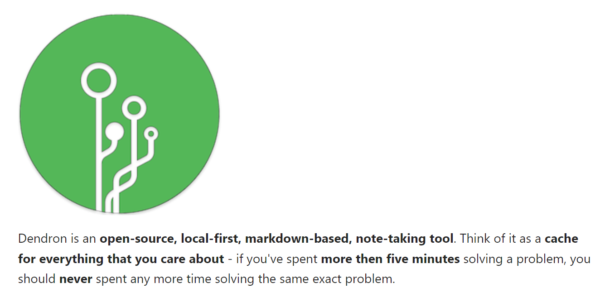

  

> **✨✨✨我是用Dendron来构建自己的Research PKM✨✨✨**

**Dendron是什么？**

* Dendron是一个开源的、本地优先的、基于Markdown的笔记工具。Dendron本质是一个VSCODE插件，但是它可以实现非常强大，高效的笔记工作流。

**在使用Dendron的过程中，以问题导向的方式，学习了很多Dendron的用法。记录于此**

* **相关资料**：
  * https://wiki.dendron.so/ 官方文档
  * https://www.youtube.com/watch?v=nfvx8rv77NA，Youtube 视频教程

