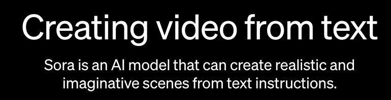
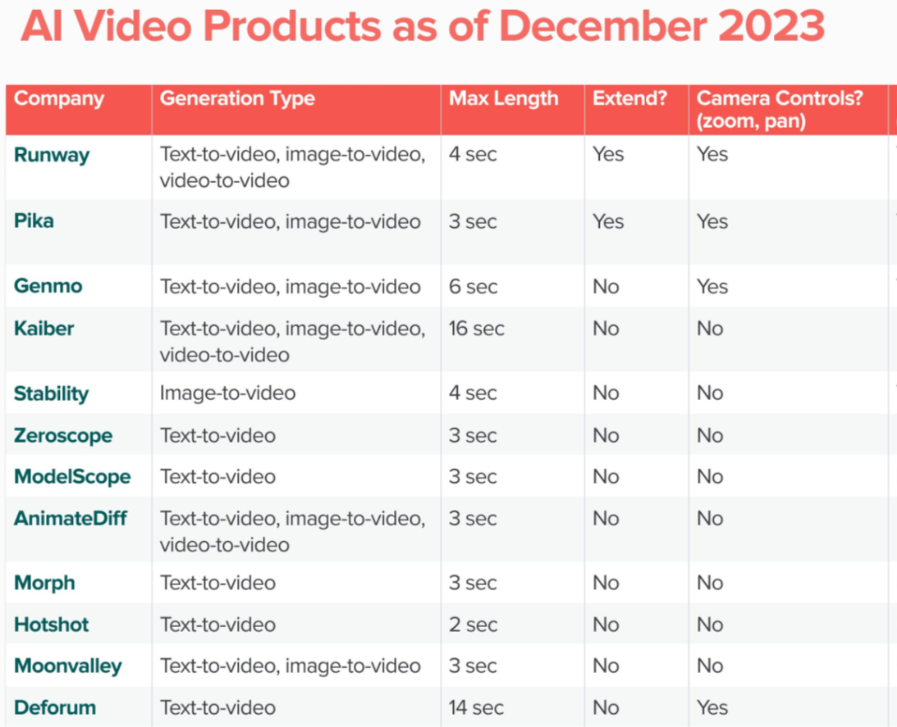
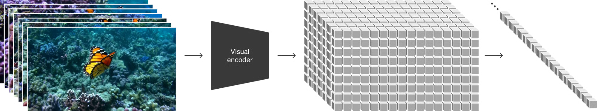
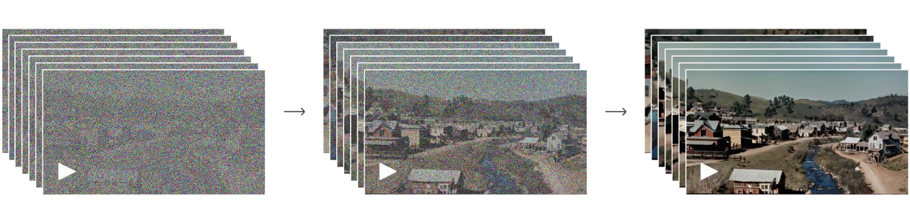
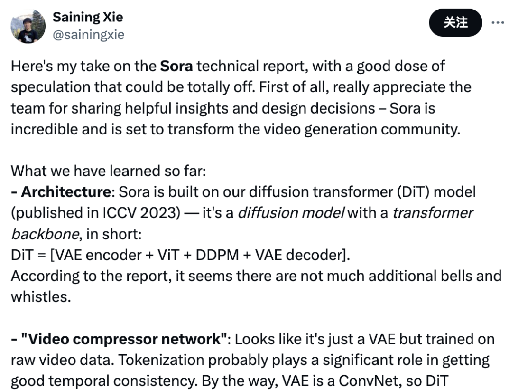
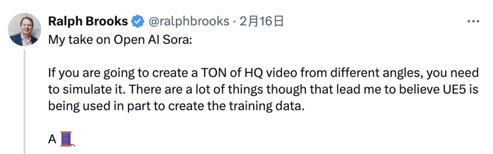
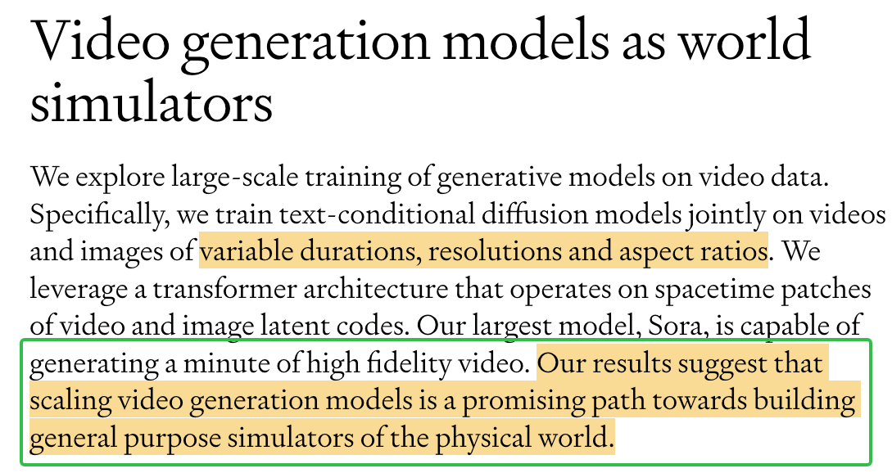

  

2024开年第一王炸，OpenAI发布Sora视频生成模型，可以实现**1min长视频**，**多机位**，**任意比例**，**任意分辨率的视频内容生成**。

## Sora和其他模型相比

2023年是视频生成领域爆发的一年，可以看到大公司、头部高校全部投入了人力物力来研究视频生成技术，但是这些产品却都没有取得突破性的进展。

## “真正”的长视频

Sora之于视频生成领域有多大的进步呢？**单单从生成长度**来说，就已经是吊打之前所有的模型了。可以看下图：

  

之前大火的Pika、Runway等模型只能生成3秒上下的视频，而Sora可以实现**1分钟**的视频生成。

虽然1min对于抖音来说，也就是平常的短视频，但是对于学界来说已经是突破的进展了。

## 多机位、任意比例、任意分辨率

Sora的另一个突破性的地方在于，它可以实现**多机位**、**任意比例**、**任意分辨率**的视频生成。

**多机位**

<video width="320" height="240" controls>
  <source src="https://cdn.openai.com/tmp/s/discussion_1.mp4" type="video/webm">
  Your browser does not support the video tag.
</video>

**任意比例**

<video width="320" height="240" controls>
  <source src="https://cdn.openai.com/tmp/s/sampling_0.mp4" type="video/webm">
  Your browser does not support the video tag.
</video>

<video width="320" height="240" controls>
  <source src="https://cdn.openai.com/tmp/s/sampling_1.mp4" type="video/webm">
  Your browser does not support the video tag.
</video>

<video width="320" height="240" controls>
  <source src="https://cdn.openai.com/tmp/s/sampling_2.mp4" type="video/webm">
  Your browser does not support the video tag.
</video>

---

## Sora的技术解析

针对openai的官网的技术报告，我们在这里对Sora的技术细节进行初步解析。

参考文献：[官网技术报告](https://openai.com/research/video-generation-models-as-world-simulators)

该技术细节主要包括以下：
* 如何统一地表示多种类型的视觉数据？
* Spacetime patch的信息
* 关于其架构的一些信息
* 大家的猜想？

## 如何统一地表示多种类型的视觉数据？

作者团队从LLM的快速发展中受到启发，因为各种类型的语言都可以表示成token，因此，对于不同类型的视觉数据能否也采用token的表示呢？Sora使用的是patch，即图像或者视频帧的小块，这样可以更好地表示视觉数据。如下图所示：

  

此外，Sora还将训练一个视觉编码器去压缩输入的视觉数据（包括图像和视频），最终将得到包含了空间和时间的视觉token representation。而Sora的训练都将在此represeantation空间上进行。当然，Sora也会有一个decoder，对其进行解码，得到pixel space。这个流程是否似曾相识？

## Spacetime patch

在处理压缩后的视频时，Sora会提取一系列spacetime patch，类似于LLM中的token。这种方法同样适用于图像，因为图像本质上就是只有一帧的视频。通过这种基于补丁的表示方式，Sora能够适应训练过程中视频和图像的**各种分辨率、时长和宽高比的变化**。在生成视频时，我们可以通过在合适大小的网格中随机排列这些补丁来调整生成视频的尺寸。

## Sora架构信息

作者团队并没有给出架构的详细信息，但是已知的是Sora是基于Tranbsformer的Diffusion模型。它将带有噪声的patch（以及像文本提示这样的条件信息）作为输入时，训练用来预测原始的“干净”patch。

  

## 大家的猜想

在X和知乎等平台上，Sora引起了众多大佬的讨论和猜想，这些猜想和讨论主要包括以下三部分：

* Sora的架构细节
* Sora的训练数据
* Sora之于AGI

### Sora的架构细节

  

谢赛宁分析：

* Sora应该是建立在DiT这个扩散Transformer之上的。
简而言之，DiT是一个带有Transformer主干的扩散模型，DiT = [VAE 编码器 + ViT + DDPM + VAE 解码器]。
谢赛宁猜测，在这上面，Sora应该没有整太多花哨的额外东西。

* 关于视频压缩网络，Sora可能采用的就是VAE架构，区别就是经过原始视频数据训练。

而由于VAE是一个ConvNet，所以DiT从技术上来说是一个混合模型。

### Sora的训练数据

  

有些人认为Sora的训练数据应该包含了使用游戏引擎例如虚幻5，制作的游戏视频，但是作者团队并没有给出具体的训练数据。

### Sora之于AGI

  

