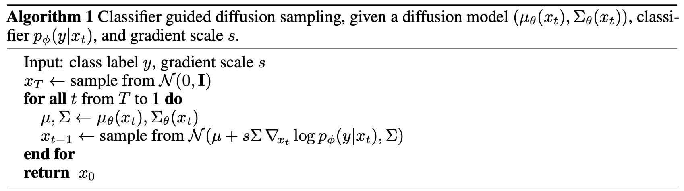

## **Guidance of Diffusion Model**

Guidance技术在条件Diffusion模型中使用的很广泛。目前主要包括两种guidance技术：
* Classifier guidance
* Classifier-free guidance

这篇文章将主要总结上述两种guidance方法。


### **前置知识**

[[05_Archives.Diffusion.Diffusion升级打怪.李宏毅-Diffusion的数学原理]]

[Diffusion的数学原理](https://zhuanlan.zhihu.com/p/675334747)


### **Guidance 简介**
Guidance是条件Diffusion模型在推理采样的时候，引入一种干预指导，使得生成的结果能够更加符合人类意图的要求的技术。

在条件Diffusion模型中，我们可以有一个额外的输入，这个输入可以是类别标签（class label）或者文本序列（text），用户希望再给定额外输入的条件下，实现可控的采样生成。这个过程可以建模为下述数学表达：
* 给定条件$y$, 模型为$P_{\theta}$
* 采样过程为$P_{\theta}(x|y)$ 

也就是给定条件输入y，生成x。

接下来，我们做一个基本的推导，根据贝叶斯定理，可有：

$$
\begin{gathered}
p(x \mid y)=\frac{p(y \mid x) \cdot p(x)}{p(y)} \\
\log p(x \mid y)=\log p(y \mid x)+\log p(x)-\log p(y) \\
\nabla_x \log p(x \mid y)=\nabla_x \log p(y \mid x)+\nabla_x \log p(x),
\end{gathered}
$$


通过上述推导，我们可以把条件Diffusion模型的 score function $\nabla_x \log p(x \mid y)$ 分解成一个无条件分量$\nabla_x \log p(x)$和一个“掺入”了条件信息的分量$\nabla_x \log p(y \mid x)$。

有了上述简单的推导，我们就可以清楚地知道了：**原条件Diffusion Model中的条件是可以通过贝叶斯定理的形式引入进来。**


### **Classifier Guidance**

OK，有了上述的基本推导和Guidance的简介，我们就开始介绍Classifier Guidance技术。

首先我们来想一下：


$$
\begin{gathered}
\nabla_x \log p(x \mid y)=\nabla_x \log p(y \mid x)+\nabla_x \log p(x),
\end{gathered}
$$

对于这个最终的score function的梯度形式，$\nabla_x \log p(y \mid x)$到底表示什么？其实也就是$p(y \mid x)$的含义是什么？

* $x$ 是样本数据
* $y$ 我们可以看成是class label
* 则$p(y \mid x)$ 表示给定样本数据，预测类别为$y$的概率是多少

经过这一段推理理解，其实$p(y \mid x)$就是一个分类器，而$\nabla_x \log p(y \mid x)$则是其梯度。

OK，经过上述理解，Classifier Guidance的本质核心就是利用一个分类器提供分类梯度，用于指导Diffusion Model合理采样。

因此，Classifier Guidance的一般流程如下：
* 首先单独预训练一个噪声鲁棒的分类器模型。
* 然后训练一个普通的无条件Diffusion模型。
* Diffusion模型生成图像的采样过程中,利用预训练好的分类器来提供条件信号。
  * 具体来说,就是每个采样步骤都计算分类器的输出,获得条件影响项∇xlogp(y|x),加入到Diffusion模型的更新公式中。
* 这样就可以利用分类器的条件信号,实现Diffusion模型在推理阶段条件生成图像的目的。

  

伪代码理解：

```python
classifier_model = ...  # 加载一个训好的图像分类模型
y = 1  # 生成类别为 1 的图像，假设类别 1 对应“狗”这个类
guidance_scale = 7.5  # 控制类别引导的强弱，越大越强
input = get_noise(...)  # 从高斯分布随机取一个跟输出图像一样 shape 的噪声图

for t in tqdm(scheduler.timesteps):

    # 用 unet 推理，预测噪声
    with torch.no_grad():
        noise_pred = unet(input, t).sample

    # 用预测出的 noise_pred 和 x_t 计算得到 x_t-1
    input = scheduler.step(noise_pred, t, latents).prev_sample

    # classifier guidance 步骤
    class_guidance = classifier_model.get_class_guidance(input, y)
    input += class_guidance * guidance_scals  # 把梯度加上去

```
在上述伪代码中，真正实现classifier guidance的是：
```python
class_guidance = classifier_model.get_class_guidance(input, y)
```
这一步的具体操作就是把生成的带噪图像和条件$y$输入分类模型，计算梯度，然后将梯度放大scale，并加到此时的带噪图像完成更新。


**Classifier Guidance 缺点**：
* 分类器引导存在一定限制。首先,分类器本身可能会忽略x(例如图像)中的很多重要细节信息,从而提供不完整的条件信号。
* 其次,分类器对x的梯度也可能会指向x空间中的任意方向,包括对抗方向,这对条件生成是不利的。


### **Classifier-free Guidance**

面对上述Classifier Guidance的种种缺点，Classifier-free Guidance技术应运而生。

顾名思义，Classifier-free Guidance是不需要分类器参与的。
其本质是在采样的过程中，对提供的条件输入做随机的dropout，这样就可以得到一个无条件和条件提示的两个输出，然后学习二者之间的方向差指导采样过程。

下面，我们从数学的角度来理解一下：

我们的目标是：


$$
\begin{gathered}
\nabla_x \log p(x \mid y)=\nabla_x \log p(y \mid x)+\nabla_x \log p(x),
\end{gathered}
$$

接下来，我们利用贝叶斯定理，看一下$\nabla_x \log p(y \mid x)$怎么进一步表示：

$$
\begin{gathered}
p(y \mid x)=\frac{p(x \mid y) \cdot p(y)}{p(x)} \\
\log p(y \mid x)=\log p(x \mid y)+\log p(y)-\log p(x) \\
\nabla_x \log p(y \mid x)=\nabla_x \log p(x \mid y)-\nabla_x \log p(x) .
\end{gathered}
$$

代入之前的表达式：

$$
\nabla_x \log p_\gamma(x \mid y)=\nabla_x \log p(x)+\gamma\left(\nabla_x \log p(x \mid y)-\nabla_x \log p(x)\right)
$$

这样就很清晰了，**$\gamma\left(\nabla_x \log p(x \mid y)-\nabla_x \log p(x)\right)$ 就是条件指导下的输出和无条件指导下的输出的差。**

```python

clip_model = ...  # 加载一个官方的 clip 模型

text = "一只狗"  # 输入文本
text_embeddings = clip_model.text_encode(text)  # 编码条件文本
empty_embeddings = clip_model.text_encode("")  # 编码空文本
text_embeddings = torch.cat(empty_embeddings, text_embeddings)  # 把它俩 concate 到一起作为条件

input = get_noise(...)  # 从高斯分布随机取一个跟输出图像一样 shape 的噪声图

for t in tqdm(scheduler.timesteps):

    # 用 unet 推理，预测噪声
    with torch.no_grad():
        # 这里同时预测出了有文本的和空文本的图像噪声
        noise_pred = unet(input, t, encoder_hidden_states=text_embeddings).sample

    # Classifier-Free Guidance 引导
    noise_pred_uncond, noise_pred_text = noise_pred.chunk(2)  # 拆成无条件和有条件的噪声
    # 把【“无条件噪声”指向“有条件噪声”】看做一个向量，根据 guidance_scale 的值放大这个向量
    # （当 guidance_scale = 1 时，下面这个式子退化成 noise_pred_text）
    noise_pred = noise_pred_uncond + guidance_scale * (noise_pred_text - noise_pred_uncond)

    # 用预测出的 noise_pred 和 x_t 计算得到 x_t-1
    latents = scheduler.step(noise_pred, t, latents).prev_sample
    
```

guidance scale是一个放缩系数，越大，生成的结果越倾向于输入条件，多样性会下降。越小，多样性越大。通常来讲这个值被设为 7.5 比较合适。


## 参考文章：

* [Guidance: a cheat code for diffusion models](https://sander.ai/2022/05/26/guidance.html)
* [Classifier Guidance 和 Classifier Free Guidance，一堆公式不如两行代码](https://zhuanlan.zhihu.com/p/660518657?utm_id=0)