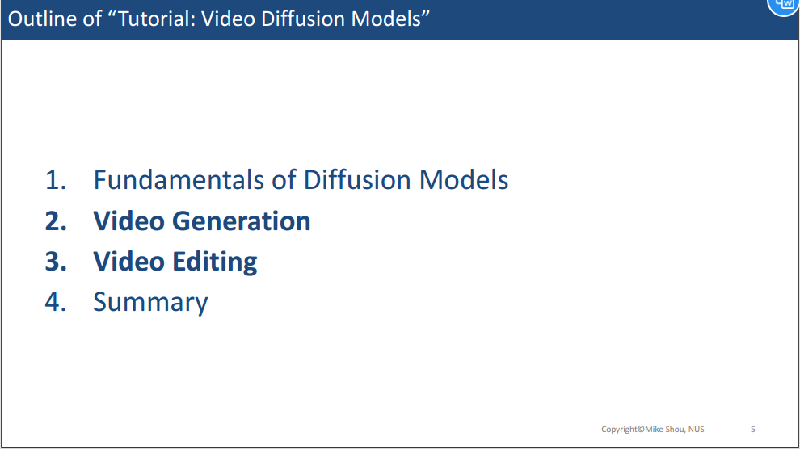

## **教程介绍**

  

来自新加坡国立大学的Mike老师制作的关于Video DIffusion Models的Tutorial教程。目前在youtube和bilibili上都有上线。

**Mike老师的个人资料：**
* [个人主页](https://www.comp.nus.edu.sg/cs/people/mikeshou/)
* [bilibili账号](https://space.bilibili.com/1409032486)
* [youtube账号](https://www.youtube.com/@mikeshou1749)
  
**课程资源：**
* 视频链接如下：
  * [youtube](https://www.youtube.com/watch?v=0K56LA821ys) 
  * [bilibili](https://www.bilibili.com/video/BV1jN4y1879z/?spm_id_from=333.1007.0.0&vd_source=45b600ad98b8c54b21b9561915c1ba61)
* Slides：
  * [PPT](https://www.dropbox.com/scl/fi/u7jgodz3tz01bzd5uftog/Video-Diffusion-Tutorial-Prof-Mike-Shou-NUS-2023-Dec-15.pdf?rlkey=de6axl9dnjhz1ub0wmpwmpq4f&dl=0)
* 课程主页：
  * [主页](https://sites.google.com/view/showlab/tutorial)

---

**本笔记用于记录自己学习该课程的学习心得。有过对你有帮助，请帮忙点赞、收藏！本笔记将持续更新，预计一周时间完成本教程的学习。**

下面是学习目录：

  

  

首先Mike老师介绍了DDPM和DDIM的原理机制，同时也介绍了DDIM Inversion的含义和概念。但是具体细节并没有详细论述。如果对此处细节不了解，可以学习李宏毅老师的课程：
* [Diffusion Model的数学原理介绍](https://www.youtube.com/watch?v=ifCDXFdeaaM)

  

<!-- # TODO DDPM为什么在denoise的时候还要加个噪音呢？
<!-- # TODO DDIM 和 DDPM的区别到底是什么？ -->
<!-- # TODO DDIM Inversion的细节是什么？ --> 

接下来介绍一些基本的技术模型：
* CLIP
* Latent Diffusion
* Stable Diffusion
* LoRA
* Dreambooth
* ControlNet

上述这些经典工作，不做详细的介绍。可以看具体的论文了解其细节。

---

  

目前视频生成发展的非常迅速，各大公司都发布了自己的视频生成架构产品。如下图所示：

  

同时，Mike老师对当前的视频生成工作进行了分类，如下图所示：

  

接下来逐个类别进行讲解：

  

  

与文生图相比，文本驱动生成视频有什么不同：

  

首先是在输出形式的不同，图像是二维的模态，而视频则是多帧组成的3维模态。

  

接下来回顾一下过去在视频处理的时候的一些技巧和技术：
* 第一个就是3D卷积

  

* 第二个是将3D卷积优化为（2+1）卷积，也就是分别在spatial和时序上做卷积

  

接下来介绍Google的最初视频生成开创性的工作：Video Diffusion Model （NIPS22）

  

这个工作可以生成16帧的烟火图像。

  

对于该工作来说，其架构和原理如上图所示，总结来看有以下主要几点：
* 核心思想还是扩展2D Diffusion至3D模态
* 因此作者设计了一个3D Unet，能够关注空间和时间维度
* 插入时序注意力层，主要是学习不同时间帧之间的关系。

接下来介绍另外一个工作：**Make-A-Video**

  

Make-A-Video采用了级联生成的方式，如上图可以看到，
* 输入文本，模型会先生成初始的几帧视频，此时视频的帧数较少，质量较低，这一步对应到上图中的SpatialTemporal Decoder。
* 初始帧经过Frame Interpolation这一module，会进步增加视频帧的数量
* 之后经过Spatiotemporal Super-Resolution，将会提高视频帧的分辨率
* 最后，经过最后一个Spatial Super Resolution进一步提高生成视频的质量。

接下来是Make-A-Video的模型细节：

  

  

值得注意的是，即使在视频生成过程中，2D上所有的操作基本都是从预训练的T2I模型中初始化的。而时序的处理则是单独设计的。

  

最后总结一下，如上图所示。

接下来介绍视频生成领域的**主要数据集**和**评价指标**：

  

  

  

总览完这些指标后，我们将详细的解释这些指标的含义：

  

FID是衡量图像之间语义的相似度。具体就是利用生成图像和参考图像分别过Inception V3网络，得到各自的embedding，然后计算FID即可。FID越小表示语义越相似，生成的图像越像真实图像。

**但是FID关于关注high-level的语义信息，忽略了Pixel-level的细节信息。**

  

  

PSNR和SSIM都是关注Pixel-level相似度的指标。

  

CLIP的图文相似度。

上述是Image的评价指标，现在我们看一下video的评价指标。

  

  

  

  

上述都是基于机器的自动评价，接下来我们看一下人工打分的指标：

  

比如在Make-A-Video中，人类需要对生成视频的质量和对文本的忠实度进行打分。

 

接下来是Prior Work中的最后两个工作：

Imagen Video:

  

Align your Latents

  

  

值得注意的是，Align your Latents是基于LDM的工作。

---

**未完待续...**