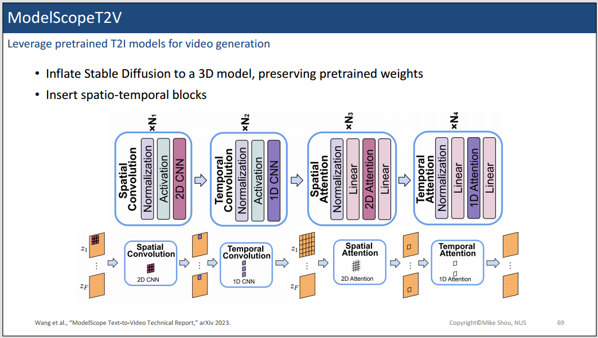

## **教程介绍**

  

来自新加坡国立大学的Mike老师制作的关于Video DIffusion Models的Tutorial教程。目前在youtube和bilibili上都有上线。

**Mike老师的个人资料：**
* [个人主页](https://www.comp.nus.edu.sg/cs/people/mikeshou/)
* [bilibili账号](https://space.bilibili.com/1409032486)
* [youtube账号](https://www.youtube.com/@mikeshou1749)
  
**课程资源：**
* 视频链接如下：
  * [youtube](https://www.youtube.com/watch?v=0K56LA821ys) 
  * [bilibili](https://www.bilibili.com/video/BV1jN4y1879z/?spm_id_from=333.1007.0.0&vd_source=45b600ad98b8c54b21b9561915c1ba61)
* Slides：
  * [PPT](https://www.dropbox.com/scl/fi/u7jgodz3tz01bzd5uftog/Video-Diffusion-Tutorial-Prof-Mike-Shou-NUS-2023-Dec-15.pdf?rlkey=de6axl9dnjhz1ub0wmpwmpq4f&dl=0)
* 课程主页：
  * [主页](https://sites.google.com/view/showlab/tutorial)

---

今天我们继续学习Mike老师的Video Diffusion Tutorial的第二部分---Video Generation

  

在这一节当中，将主要介绍当前open-source的base model for video generation。

  

第一个工作是**ModelScopeT2V**。这个工作的idea，是利用现有的预训练的T2I模型，迁移到视频生成任务上。请看下图

  

左右对比，可以发现ModelScopeT2V，基本保留了Stable Diffusion的原始架构。

  

此外，ModelScopeT2V还针对视频设计了spatio-temporal blocks，具体的结构可以看上图。

  

一个比较有趣的地方是ModelScopeT2V是可以支持变长的视频生成的，这得益于Temporal Block的数量是可以设置的。当只有一个Temporal Block的时候，模型就会生成图像。

  

接下来看一下结果：

  

---

接下来介绍第二个工作，**Show-1**。

  

Show-1的动机是发现，之前的一些方法比如ZeroScope和ModelScope生成的视频，和对应的文本之间并不完全相符。比如上图上bule tiger。

  

如上图所示，show-1认为pixel-level的Diffusion Model能够带来更好的文本和视觉内容的alighment。这个可能是因为：
* pixel-level的Diffusion Model本质上是像素和文本之间的交互。
* 但是latents-level的Diffusion Model和文本的交互，时间接的，所以就有可能发生无法对齐的现象。

但是如果直接在Pixel-level进行视频生成工作的话，显存的消耗是巨大的。这个该如何解决呢？
作者团队采用了级联的模型架构，也就是在生成初期采用Pixel-level，这个时候像素分辨率较低，显存压力不大，同时在init的时候提供了很好的alignment。然后在后续的超分阶段，虽然分辨率较大，但是可以在latents-level进行，进一步降低显存消耗。

  

  

这样的话，Show-1就能获得更好的alignment，同时计算也是高效的。

  

---

接下来，简单介绍了两个开源工作VideoCrafte，LaVie。

  

  

这里，Mike老师介绍也比较快速。大家感兴趣可以去看一下原论文。

之后，介绍了Stable Video Diffusion。

  

第一步就是使用SD2.1的权重进行初始化。

  

第二步是开始收集并制作高质量的视频-文本数据。

  

  

这是最终的数据情况。

  

第三步就是Finetuning。SVD可以支持：
* Text2Video
* Image2Video
* Frame Interpolation
* Multi-View Generation

---

未完待续...