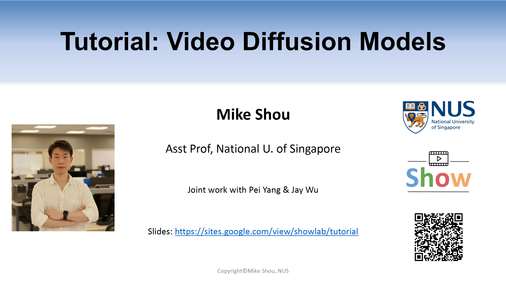

## **教程介绍**

  

来自新加坡国立大学的Mike老师制作的关于Video DIffusion Models的Tutorial教程。目前在youtube和bilibili上都有上线。

**Mike老师的个人资料：**
* [个人主页](https://www.comp.nus.edu.sg/cs/people/mikeshou/)
* [bilibili账号](https://space.bilibili.com/1409032486)
* [youtube账号](https://www.youtube.com/@mikeshou1749)
  
**课程资源：**
* 视频链接如下：
  * [youtube](https://www.youtube.com/watch?v=0K56LA821ys) 
  * [bilibili](https://www.bilibili.com/video/BV1jN4y1879z/?spm_id_from=333.1007.0.0&vd_source=45b600ad98b8c54b21b9561915c1ba61)
* Slides：
  * [PPT](https://www.dropbox.com/scl/fi/u7jgodz3tz01bzd5uftog/Video-Diffusion-Tutorial-Prof-Mike-Shou-NUS-2023-Dec-15.pdf?rlkey=de6axl9dnjhz1ub0wmpwmpq4f&dl=0)
* 课程主页：
  * [主页](https://sites.google.com/view/showlab/tutorial)

---

今天，继续学习Mike老师关于Video Diffusion Tutorial的内容。

  

首先介绍AnimateDiff，他的初衷是如何高效的利用社区的大量定制化模型，来生成视频。而不是重新训练，降低代价。

  

整体的思路比较简单和直观，通过插入一组Temporal layer list，原文中论述为motion module，然后固定SD，在视频数据上利用Noise MSE Loss仅训练这个module的参数。训练好之后，motion module就具备了从视频中提取motion信息的功能。

  

这是直观的模型架构，还是比较简单的。

  

（不过这个AnimateDiff实际上是个Image Animation模型）

--- 

接下来这篇工作是Text2Video-Zero，其动机是如果不微调的话，能否直接利用Stable Diffusion来实现视频的生成？如下图所示，实际上可以通过两个方面进行探索：
* 让每一帧的初始化噪音在pattern上都比较类似
* 让不同帧之间的中间特征尽可能的相似

上述两个做法的核心和本质就是保持视频帧的时序一致性。

  

接下来逐个点解释：

第一个点，如何才能让不同帧之间的噪音pattern尽可能相似呢？
具体做法就是定义一个motion，在给定第一帧噪音的基础上，根据motion逐帧修改noise，得到其他帧的噪音初始化。比如下图中得马，第一帧的噪音初始化后，如果定义的motion是逐渐向左下走，那就逐渐的将噪音向左下移动。

  

第二个点，如何才能让不同帧之间的特征更相似呢？
具体做法就是让所有帧对应的self-attention中的k，v，全都替换为第一帧的K，V。

  

第三个点，做背景的smooth。
  

其他training-efficient的工作：

  

---

接下来介绍电影脚本相关的视频生成：

  

  

  

  

  

如何才能生成电影脚本呢？或者电影脚本对于模型来说如何建模呢？

答：通过定义prompt，利用GPT生成脚本，并且在脚本中可以生成物体的bbox。有了这些脚本之后，可以得到很多的condition，之后就可以利用ControlNet的机制利用这些条件。

  

  

  

除了上述工作外，现在也有很多工作利用LLM来实现StoryBoard Video的生成。

  

  

  

GPT本身并不能很好的理解Visual Prior，有的时候生成的结果并不合理。因此，也有一些工作去利用GPT先去训练一下，使其更好的适配long-form video prior。

作者收集并标注了StoryBoard20K的数据集，用来训练GPT或者LLM，能够生成更加合理的video layout。

  

其他更多的工作：

  

---

接下来介绍了长视频生成的代表性工作。

  

  

NUWA-XL这个工作是一个代表性的工作，他的核心思想就是**迭代的进行插帧，实现长视频的生成**，提出了diffusion over diffusion的架构，利用两个Diffusion实现。

  

详细来说，先准备好一些notes，就是文本提示，然后基于这些文本提示，你可以得到每个文本对应生成的关键帧。这就是第一个Diffusion要做的事情。基于这些关键帧，第二个Diffusion就可以不断插帧，得到最后的视频。

  

这张图就更加详细了。
* 自顶向下，Global Diffusion得到3个关键帧。
* 选择第一帧和最后一帧，利用Local Diffusion生成中间的帧
* 递归如此

  

可以看到，当Global DIffusion作用的时候，输入的就是纯噪音，所以Mask ALl Frames。
但是当Local DIffusion作用的时候，需要保留首尾帧，然后Mask掉中间帧。

  

更多长视频生成的工作：

  
