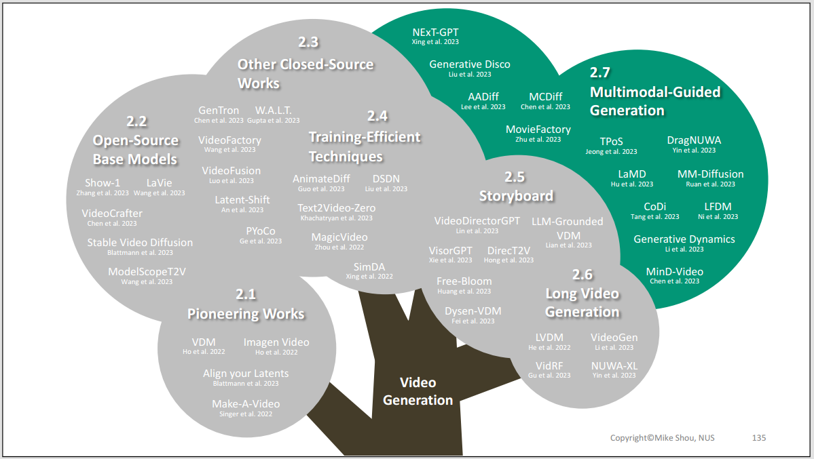
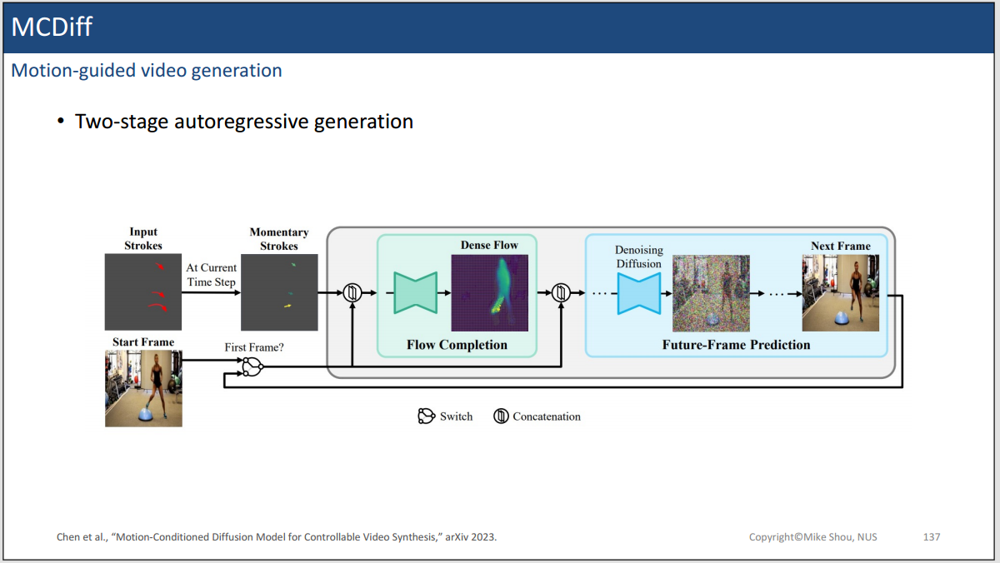
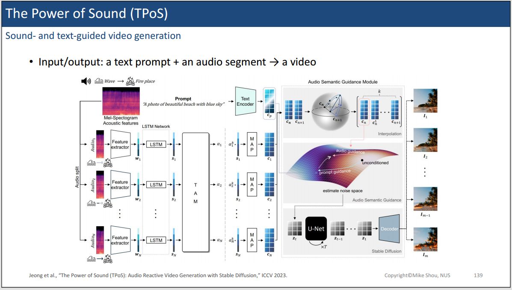
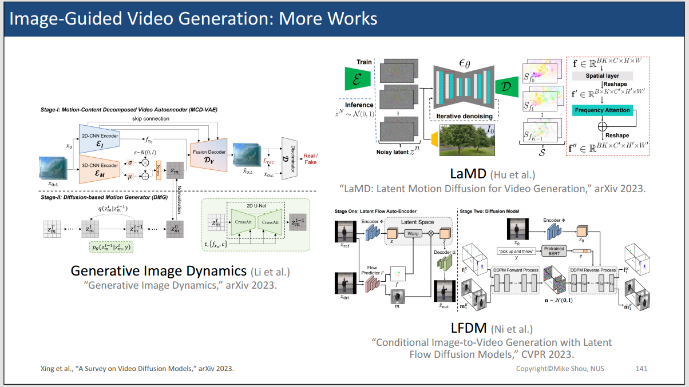
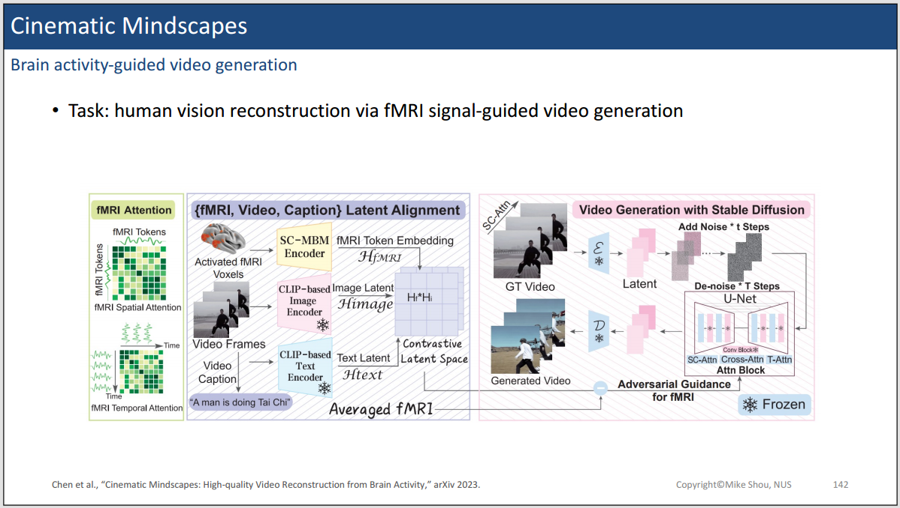
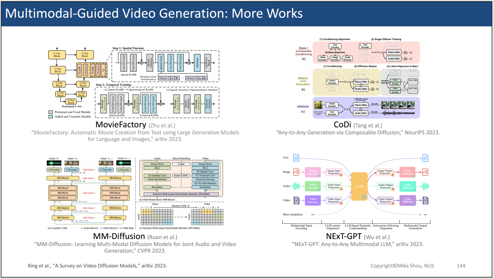
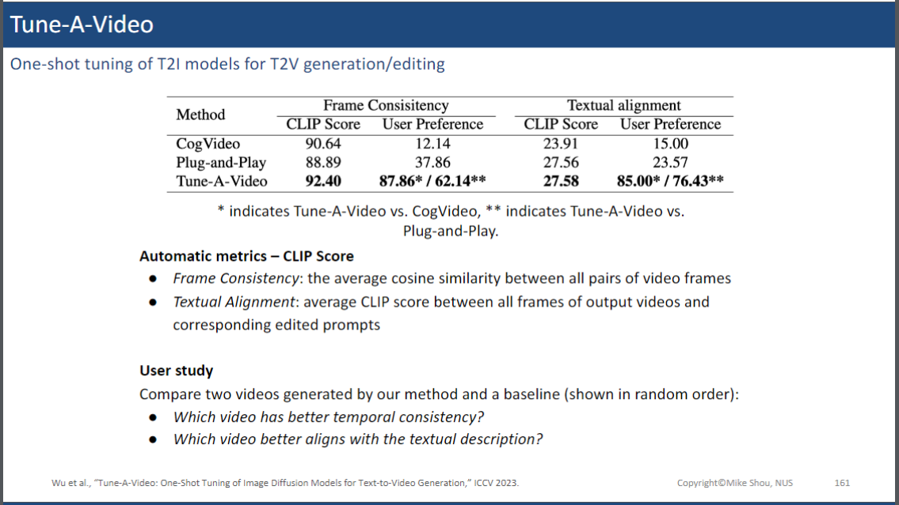
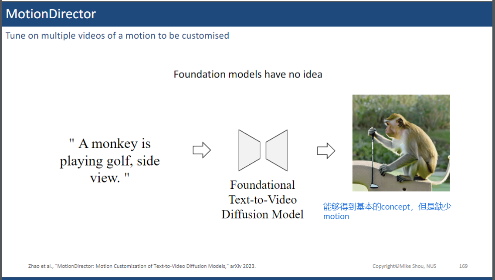
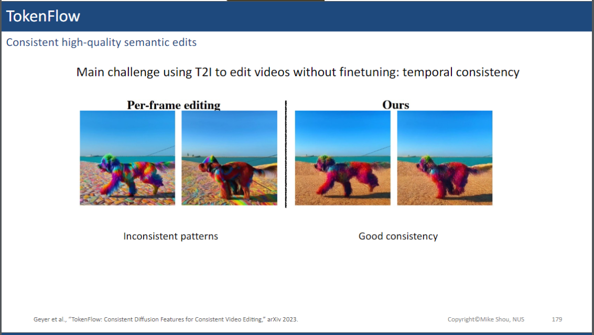
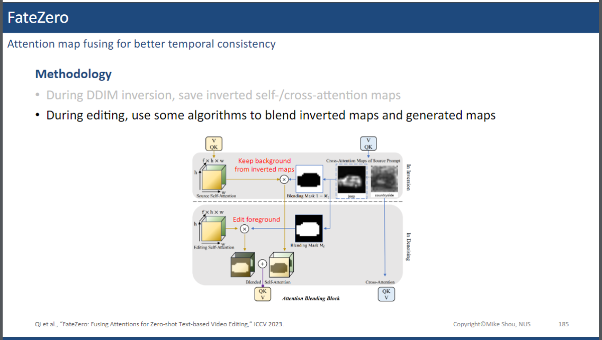

## **教程介绍**

  

来自新加坡国立大学的Mike老师制作的关于Video DIffusion Models的Tutorial教程。目前在youtube和bilibili上都有上线。

**Mike老师的个人资料：**
* [个人主页](https://www.comp.nus.edu.sg/cs/people/mikeshou/)
* [bilibili账号](https://space.bilibili.com/1409032486)
* [youtube账号](https://www.youtube.com/@mikeshou1749)
  
**课程资源：**
* 视频链接如下：
  * [youtube](https://www.youtube.com/watch?v=0K56LA821ys) 
  * [bilibili](https://www.bilibili.com/video/BV1jN4y1879z/?spm_id_from=333.1007.0.0&vd_source=45b600ad98b8c54b21b9561915c1ba61)
* Slides：
  * [PPT](https://www.dropbox.com/scl/fi/u7jgodz3tz01bzd5uftog/Video-Diffusion-Tutorial-Prof-Mike-Shou-NUS-2023-Dec-15.pdf?rlkey=de6axl9dnjhz1ub0wmpwmpq4f&dl=0)
* 课程主页：
  * [主页](https://sites.google.com/view/showlab/tutorial)

---

今天我们继续学习NUS Mike老师的Video Diffusion课程。今天的主要内容包括：

* Multimoda-guided generation
* Video Editing 
  * Tuning-based One-shot
  * Tuning-based Multiple-shot
  * Training-free

首先，我们先对视频生成领域的最后一个板块---Multimodal-guided generation进行介绍。如下图所示：

  

  

  

  

  

  

  

  

  

---

接下来，我们主要介绍视频Editing的工作。因为对于视频数据的训练，计算资源将消耗巨大。因此，基于Tuning-based的方法对于高校科研来说可能更加合适。

  

而One-shot Tuned的方式，就是只给定一个视频数据，然后在给定的这个视频上训练微调，实现对视频的editing。而这样的训练成本是相对较低的。

  

接下来，我们介绍one-shot tuned的代表性工作 **Tune-A-Video**：

  

这个工作要做的事情是：给定一个目标视频，我能否在保持目标视频的motion的前提下，editing目标视频中内容的appearance。

为了实现这个目标，这篇论文从下述动机出发：可以利用预训练好的T2I模型来生成很好的appearance信息，然后从给定的reference video中学习motion的信息。

  

  

作者采用的核心做法就是在给定的one-shot视频和文本描述下，inflate预训练的T2I模型，并高效微调。

  

  

如上图所示，左侧是训练图例，而右侧是推理图例。在训练的流程图中，因为给定的Reference Video只有一个，因为全部finetuning整个T2I是不切实际的。于是作者采用的做法是在T2I中插入Spatial-Temporal Attn和Temporal-Attn，然后只训练这些相关层，其他均固定。此外，作者还设计了一个高效的注意力计算方法，那就是在计算帧与帧之间注意力关系的时候，只需要计算当前帧和第一帧，以及当前帧和前一帧之间的关系。

以下是一些效果展示：

  

  

  

  

后续One-shot tuning的工作，还有一篇是来自于google的**Dreamix**：

  

  

他的核心做法是：同时混合训练视频数据，和其乱序的帧图像数据，训练视频数据的时候，temporal attention需要训练。而训练image的时候，时序的layers不需要训练。

更多的工作如下所示：

  

接下来，我们介绍一下**Multiple-Shot Tuned**的方法。

  

这里要介绍的代表性的工作是：**MotionDirector**。

这个工作的核心是如果给定多个参考视频，可以怎么学习？比如下面这张图，如何让猴子打高尔夫球？

  

如果直接利用T2V模型去生成，你会发现猴子，高尔夫这些概念都是有的，但是打高尔夫的motion是缺失的。

  

这个工作的做法就是，提供一些motion video subset，然后从这些视频集中学习motion，并应用。

  

  

作者分别训练了两个分支，对应两个LoRA，一个负责学习Spatial appearance信息，另外一个负责学习Temporal信息。

这个方法不仅能学习物体的motion，还可以学习相机的motion。
  

该方法可以实现motion和appearance的解耦。

  

---

接下来，我们将介绍Training-free Video Editing的相关内容：

  

第一个代表性的工作是TokenFlow。

这篇工作的动机是，如果采用T2I模型逐帧编辑的模式，会发现时序一致性很差。

  

因此，可以利用帧与帧之间的token correspondence来学习。

  

  

  

具体的做法就是利用当前帧之前和之后的帧对应的特征，进行加权融合，得到当前帧的表示。

  

如上图所示，TokenFlow的一致性还是不错的。

另外一个工作是：**FateZero**

  

  

从上述两个图可以看出，FateZero的核心步骤分为两步：

* 第一步就是利用DDIM inversion，得到当前视频的self-attention的特征
* 第二步就是前景使用编辑文本驱动得到的特征，背景使用第一步得到的self-attention的特征。依赖mask进行融合。

看一下结果：

  

更多的工作：

  

未完待续。。。。

