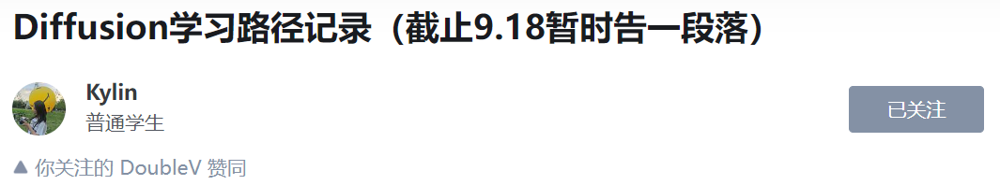
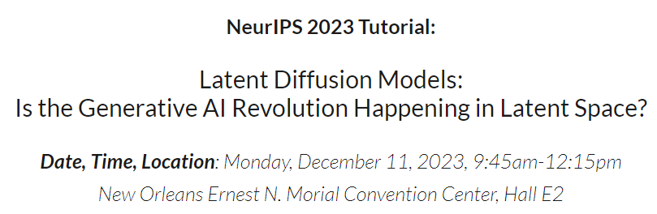

> 从今天开始正式从头开始学习Diffusion，包括数学原理，关键论文，底层代码，当前的小领域进展，论文总结等。
>

## **参考资料**：

* **知乎**
  * https://zhuanlan.zhihu.com/p/605973097
      
  * https://zhuanlan.zhihu.com/p/670174195
      

* **Blog**
  * Lilian Weng的博客: https://lilianweng.github.io/posts/2021-07-11-diffusion-models/

* **Tutorial**
  * https://flowus.cn/wangye123/d9fa948f-e692-4963-9ea0-c6ad365d4af3 (Valse 2023, Diffusion教程)
    *   

  * https://neurips2023-ldm-tutorial.github.io/ （NIPS2023 tutorial）
    *   

* **Slides**
  * [UNC课程](https://www.cs.unc.edu/~ronisen/teaching/fall_2022/pdf_lectures/lecture8_diffusion_model.pdf)
  * [CS231n](http://cs231n.stanford.edu/slides/2023/lecture_15.pdf)
  * [李宏毅](https://speech.ee.ntu.edu.tw/~hylee/ml/ml2023-course-data/DDPM%20(v7).pdf)

* **Code实践**
  * https://github.com/huggingface/diffusion-models-class（Huggingface课程）

---

## **学习路线** 
1.📚🧠📖先学习李宏毅的视频课程，学习Diffusion Model的数学原理 📚🧠📖
