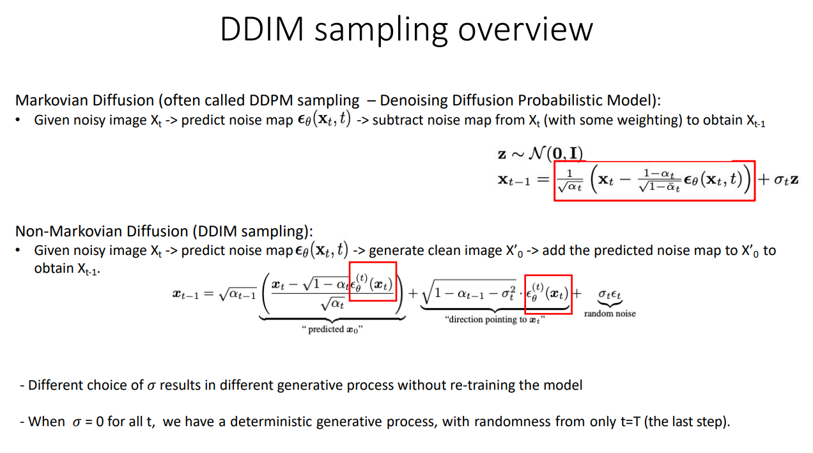

> **注：本文是作为自我学习和理解使用，有些观点不一定正确。请慎重参考**

## **DDPM的基本原理和弊端**

对于DDPM，我们推导其采样目标的路线为：

$$
p\left(\boldsymbol{x}_t \mid \boldsymbol{x}_{t-1}\right) \stackrel{\text { 推导 }}{\longrightarrow} p\left(\boldsymbol{x}_t \mid \boldsymbol{x}_0\right) \stackrel{\text { 推导 }}{\longrightarrow} p\left(\boldsymbol{x}_{t-1} \mid \boldsymbol{x}_t, \boldsymbol{x}_0\right) \stackrel{\text { 近似 }}{\longrightarrow} p\left(\boldsymbol{x}_{t-1} \mid \boldsymbol{x}_t\right)
$$

同时，我们是利用贝叶斯定理：

$$
p\left(\boldsymbol{x}_{t-1} \mid \boldsymbol{x}_t, \boldsymbol{x}_0\right)=\frac{p\left(\boldsymbol{x}_t \mid \boldsymbol{x}_{t-1}\right) p\left(\boldsymbol{x}_{t-1} \mid \boldsymbol{x}_0\right)}{p\left(\boldsymbol{x}_t \mid \boldsymbol{x}_0\right)}
$$

实现，$x_t$到$x_{t-1}$的去噪推理。

由于DDPM依赖于马尔科夫链进行加噪，那么在去噪的过程中也需要计算 $p\left(\boldsymbol{x}_t \mid \boldsymbol{x}_{t-1}\right)$，同理其去噪的过程同样收到马尔科夫链的影响，需要逐步降噪。如果总时间步是1000的话，那就需要迭代1000次才能实现，这样的采样速度是非常慢而不能接受的。

## **DDIM的原理和数学推导（直观）**

DDIM的核心原理就是摆脱了马尔科夫链的限制，使得其在采样的时候，不必一步一步地去噪，而是可以跳步去噪，这样就加快了采样速度。

下面我们看一下DDIM的数学推导，在这里我们主要是以直观为主：

从贝叶斯公式出发，为了令DDIM不依赖于马尔科夫过程，我们在求解$p\left(\boldsymbol{x}_{t-1} \mid \boldsymbol{x}_t, \boldsymbol{x}_0\right)$的时候，可以不计算$p\left(\boldsymbol{x}_t \mid \boldsymbol{x}_{t-1}\right)$，那么这样，我们就不需要逐步的去降噪了。

OK，那我们直接将假设：

$$
\begin{aligned}
& P\left(x_{t-1} \mid x_t, x_0\right) \sim N\left(k x_0+m x_t, \sigma^2\right) \\
& x_{t-1}=k x_0+m x_t+\sigma \epsilon \epsilon \sim N(0,1)
\end{aligned}
$$

这样的话，我们就可以直接将$x_{t-1}$表示成一个正态分布，而不是依赖于贝叶斯定理，中间借助马尔科夫链来求解。

又因为加噪公式为：

$$
x_t=\sqrt{\overline{\alpha_t}} x_0+\sqrt{1-\overline{\alpha_t}} \epsilon, \epsilon \sim N(0,1)
$$

因此，可将$x_t$代入上式并进行化简：

$$
\begin{gathered}
x_{t-1}=k x_0+m\left[\sqrt{\bar{\alpha}_t} x_0+\sqrt{1-\overline{\alpha_t}} \epsilon\right]+\sigma \epsilon \\
x_{t-1}=\left(k+m \sqrt{\overline{\alpha_t}}\right) x_0+\epsilon^{\prime}, \epsilon^{\prime} \sim N\left(0, m^2\left(1-\overline{\alpha_t}\right)+\sigma^2\right)
\end{gathered}
$$

那由前向加噪公式，我们可以得到$x_{t-1}$的表示：

$$
x_{t-1}=\sqrt{\overline{\alpha_{t-1}}} x_0+\sqrt{1-\overline{\alpha_{t-1}}} \epsilon
$$

OK，我们只需要满足对应系数相等：

$$
\begin{gathered}
k+m \sqrt{\bar{\alpha}_t}=\sqrt{\alpha_{t-1}^{-}} \\
m^2\left(1-\overline{\alpha_t}\right)+\sigma^2=1-\alpha_{t-1}^{-}
\end{gathered}
$$

求得：

$$
\begin{gathered}
m=\frac{\sqrt{1-\alpha_{t-1}^{-}-\sigma^2}}{\sqrt{1-\overline{\alpha_t}}} \\
k=\sqrt{\alpha_{t-1}^{-}}-\frac{\sqrt{1-\alpha_{t-1}^{-}-\sigma^2}}{\sqrt{1-\overline{\alpha_t}}} \sqrt{\overline{\alpha_t}}
\end{gathered}
$$

因此：

$$
\begin{aligned}
& P\left(x_{t-1} \mid x_t, x_0\right) \sim N\left(\left(\sqrt{\alpha_{t-1}^{-}}-\frac{\sqrt{1-\alpha_{t-1}^{-}-\sigma^2}}{\sqrt{1-\overline{\alpha_t}}} \sqrt{\overline{\alpha_t}}\right) x_0+\left(\frac{\sqrt{1-\alpha_{t-1}^{-}-\sigma^2}}{\sqrt{1-\overline{\alpha_t}}}\right) x_t, \sigma^2\right) \\
& \sim N\left(\sqrt{\alpha_{t-1}^{-}} x_0+\sqrt{1-\alpha_{t-1}^{-}-\sigma^2} \frac{x_t-\sqrt{\bar{\alpha}_t} x_0}{\sqrt{1-\overline{\alpha_t}}}, \sigma^2\right)
\end{aligned}
$$

接下来，我们把$x_0$ 替换成$x_t$表示：

$$
\begin{array}{r}
x_0=\frac{x_t-\sqrt{1-\overline{\alpha_t}} \epsilon_t}{\sqrt{\overline{\alpha_t}}}
\end{array}
$$

$$
\begin{array}{r}
\epsilon_t=\frac{x_t-\sqrt{\overline{\alpha_t}} x_0}{\sqrt{1-\overline{\alpha_t}}}
\end{array}
$$

最后，得到采样的最终形式：

$$
x_{t-1}=\sqrt{\alpha_{t-1}^{-}}\left(\frac{x_t-\sqrt{1-\overline{\alpha_t}} \epsilon_t}{\sqrt{\overline{\alpha_t}}}\right)+\sqrt{1-\alpha_{t-1}^{-}-\sigma^2} \epsilon_t+\sigma^2 \epsilon
$$

需要注意的是，我们整个推导的过程中，并没有使用和依赖马尔可夫过程。那也就是说此时$x_{t-1}$，并不是严格的从$x_t$到$x_{t-1}$，而是通用的代表着以前的任一时刻：$x_{prev}$。因此，一般化的公式如下：

$$
x_{\text {prev }}=\sqrt{\alpha_{\text {prev }}}\left(\frac{x_t-\sqrt{1-\overline{\alpha_t}} \epsilon_t}{\sqrt{\overline{\alpha_t}}}\right)+\sqrt{1-\alpha_{\text {prev }}^{-}-\sigma^2} \epsilon_t+\sigma^2 \epsilon
$$

## **DDIM加速采样**

在上述的推导过程中，我们发现DDIM实际上并不依赖于马尔科夫链，因为我们在做推导的时候，并没有利用$p\left(\boldsymbol{x}_t \mid \boldsymbol{x}_{t-1}\right)$ 这一项，而是直接假设，然后通过系数对应的方式，求解出$x_{t-1}$的最终形式。因此，DDIM便不再依赖于马尔科夫链来逐步求解$x_{t-1}$。而是可以以跳步的方式进行。

同时，DDPM的训练结果包含了任意时间步子序列的采样生成结果。因此，如果训练时间步是1000，DDIM可以跳步执行，因此，1000以内的任意子时间步都可以作为DDIM的采样步骤，而不是严格按照1000步进行去噪采样。

## **DDIM 和 DDPM 对比**

* DDPM依赖于马尔科夫链进行扩散过程，同时去噪过程也依赖于马尔科夫链，进行逐步去噪，这就导致采样时间花费较多
* DDIM在求解$x_{t-1}$时，没有利用马尔科夫链，因此DDIM的采样过程可以跳步执行，提高采样速度。
* DDIM并没有要求改变前向过程，甚至DDIM和DDPM的训练目标都是一致的，只是DDIM可以作为高效的采样算法，实现更加快速的采样和生成。也就是说你可以用DDPM来训练，使用DDIM来高效采样生成。

  

上述这一页PPT总结的非常好，我在此处使用中文进行总结和理解：

我们在基于马尔科夫的DDPM采样过程中，$x_{t-1}$是依赖于$x_t$的，  

$$
\begin{aligned}
& \mathbf{z} \sim \mathcal{N}(\mathbf{0}, \mathbf{I}) \\
& \mathbf{x}_{t-1}=\frac{1}{\sqrt{\alpha_t}}\left(\mathbf{x}_t-\frac{1-\alpha_t}{\sqrt{1-\bar{\alpha}_t}} \boldsymbol{\epsilon}_\theta\left(\mathbf{x}_t, t\right)\right)+\sigma_t \mathbf{z}
\end{aligned}
$$

上述这个过程可以理解为从$x_t$减去模型预测出来的噪音，得到$x_{t-1}$，因此，我们说DDPM依赖于马尔科夫链，只能逐步降噪。

而DDIM却不同，我们看下面的采样表达式：

$$
\boldsymbol{x}_{t-1}=\sqrt{\alpha_{t-1}} \underbrace{\left(\frac{\boldsymbol{x}_t-\sqrt{1-\alpha_t} \epsilon_\theta^{(t)}\left(\boldsymbol{x}_t\right)}{\sqrt{\alpha_t}}\right)}_{\text {"predicted } \boldsymbol{x}_0 \text { " }}+\underbrace{\sqrt{1-\alpha_{t-1}-\sigma_t^2} \cdot \epsilon_\theta^{(t)}\left(\boldsymbol{x}_t\right)}_{\text {"direction pointing to } \boldsymbol{x}_t \text { " }}+\underbrace{\sigma_t \epsilon_t}_{\text {random noise }}
$$

它由三部分组成，第一部分是模型预测出来的"predicted $x'_0$" , 然后第二项是朝向$x_t$的噪音预测的map，第三项可以置为0，这样就可以利用前两项直接逼近$x_{t-1}$。而整个过程是没有用到马尔科夫链的。

## **参考资料**

* [DDPM与DDIM简洁版总结](https://www.bilibili.com/video/BV1Bh4y1E7vZ/?spm_id_from=333.337.search-card.all.click&vd_source=45b600ad98b8c54b21b9561915c1ba61)
* [生成扩散模型漫谈（四）：DDIM = 高观点DDPM](https://kexue.fm/archives/9181)
* [一文带你看懂DDPM和DDIM（含原理简易推导，pytorch代码）](https://zhuanlan.zhihu.com/p/666552214)
* [扩散模型之DDIM](https://zhuanlan.zhihu.com/p/565698027)
* [万字长文+详细公式推导解读扩散模型的经典论文](https://zhuanlan.zhihu.com/p/674019932)

