> **自我记录使用，他人参考请慎重**

首先扩散模型和传统的生成模型核心思想一致，都是希望能够预测数据x的分布$P_\theta(x)$来逼近真实数据的分布$P_{data}(x)$。如下图所示：

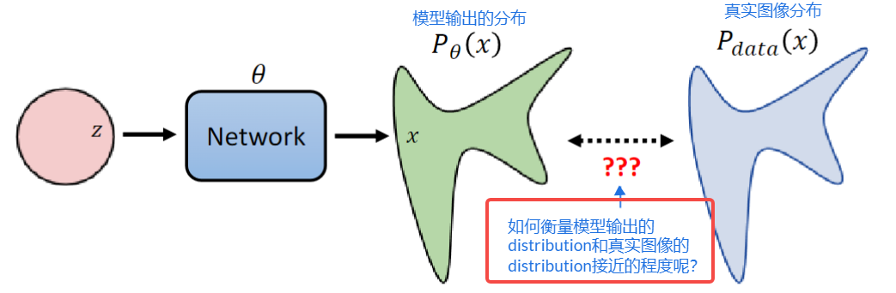  

那现在的问题变成了，**如何衡量模型预测的distribution和真实图像的distribution的接近程度呢？**

最经典的方法就是使用**极大似然估计（Maximum Likelihood Estimation）**:
* 假设我们有一组观测数据，我们希望找到一个参数值，使得这组观测数据出现的概率最大。极大似然估计的思想是，我们假设观测数据是从一个已知的概率分布中独立地抽取得到的，然后通过最大化观测数据的联合概率密度函数来找到最优的参数值。

OK，当前的问题我们可以定如下数学过程：

1. Sampling 数据样本 {$x^1,x^2,\dots,x^m$} from 真实数据分布$P_{data}(x)$
2. 计算每个样本的出现概率：$P_\theta(x^i)$
3. 求解最优参数$\theta^*$ 使得所有数据样本的联合概率密度函数最大：
   1. $\theta^* = argmax^{\theta} \prod_{i=1}^{n} P_\theta(x_i)$

**为什么极大似然估计可以让两个分布变得更加接近呢？**

因为极大似然估计等价于最小化两个分布的KL散度。可看如下推导：

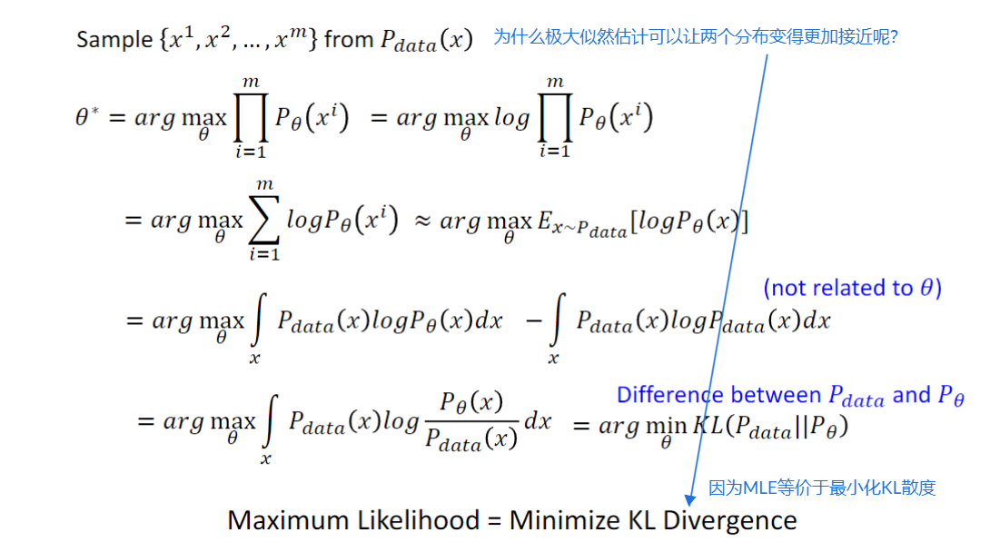  

OK, 接下来我们要思考用什么目标来优化Diffusion Model使得极大似然估计成立。根据李宏毅老师讲解的内容，DDPM实际上可以类比VAE。

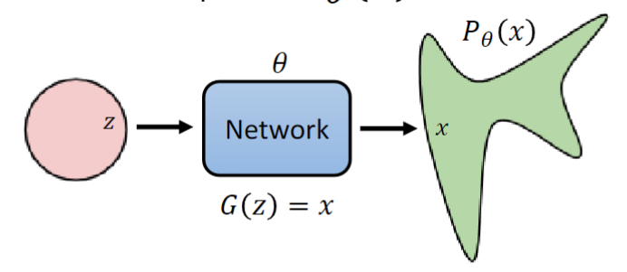  

上图是VAE的示意图，还是给定一个分布，并从分布中采一个z点，然后经过网络$G(z) = x$ 预测得到逼近的数据分布。 既然预测的也是一个分布，我们就可以利用分布的mean作为目标进行学习（方差这里不考虑）。如下图所示：

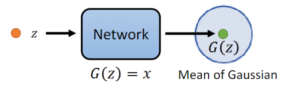  

众所周知，VAE通过最大化下界来实现目标的学习。而DDPM其实也是类似的道理。

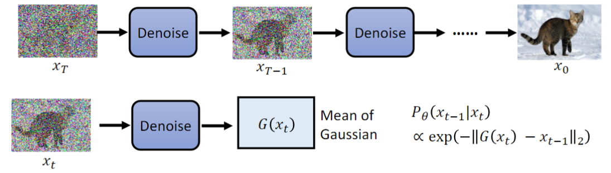  

可以看到，一张加噪图$x_t$ 经过降噪输出$G(x_t)$，类比VAE，我们只需要让模型预测的$G(x_t)$的mean和$x_{t-1}$时刻的所加噪音的mean接近即可。

因此，DDPM类比VAE，都是最大化下界。

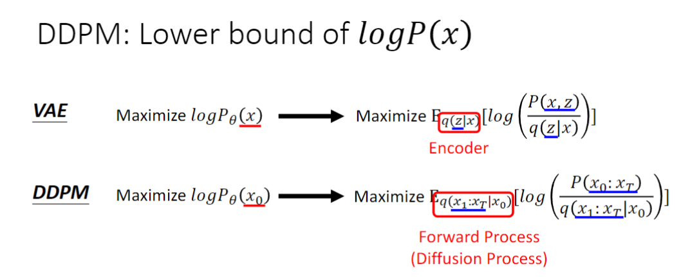  

接下来就是一顿推理，得到下述目标：

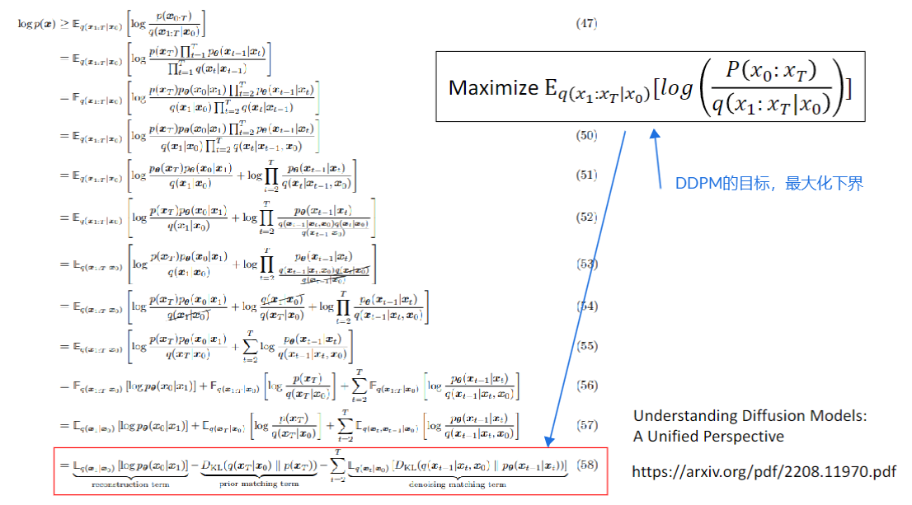  

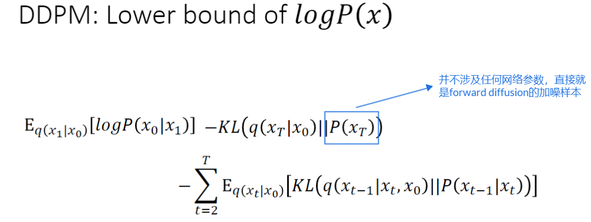  

从上述公式可以得出，如果想要最大化上界，就需要让最后一个负项最小（因为KL散度恒大于0）,那也就等价于KL散度最小。可以看到，KL散度这一项包括
* $q(x_{t-1} | x_t, x_0)$ : 真实的噪音数据分布
* $P(x_{t-1} | x_t)$ ：模型预测的噪音分布

那真实的噪音分布$q(x_{t-1} | x_t, x_0)$如何计算呢？可以看如下推导：

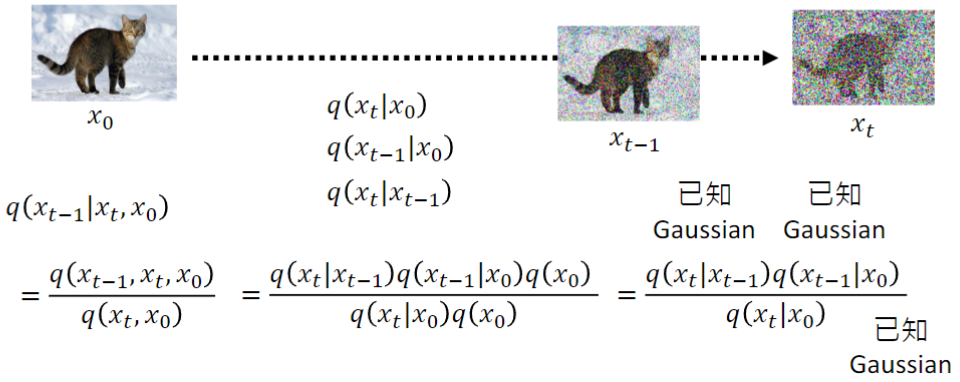  

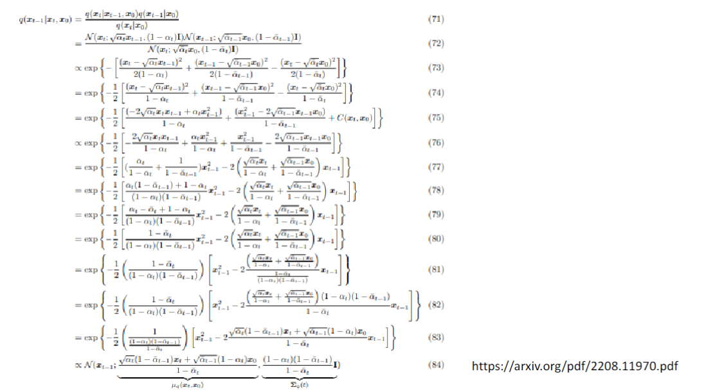  

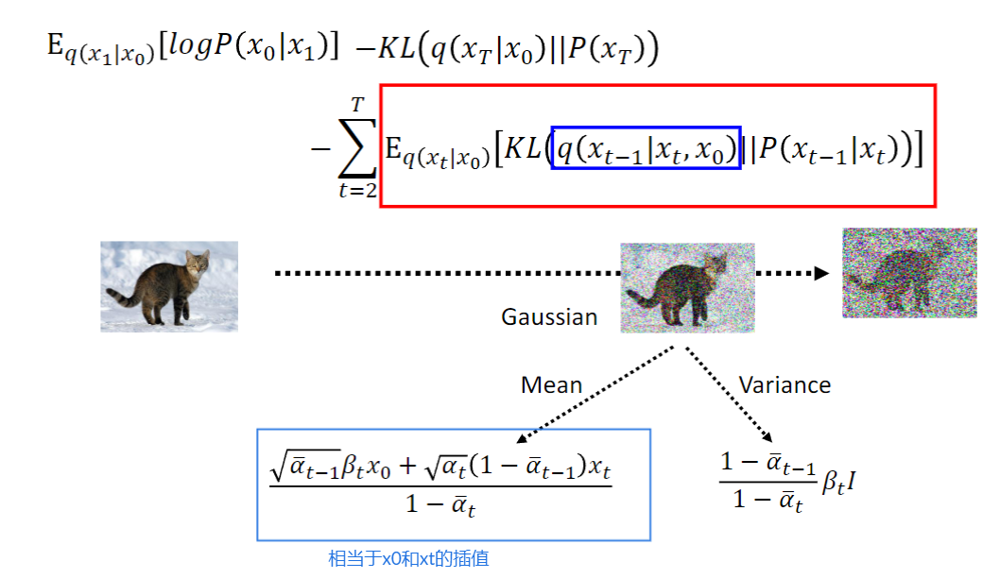  

最终我们就得到了真实的噪音分布$q(x_{t-1} | x_t, x_0)$的mean和var。

之后，我们把$x_0$用$x_t$表示，然后重新化简mean的表达式：

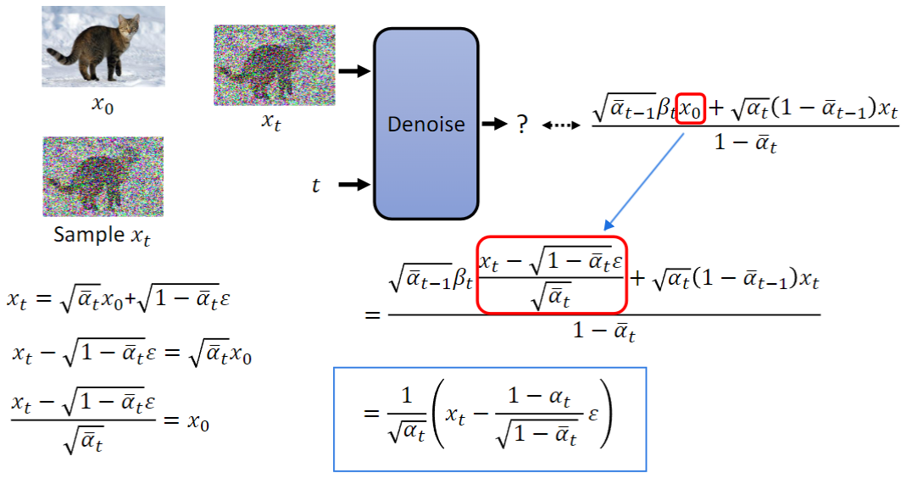  

如何最小化KL散度呢？很简单，直接让两个分布的mean接近即可（这里不考虑方差）：

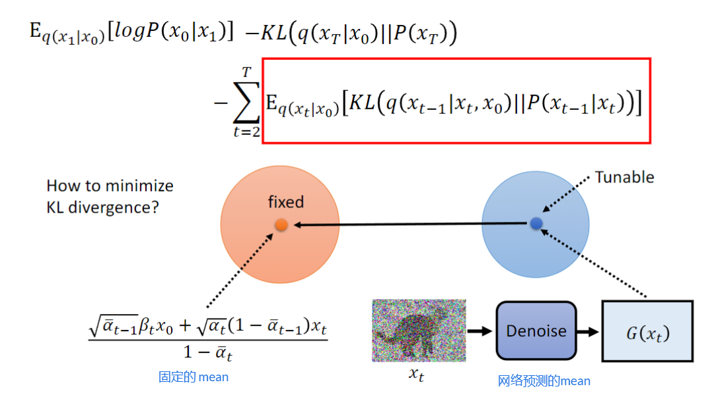  

最后，DDPM的训练目标：

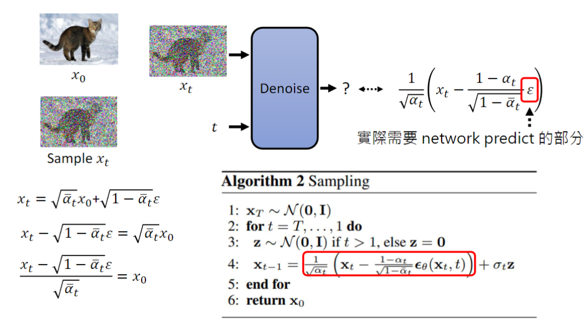  

最后，这里还有个疑问，就是为什么每次模型预测并减去噪音后，还要再加一个随机的小噪音呢，如下图红色bbox所示：

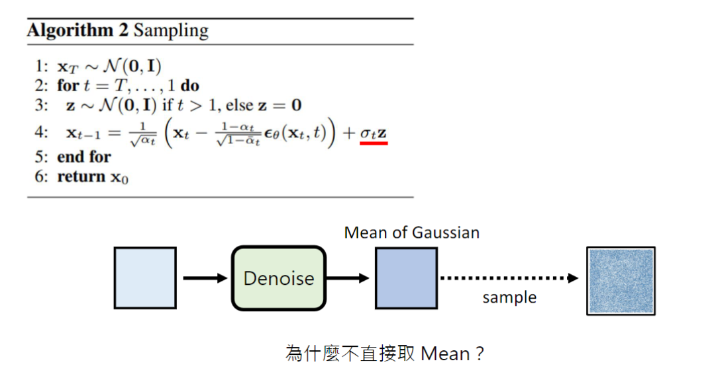  

**李宏毅的解释是加入一定的随机性能带来更好的性能。** 

## 参考资料

* [李宏毅的Diffusion 数学原理PPT](https://readpaper.com/pdf-annotate/note?pdfId=4751710721880883201&noteId=2111872917512679936) 
* [李宏毅的bilibili视频课程](https://www.bilibili.com/video/BV1734y1c7Hb/?spm_id_from=333.337.search-card.all.click&vd_source=45b600ad98b8c54b21b9561915c1ba61)