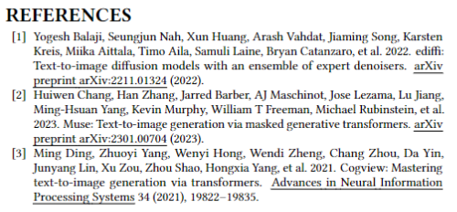
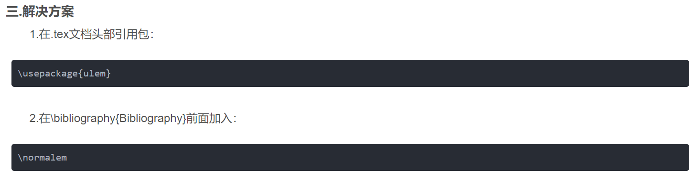

## Latex 添加删除线

在LaTeX中，你可以使用 `\usepackage{ulem}` 来调用 `ulem` 包，并使用 `\sout{}` 命令来添加删除线。例如：

```latex
\documentclass{article}
\usepackage{ulem}

\begin{document}
这是有删除线的文字：\sout{被删除的部分}，而这是保留的部分。
\end{document}
```

这个例子会生成一个有删除线的文本，其中 "被删除的部分" 将被带有删除线的效果显示出来。


## Latex 加粗

要在 LaTeX 中将文本加粗，你可以使用 `\textbf{}` 命令。将你想要加粗的文本放在花括号内即可。例如：

```latex
\textbf{这是加粗的文本}
```

如果你想要给整段文字加粗，可以使用 `\bfseries` 命令：

```latex
{\bfseries 这是整段加粗的文字}
```

另外，你也可以使用 `\bfseries` 或 `\textbf` 命令来加粗段落标题或其他文档元素。


## Latex 参考文献出现下划线
  

  
