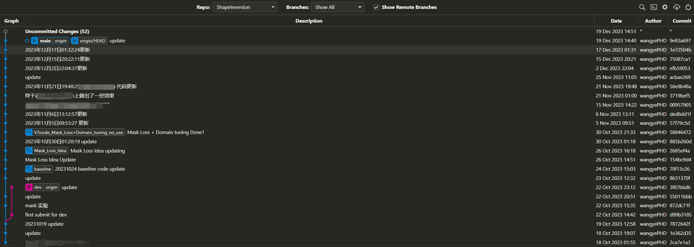
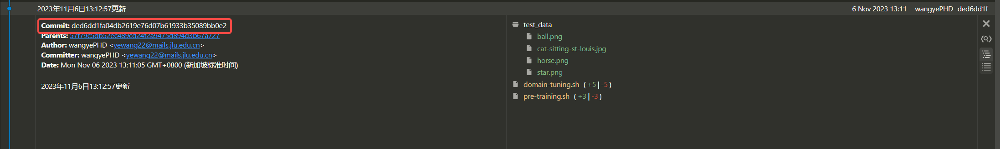
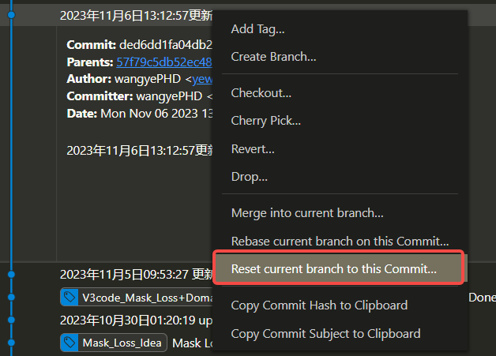

## **Git使用之版本回退**

版本代码回退是一个非常重要的功能，尤其是当做实验的时候，总是会出现莫名其妙突然代码就有问题，之前的效果就跑不出来了。这个时候就需要代码回退，回退到之前work的代码。

**前提：**

* 需要养成push代码的习惯，同时每次push都要写好tag和相关的commit信息。方便以后使用。推荐使用Vscode+Git Graph插件。如下图所示，我的提交记录：

  


**使用：**
* 根据时间，你可以找到你希望回退的代码版本，然后点击，如下图所示：

  


每次commit，git都会默认赋给一个hash id。基于这个id，我们可以唯一指定的回退代码。

* 右键当前的版本

  
点击红色框内，进行回滚。

* 请注意，上述操作只是将目标版本的代码作为了这次commit的内容，你还需要提交到git，这样github上的代码，就是你希望回滚的代码版本了。执行如下命令：
```bash
git push --force origin main（注意main是分支名字）
```
