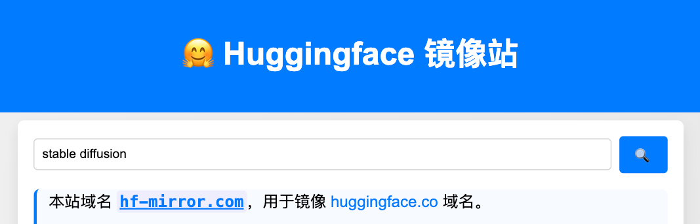
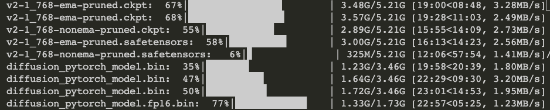

今天偶然发现了一个huggingface的镜像站，如下图所示：

  


这个站点的作用是什么呢？我觉得可以用来加速下载huggingface的模型，因为下载模型的过程比较耗时，如果有镜像站的话，可以大大加快下载速度。

那么如何使用这个镜像站呢？很简单，原作者给了三种下载方式，本文只介绍最简单的方法，如果对其他方式感兴趣可访问[原文链接](https://hf-mirror.com/)。

```bash
export HF_ENDPOINT=https://hf-mirror.com
huggingface-cli download --resume-download 下载的repo_name --local-dir checkpoints

```
例如，我打算下载Stable Diffusion V2-1的预训练模型，那么可以这样下载：

```bash
export HF_ENDPOINT=https://hf-mirror.com
huggingface-cli download --resume-download stabilityai/stable-diffusion-2-1 --local-dir checkpoints
```

实测下载网速达到10MB/s，下载速度非常快。

  


参考以下：

* [huggingface镜像站](https://hf-mirror.com/)
* [作者github](https://github.com/padeoe/hf-mirror-site)

