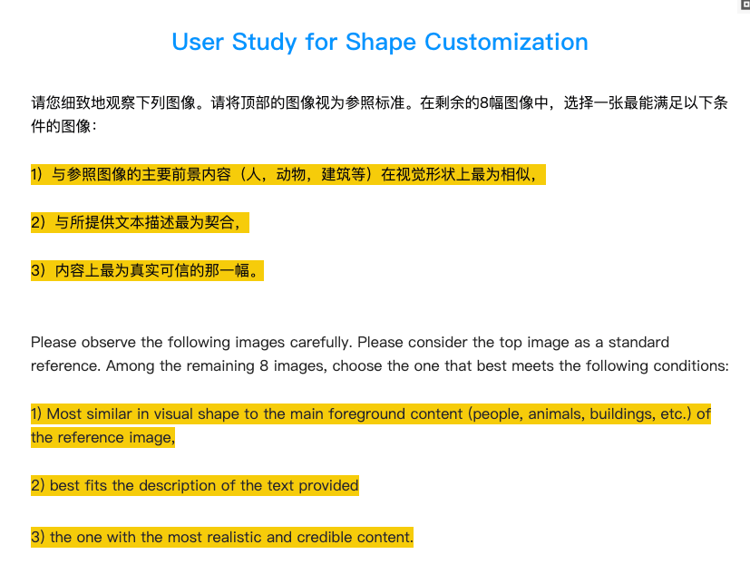
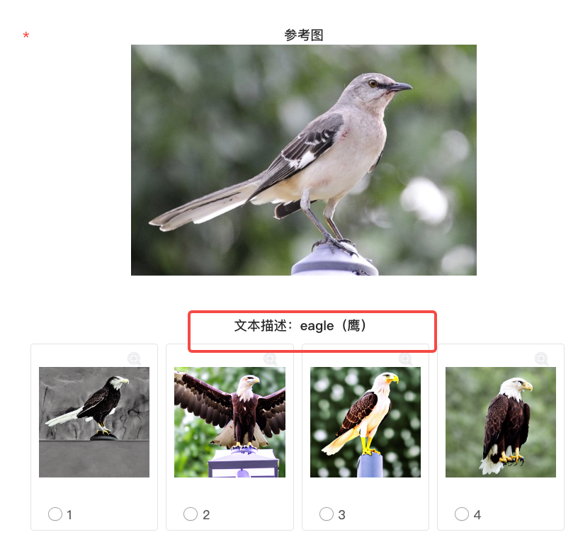
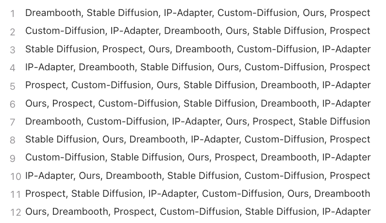

我使用的是问卷星来制作User Study。问卷星是一个很好的工具，可以很方便地制作问卷，并收集用户的反馈。

主要用到的就是单选选项题，题目可以插入图像，可以设置多个选项，然后每个选项也可以插入图像。这样就可以题目区域设置参考图，选项区域设置多个方法生成的图像进行对比。

注意事项：

* 对于user study的说明，需要准备中文和英文两种，中文方便大家查看，英文比较正式，可以用作论文中的叙述。
* caption要和生成图像更加接近，能够减少歧义。
* 提前备份好选项的顺序，以便统计分数

中英文描述：
  

caption贴近生成图像：
  

使用kimi提前备份选项的顺序：

让其随机顺序输出就好。

  
