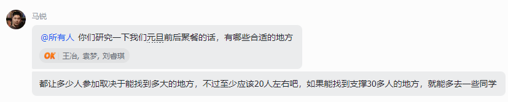
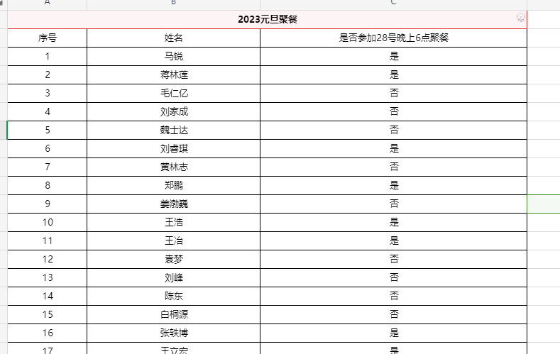

  

## **聚餐地点列表**：
* **北雁南棠**
  * 205 206包间，中间有隔断，可打通，摆2-3张桌子，每张12人左右
  * 无套餐，让经理推荐了一套性价比高的菜品
  * 目前可预订
* **巴渝人家**
  * 有大桌能做32人，也有两小桌，每桌大概做16人
  * 2023年12月21日晚咨询，26，27，28，30号都可以订
* **蒙古人烤全羊**
  *  一个桌子坐20-30人没问题
  *  如果咱们人更多的的话，有一个包间俩桌，能坐40-50人
  *  如果元旦前后吃的话建议咱们早点订，怕到时候订出去了，现在是有的
* **宴都酒店**  
  * **宴会大厅没有合适的了**
  * 只能做大包间，上次那个
* **董鲁烤鸭(临河街店)**
  * **最多两桌，最大支持人数22人。距离较远**

## **蒙古人烤全羊整理**
* 合适的时间：
  * 无论是东风大街还是工农大路店，目前年前都比较紧张，**东风大街28号有包房，可容纳35人**
  * 目前预定的是**28号晚上6点**
* 套餐：
  * 套餐目前最高**支持22人**, 然后就是需要**单独点10-12菜。**
  * **22人套餐 3698元**
    *   

## **通知脚本**
* 2023年到年尾了，马老师组织大家聚餐，目前聚餐时间为28号晚上。（由于元旦期间，聚餐人太多，各个店面预定基本都满了，因此，这次无法根据大家时间来进行调整）需要统计参加聚餐的人员数量情况。**请大家在下述链接中，选择是否参加本次聚餐**。**请在今晚7点前完成。**
* 统计方式
  * 采用WPS在线文档
  *   
* **不参加人员**
  * 毛仁亿
  * 陈盼
  * 阳州
  * 魏士达
  * 施林静
  * 贾云龙
  * 刘云征
  * 刘家成
  * **剩余参加人数为33-7=26人**

## 加菜
* 山庄大盘肚
* 砂锅有机花菜
* 干煸四季豆
* 锅包肉
* 蒙古凉皮
* 蛋炒饭 1份
* 水饺 2份

酒水：
* 青岛优质 30瓶 
* 大可乐 2瓶 
* 大雪碧 2瓶

## **聚餐信息：**

* **预留包房**: 成吉思汗厅（V888）包房
* **地址**：蒙古人烤羊大师**东风大街店**--长春市东风大街与奔驰路交汇东行50米，
* **电话**：17743463276

请大家**下午** **5:40到**。安排好行程，**避免堵车**。
(6:00陆续上菜，6:20上全羊)

## **经验总结**

### 点菜事宜：
  * 5点-6点会堵车，最好早点走
  * 上菜时间可以是定的早一点，陆续上菜，时间也很慢。所以可以早点上菜。
  * 烤全羊可以慢一点，等上了一部分菜之后，能吃一点，再上全羊。
  * 25个人，22人套餐，3698元。不够，又加了10个菜左右，还有每人的酸奶
  * 主食包括炒饭，饸饹面，两份饺子
  * 酒水就喝了一箱，可以多点，然后不喝的退掉，这次点了3箱。
  * 饮料一共点了8大瓶，4个大可和雪碧，4个开胃

### 讲话经验：
  * 第一步谦虚+惶恐
  * 第二步感谢
    * 先感谢马老师组局
    * 后感谢师弟师妹
  * 最后祝福

