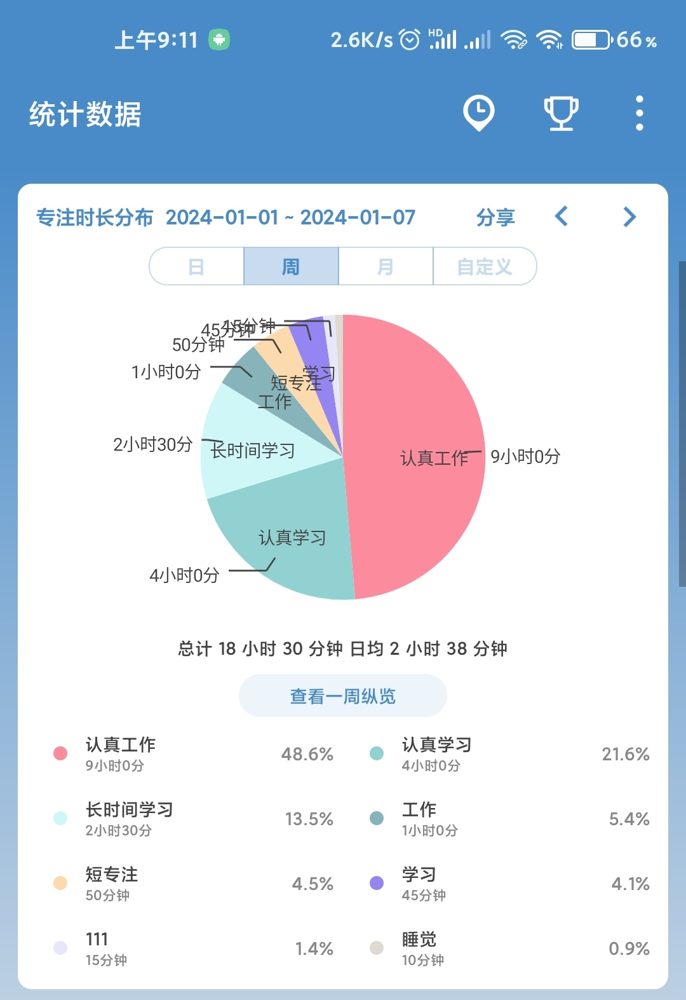

## 2024年1月2日

## TODO
* 整理当前实验结果，分析benchmark数据是否完整
* 查找思考相关的定量评测指标

## Doing
* 公众号内容浏览

## Done
* ~~Arxiv整理~~
* ~~NUS视频教程笔记写完~~
* ~~测试最新训练好的模型~~
* ~~读一篇新论文~~

## Notes
* 发现了苏剑林制作的刷Arxiv论文的网站 cool paper
* 阅读了马斯克的时间管理方法 DDL设置

## Backlog

* 整理当前实验结果，分析benchmark数据是否完整
* 查找思考相关的定量评测指标
* 公众号内容浏览

---

## 2024年1月3日

## TODO

* 阅读一篇论文并写笔记 40分钟
* 根据当前的benchmark v0信息，修改论文benchmark的描述。（30分钟）

## Doing
* 写作Introduction
  * 构思思路 30分钟
  * 写论文 1小时

## Done 
* 公众号内容浏览 10分钟
* 整理公众号内容发布知乎 10分钟
* 测试剩余的两个预训练模型 10分钟
* 挑选sweater1 和 handbag的生成图像 10分钟
* 整理当前实验结果，分析benchmark数据是否完整 (20分钟)
* 对当前的benchmark v0，整理一个文档，简单描述。（5分钟）
* 挑选rock的生成图像 10分钟
* 写一下定量测试代码 1小时
* 解决昨日backlog
  * 查找思考相关的定量评测指标 20分钟
* 整理今日Arxiv 30分钟
* 阅读SiDa Peng的写作论文模板 30分钟 
* 正在跑appearance生成图像代码 每个文本生成5张图
* 整理shape生成图像，写shape inversion生成代码 同上 （45分钟）

## Backlog
* 阅读一篇论文并写笔记 40分钟
* 根据当前的benchmark v0信息，修改论文benchmark的描述。（30分钟）

## Notes
  * 今天感兴趣的文章：
    *  Joint Generative Modeling of Scene Graphs and Images via Diffusion Models
    *  VideoDrafter: Content-Consistent Multi-Scene Video Generation with LLM
    *  TRAILBLAZER: TRAJECTORY CONTROL FOR DIFFUSION-BASEDVIDEO GENERATION

 * 关于当前实验结果的记录：
   * 从目前来看，shape实验结果的选取还是要多跑些代码，找到泛化性更好的epoch。

--- 

## 2024年1月4日

## TODO

## Doing

* weight offset实验验证

## Done
* 写24年的目标 20分钟
* Arxiv浏览整理 20分钟
* 公众号浏览整理 20分钟
* 写Introduction内容 2小时
* 昨日感兴趣的三篇工作泛读
  * ~~Joint Generative Modeling of Scene Graphs and Images via Diffusion Models~~
  *  ~~VideoDrafter: Content-Consistent Multi-Scene Video Generation with LLM~~
  *  ~~TRAILBLAZER: TRAJECTORY CONTROL FOR DIFFUSION-BASED VIDEO GENERATION~~
* 阅读一篇论文并写笔记 40分钟

## Backlog

* 昨日backlog
    * 根据当前的benchmark v0信息，修改论文benchmark的描述。（30分钟）
* 论文泛读
  * Moonshot: Towards Controllable Video Generation and Editing with Multimodal Conditions
  * S-DMs:Skip-Step Diffusion Models 
  * ColorizeDiffusion: Adjustable Sketch Colorization with Reference Image and Text

---

## 2024年1月5日

## TODO

  
## Doing

## Done
* Arxiv整理 30分钟
* 知乎收藏文章阅读 10分钟
* 公众号整理 20分钟

## Backlog
* 感兴趣论文：
  * Learning the 3D Fauna of the Web

--- 

## 2024年1月6日

## TODO

## Doing
* 定量实验进行
  * shape挑选合格生成结果 15分钟

## Done
* weight offset的原理探究 1小时
  * HyperStyle: StyleGAN Inversion with HyperNetworks for Real Image Editing论文阅读 + 笔记记录 1小时

## Backlog
* 马老师面上项目的调研
* 论文撰写
* 公众号浏览
* 马斯克纪录片

---

## 2024年1月7日

## TODO

## Doing
* 论文撰写 
  * 修改Introduction 1h
    * 段间逻辑是否清晰
    * 段内句子逻辑是否清晰
    * 是否有confuse的语句或者词汇
    * 是否简洁
    * 是否清楚的表达了我的目标和创新点3

## DONE
* 公众号浏览
* 论文泛读
  * Instruct-Imagen: Image Generation with Multi-modal Instruction 30分钟
* 马老师面向项目调研 1小时

## Backlog

* 昨日backlog
  * 马斯克记录片
* 其他事项
  * VideoLCM
* 给旭平改论文

---

## **周总结**

本周主要进行了论文撰写，实验推进，论文泛读，资料整理等四项主要工作。本周共专注学习时间为：

  

* 核心事项推进不足
* 专注工作时间不够

改进：

* 将主要精力用在核心事项推进上
* 泛读论文，公众号整理，每天限时，做不完就backlog
* 提高专注时长，少看手机

