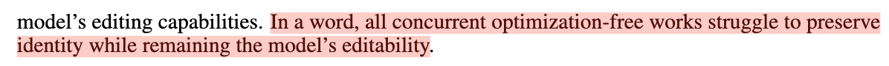
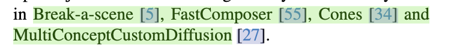

## 第三周 TODO事项

- [x] 完成ECCV的补充材料的投稿
- [x] 完成对多人一致性生成的论文调研，从单人到多人
- [x] 测试多概念一致性生成的性能
- [x] 完成XXP论文项目的问题了解，相关技术熟知
- [x] 完成两个视频的PaperABC更新
- [x] OSTAF 上传Arxiv
- [ ] ECCV代码整理
- [ ] ECCV Benchmark 评测json信息整理
- [ ] Chatgpt写论文心得总结

## 第三周 复盘总结

* 学习时长：
  * 本周有效学习时长共**36h**，平均每天学习**5.14h**。学习时长未达标（6h/天），不过效率还可以。
* 核心事项完成：
  * 完成了ECCV论文投稿和补充材料投稿这一核心事项。
  * 完成了单人、多人一致性生成的论文调研，从单人到多人，并完成周五会议汇报，想法得到认可和支持，开始写代码完成架构。
  * 测试了多概念一致性生成的性能，了解了当前SOTA方法的性能瓶颈。
  * 本周完成了两期PaperABC视频的更新
  * 完成了OSTAF论文上传Arxiv这一核心事项。
  * 完成了XXP论文代码的训练测试，发现效果不好。
* 未完成事项
  * ECCV代码整理
  * ECCV Benchmark 评测json信息整理
  * Chatgpt写论文心得总结

* 反思：
  * 周二、周三、周四效率不高，主要是因为玩游戏了，已经把游戏卸载了。
  * 要为算法实习项目赶出提前量。
  
* 收获：
  * 极简主义的生活
  * 极简主义的学习

总体打分：5.5/10

---

## 2024.03.09

## TODO

## Doing   

## Done

完成一个垃圾版本
  * ECCV 补充材料撰写
    * 整理需要写的内容
      * 我们的训练参数展示
        * 各种细节参数
        * \*a和\*m的初始化细节
      * 收集的数据集展示
      * User Study的细节展开
      * 更多的实验结果展示
        * 我们自己的
        * 和其他方法比较的
        * 多图下的训练情况
      * Societal Impact
    * 模板搞定
    * 论文写作
* 谢旭平的文章学习
* AK发的文章
* 调研单人一致性生成的论文，从InstantID，PhotoMaker入手。

## Backlog
* 整理画图代码
* attribute benchmark json文件
  * 图像名 -- 推理使用的文本
* zero-shot和one-shot的视频工作调研

## Note

---

## 2024.03.10 

## TODO

* 修改ECCV补充材料
* 整理画图代码
* attribute benchmark json文件
  * 图像名 -- 推理使用的文本
* zero-shot和one-shot的视频工作调研
* 搞定A800配置

## Doing

## Done
* XXP科研论文代码阅读
* 查找PaperABC更新内容
* 单人一致性论文调研结束，捋清楚方法路线

## Backlog

## Note
* T2I-Adapter
* UniControlNet
* SeeCoder
* CntrolNet

---

## 2024.03.11 

## TODO

* 更新一期PhotoMaker视频 PaperABC
  * PixArt
  * PiKa 音频+视频
* 了解一下LightGCN* 

## Doing

## Done
* 对照HCCF论文查看代码逻辑
  * GCN负责提取local feature
  * HGNN负责提取global feature
  * 代码对照已完成
* 等待老师反馈补充材料修改意见
* 单人一致性论文调研
* 新文章关注，新闻关注
* 今日Arxiv
  * 已查看，未整理
* HCCF训练一下，看一下torch版本的性能如何
* 什么是Kandinsky？

## Backlog
* 测试ECLIPSE的性能
  * 多人
  * 人和物
  * 物和物

## Note

DreamIdentity:可编辑性和身份保持之间应该是trade o
  

  

---

## 2024.03.12 

## TODO

## Doing

## Done
* 跟进最新行业资讯
* 整理Arxiv论文
* 小红书内容更新
* 补充材料：参数改成表格形式
* 多人一致性论文阅读

## Backlog

* 从代码角度学习一下lora的原理，进行实践
* 其他
  * 理解最小二乘法，之后回看Custom Diffusion和Make-of-Show的论文

* Midjouney 产品跟进
* 论文写作经验总结 语气词篇
* 爸妈保险报销流程记录
  * 形成图像，保存到手机中和云端

## Note
* SDXL这个模型 需要去了解了。
* In [10], authors discuss fusing multiple concept LoRAs, however, it is an expensive method that requires retraining as it does not merge LoRAs but rather re-trains the entire model. 这是ZipLoRA中队Mix-of-Show的评价。

---

## 2024.03.13 

## TODO

## Doing
* 

## Done
* 听报告
  * 擦 也没听懂个啥
* 爸妈保险报销流程记录
* 多人定制化论文阅读
* 多人定制化生成模型测试

## Backlog

* 完成昨日的遗留工作
  * 论文写作经验总结 语气词篇
* Midjouney 产品跟进
* 公众号新闻跟进
* Arxiv整理
* 从代码角度学习一下lora的原理，进行实践
* 其他
  * 理解最小二乘法，之后回看Custom Diffusion和Make-of-Show的论文

## Note

---

## 2024.03.14 

## TODO

* 昨日Backlog
* SOTA模型测试，总结分析
  * 给出架构设计思路
  * 准备汇报PPT
  * 与易老师约时间汇报讨论
* 其他事项

## Doing
* Arxiv整理
  * https://papers.cool/arxiv/2403.07860,2403.07773,2403.07711,2403.07605,2403.07500
  * 已浏览，未整理

## Done
* 公众号浏览
  * 无特殊新闻
* 更新一期视频

## Backlog

## Note

---

## 2024.03.15 

## TODO

## Doing

## Done
* SOTA模型测试，总结分析
  * 给出架构设计思路
  * 准备汇报PPT
  * 与易老师约时间汇报讨论

## Backlog

## Note

---

## 2024.03.16 

## TODO

* paperABC事项
  * 动态发布
  * 大事件视频更新
* Fastcomposer代码调试

## Doing

## Done
* XXP代码调试
  * 发现GCN和超图没有作用
* OSTAF上传Arxiv
  * 老师审核中

## Backlog

## Note

---

## 2024.03.17 

## TODO
* 公众号新闻跟进
* 周四周五Arxiv整理
* 观看一些极简主义的学习内容
* 学习如何迁移InstantID到Fastcomposer上
* 写周报

## Doing

## Done
* Fastcomposer代码调试
* 备份Fastcomposer的conda环境
* 写周复盘
* 整理下周PaperABC要更新的内容
  * 论文
    * LCM这些加速的方法
  * diffusers 代码实践
* 飞书项目管理
* 计划着手准备Diffusers 代码实战讲解

## Backlog

## Note

---