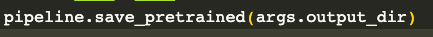
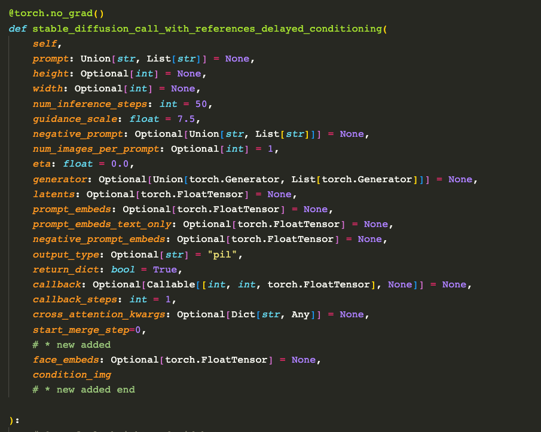
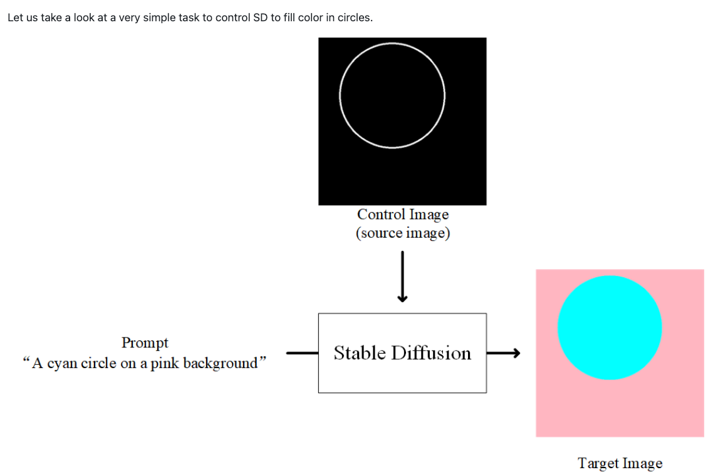
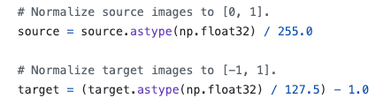

## 第4周 TODO事项

* 核心事项
  - [x] 完成多人一致项目的代码架构
  - [x] 产出v0版本的模型效果
  - [x] 准备本周五下午三点的汇报
* 扩展事项
  - [x] XXP项目的方法查找，论文追踪
  - [x] Arxiv论文追踪
  - [x] 最新技术和产品新闻的阅读和记录
  - [x] CVPR2024 AIGC 图像编辑生成相关论文的阅读
    * [知乎blog](https://zhuanlan.zhihu.com/p/687467814?utm_campaign=shareopn&utm_medium=social&utm_psn=1752772259935088640&utm_source=wechat_timeline&utm_id=0)
* 其他事项
  - [x] 完成2期PaperABC视频更新
  - [x] 字节跳动Magicme 论文推广，周日前完成。

未完成事项：
  - [ ] 准备Diffusers代码教程PPT和脚本
  - [ ] 极简主义内容学习  
  - [ ] 搞定初始效果

## 第四周 复盘总结

学习时长：

本周高效学习时间为**40h38min**。平均每天学习**5.80小时**。**学习时长未达平均每天6小时标准。**

核心事项解决：
* 本周完成了当前Idea的基本pipeline的搭建，完成了training和inference代码的编写。
* 完成了当前Idea需要的demo数据集的制作。
* 实现了当前的架构在demo数据集上的稳定训练和高效推理。
* 完成V0版本的模型生成效果。确定接下来的实验方向
* 完成周四和易老师的科研汇报。

扩展事项解决：
* 完成了2期PaperABC的视频内容的录制与发布

反思和收获：
* 本周学习了Time boxing的技巧，发现真的好用，不应该关注要学习多长时间，而是要从任务的角度出发，设置单位时间，规定自己在单位时间内，完成对应的任务。这一点，也从老石的视频中得到了验证，“生活是若干次的百米冲刺，不是长期的马拉松”。也就是说蓄力，集中精力的完成任务，而不是盲目的追求长时间的低效学习。

---

## 2024.03.18 

## TODO

## Doing

## Done
* 整理公众号行业新闻
* 配置trzsz
  * 升级iterm2 到最新版本
  * enable python api 在iterm 的general中配置
  * 按照[官方文档](https://trzsz.github.io/cn/iterm2)进行配置即可
* Review InstantID的代码架构
## Backlog

## Notes

* 为什么SDXL性能好于SD1.5，但是SD1.5用的人更多一些呢？
  * [Reddit上的一些回答](https://www.reddit.com/r/StableDiffusion/comments/1950rdf/why_sd15_models_are_still_more_popular_over_sdxl/)

---

## 2024.03.19 

## TODO

* 写代码，目标是完成Fastcomposer结合ControlNet的训练逻辑
  * Train Model的逻辑代码编写 测试前向过程，跑通流程
    * 数据加载，进入模型代码编写 完成c
    * 人脸特征的映射model代码编写
    * 模型处理数据代码编写
      * 模仿InstantID的写法即可。InstantID的推理代码不是很理解，还需要进一步review
    * 模型参数需要train的代码编写
    * 目前最大的未知和难点是：
      * 不了解ControlNet的输入维度是什么？
      * 这一点可以从两个点来解决：
        * review InstantID的推理代码
        * 从diffusers给定的train_controlNet的脚本调试一波看一下。 
* 其他
  * 准备Diffusers的代码教程和今日更新计划

## Doing

## Done

* 整理Arxiv 10分钟
* 浏览一遍CVPR2024 AIGC 图像编辑生成相关论文的阅读 10分钟
* 基于现有方法，完成face embeddings的提取和存储 0.5h
  * 多张人脸顺序如何确定，如何和原数据进行对应
    * 解决办法：当前数据中的json数据中，对于人脸的区域，使用bbox进行了圈画，然后给定了coco_lable=person，我可以遍历json文件，然后按照person选取出segment，然后按照选取出来的顺序进行crop，然后过face encoder提取embedding，然后按照这样的顺序存入文件，并修改json文件，注入每个face segment对应的embedding文件路径。
      * crop下来的人脸图像有些问题：
        * 背景区域也被保存下来了一部分
        * 有些人脸太模糊了，可能会导致embedding提取效果不好
        * 有些人脸太小了，可能会导致embedding提取效果不好
        * 有些不是单个人脸，而是多张人脸
        * 人脸裁剪的粒度很粗，有的crop区域，仍然包含了多张人脸
      * 已经搞定，但是数据质量不高，后续还需要考虑如何提高数据质量。
* 梳理dataset加载流程
* 基于现有数据集，完成Dataset代码的修改 1.5h
  * 结合现在的读取方式，修改face encoder embedding提取流程
    * 利用Segment将背景剔除，仅保留前景图像，然后利用bbox进行人脸附近区域的裁剪，得到face-center 无背景图像，然后利用face encoder进行编码，得到embedding，存入文件，并修改json文件，注入每个face segment对应的embedding文件路径。
      * Fastcomposer的bbox是coco上的标注，有点大，需要精细化到人脸区域。

* 完成数据流加载代码
  * 在现有代码的基础上，加载多个人脸的embedding数据，加载当前图像的landmarks数据。
    * 人脸的embedding数据，直接从json中的embed中读取即可。
    * 图像的landmarks数据，需要提前读取，并和原始图像做相同的数据增强变换
  

## Backlog

## Notes

今日Arxiv感兴趣的论文：
* E4C: Enhance Editability for Text-Based Image Editing by Harnessing Efficient CLIP Guidance
* https://papers.cool/arxiv/2403.10133

kimi支持200万的上下文窗口，我已申请内测。

The magic you are looking for is in the work you are avoiding.

https://mp.weixin.qq.com/s/nsSJD7CjqT7CS2008pFTcQ

---

## 2024.03.20 

## TODO 

核心事项： 

* Fastcomposer中的保存模型权重的代码有问题：
  *   
  * 保存模型的代码会加载diffusionpipeline的config，然后只会保存config中的module。对于controlNet这些，都不会保存的。
  * 解决方法：
    * 每个module全部单独保存，单独读取。

* 开始写inference code
  * 数据集适配
  * 模型适配
  * inference阶段适配
  * 原始的推理过程使用的是StableDiffusionPipeline，我只需要在此基础上，添加一个ControlNet的推理过程即可。
  * 还有一种解决办法就是，在现在的inference代码中，加入ControlNet模块即可。

扩展事项：
* Arxiv论文追踪
  * 看了前100个，后续在看
* 今日新闻阅读
* PhotoMaker论文讲解视频
其他事项：
* 无

## Doing

## Done

* 完成InstantID的推理代码review，并理解其输入输出 1h
* 完成diffusers的train_controlNet脚本的调试，跑通流程 1h 
* 搞定上述流程了，因为InstantID是依靠SDXL-ControlNet，而SDXL和SD1.5之间还存在着结构差异，因此，有些参数的设置，我们是不能和InstantID完全保持一致的。因此，我们基于SD1.5，那我们就只需要和SD-ControlNet保持一致即可。
* 结合上述理解，编写Fastcomposer+ControlNet的训练逻辑代码，跑通流程 1h
  * 确定train_ControlNet的输入图像数据，有没有做特定的数据增强处理？
    * 根据ControlNet官网所示，source是条件图，target是目标图。
      *   
      * 这两个图像的标准化方式如下：
      *   
      * 也就是条件图直接除以255，而目标图是正常-1到1的标准化操作。
  * 仿写
    * 使用InstantID的Resampler model
    * 前向和反向流程跑通
    * 对照InstantID的推理代码，找差异，判断是否需要修改。
* 检查训练流程
  * 数据加载正确性
    * 查看了一遍，没有问题。
  * 训练过程正确
    * 除模型forward外，其他均正常。
  * 模型保存正确
  * 检查了一遍，总体的训练代码应该是没有问题的。

## Backlog

## Notes

* 卧槽 https://mirrors.bfsu.edu.cn/pypi/web/simple/ 这个源好快 https://zhuanlan.zhihu.com/p/616174273

* 成功修复一个train_controlnet.py的bug
  * 无法从hub加载数据集
  * 改为手动下载，但是按照原始的数据加载代码，出现bug，提示没有caption column
  * 于是改成读取json文件，然后自定义process_train代码，读取图像数据。
  * 顺利解决。

---

## 2024.03.21 

## TODO 

## Doing

## Done
* review Fastcomposer inference代码
  * 整理其过程
    * 已经阅读完这段代码，整体过程有几个重点需要关注
      * 前期的数据准备过程只需要保持一致，然后添加一下landmarks图像的读取，和face embedding的读取即可。
      * 然后保持当前的文本加载和postfusion过程
      * 修改推理过程，定义新的推理方法，两个路子：
        * 在现有的inference代码中，加入ControlNet模块，然后调用即可。
        * 参考SDControlNet的推理代码，自己写一个新的推理代码，然后调用即可。
  * 类比该过程和SDCOntrolNet的推理过程，看是否有差异
  * 尝试修改Fastcomposer的inference代码，使其和SDControlNet的推理代码一致
* inference code编写
  * 测试图像的landmarks数据如何制作
    * 目前是直接两张图像concat成一张图，然后从一张总图上提取landmarks
    * 后续可以考虑使用chatGPT 对输入的目标文本 生成一张landmarks。
  * 人脸数量不足4张的直接补0处理

* arxiv整理
* 新闻阅读
* 准备下午汇报内容

## Backlog

## Notes

* 目前已经完成了SDControlNet的pipeline的调用，默认权重的加载，然后我们自己的fastcomposer model的预训练权重的加载。加载前后参数的变化判断是否加载成功。

---

## 2024.03.22 

## TODO 

* 重新做一波数据
* 训练V0 model
  * 检查代码是否有问题
  * 无问题，从最简单入手，开始训练demo，收集结果和分析效果
* 个人主页制作
  * Jeklly
  * 个人博客制作
* Arxiv浏览
* 公众号新闻阅读
* 新技术学习
  * Magicme论文阅读
*  
2b010a5d97a80a2e9a20c626c77d9312

## Doing

## Done

* 新建github 保存自己的代码
  * 使用国内平台

## Backlog

## Notes

模板大全：https://jekyll-themes.com/category/academic
project主页：
* https://github.com/eliahuhorwitz/Academic-project-page-template

个人blog：
* https://github.com/flysnow-org/maupassant-hugo?tab=readme-ov-file

学术主页：
* https://github.com/yaoyao-liu/minimal-light/blob/main/README_zh_Hans.md

教程：
* https://zhuanlan.zhihu.com/p/554944209

检查V0 Model的训练代码，看是否有问题：

Gitee 避坑：
* [如何免密](https://blog.csdn.net/weixin_41622043/article/details/102470256)

---

## 2024.03.23 

## TODO 

* Arxiv浏览
* 新闻浏览
* Magicme论文阅读，准备推广视频
* 测试第一版pre-trained model，记录好实验细节和实验结果

## Doing

## Done
* 检查代码正确性
  * 初步检查了一下，问题不大。
* 挂一组实验
  * 已跑完，开始测试case

## Backlog

## Notes
* 一个老哥的代码库：https://github.com/roatienza/Deep-Learning-Experiments/tree/master
* [Wandb如何使用梯度图](https://docs.wandb.ai/guides/app/pages/gradient-panel)

---

## 2024.03.24 

## TODO 

## Doing

## Done

## Backlog

## Notes

---

## 2024.03.25 

## TODO 

## Doing

## Done

## Backlog