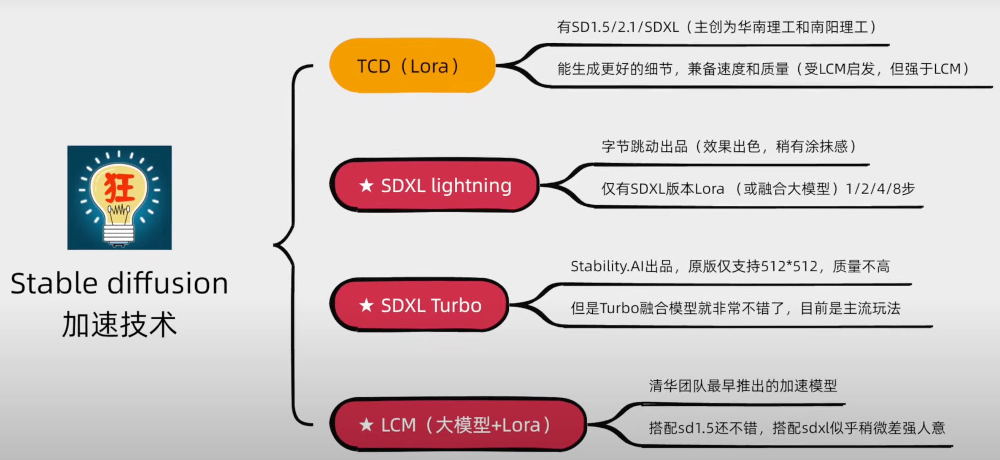

## 第四周 TODO事项
核心事项
- [ ] 进行实验，对每一次的实验，目的要明确，结果要记录，并分析。
- [ ] 完成至少4个结论的验证
- [ ] 周四完成汇报

扩展事项
- [ ] 在实验过程中，准备PaperABC本周更新内容
  - [ ] SD加速系列文章学习
  - [ ] Video Diffusion系列文章学习
- [ ] 完成至少两期视频内容的更新

其他事项
- [ ] Arxiv论文追踪
- [ ] 公众号业界新闻浏览

---

## 2024.03.24 

## TODO

## Doing

## Done
* 对昨晚跑的实验，不同的ckpt进行测试。观察和记录结果，分析实验。
  * 目前的效果都不是很好，可能存在如下原因：
    * 训练时间不够长，继续训练，看看今天傍晚效果会怎么样
    * 架构有问题，但是查了一下代码，发现没有问题。
    * 训练数据集不够大，需要扩充数据集。
* 简历更新
* 给量子位和新智元投简历
* 确定下一步要进行的实验
* 公众号新闻浏览
* SD加速系列文章学习
  *  lcm turbo sdxl-lighting  tcd
* 代码进行备份
  * Wandb默认存储位置修改

## Backlog

* Video Diffusion系列文章学习内容 准备

## Notes

SD 加速

  

---

## 2024.03.25 

## TODO

* 测试模型，更新实验结果
* 测试对比模型，验证ControlNet的具体作用是什么
* 根据上两项实验，确定下一步要做的实验
* Arxiv更新
* 公众号更新
* 简历最终版本更新
* 调研Link prediction的SOTA工作，补一些基础知识

## Doing

## Done
* Magicme推广视频更新
* Magicme知乎更新

## Backlog

## Notes    

## 2024.03.26 

## TODO

## Doing

## Done

## Backlog

## Notes    

## 2024.03.27 

## TODO

## Doing

## Done

## Backlog

## Notes    

## 2024.03.28 

## TODO

## Doing

## Done

## Backlog

## Notes    

## 2024.03.29 

## TODO

## Doing

## Done

## Backlog

## Notes    

## 2024.03.30 

## TODO

## Doing

## Done

## Backlog

## Notes    

## 2024.03.31 

## TODO

## Doing

## Done

## Backlog

## Notes    
