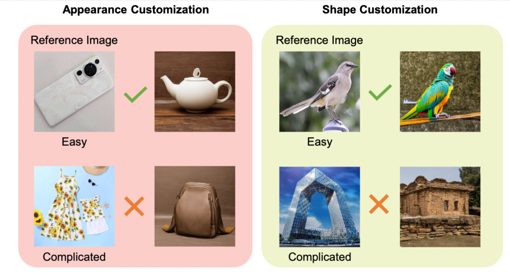
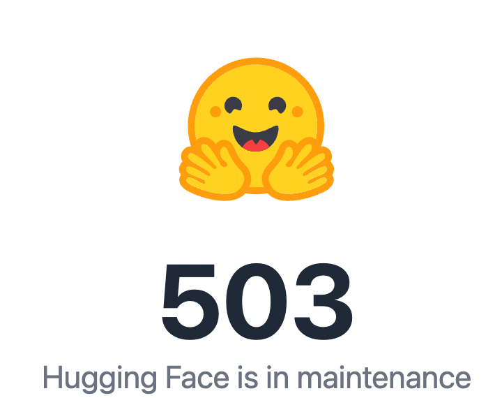

## 2024.02.21

## TODO

* 之前的idea继续打磨，论文研读，跑代码，思考这些论文的问题
  * 调通Fastcomposer代码
    * 测试case 牛顿和爱因斯坦在握手
  * 思考InstantID能否拓展到Car数据上。
* 选题，剪视频

## Doing

## Done
* 今天的Arxiv更新
* 看一下论文，准备给老师讲解思路，制作PPT
* 整理文件夹
* 阅读论文InstantID，查找人脸定制化的相关文章
## Backlog

## Notes

---

## 2024.02.22

## TODO

* 依次解决昨日讨论出的论文修改问题
  * User Study
  * 查找新指标+计算新指标
  * 平滑过度实验
* Arxiv整理
* PaperABC更新
  * InstantID论文解读，录视频。
  * DiT系列论文阅读

## Doing

* 先解决平滑过度实验
  * 先研究一下代码
  * 目前已经开始跑上了

## Done

## Backlog

## Notes

对于平滑过度实验：

* 首先，不考虑$\delta$的影响，平滑过度的效果会随着微调步数的增加，而实现越来越接近参考图像。这是一个现象。

对于新指标：

* StyleDiffusion: Controllable Disentangled Style Transfer via Diffusion Models
  * SSIM
    * Structural Similarity Index (SSIM) to assess the content similarity
  * Style Loss
    * 从style layer中提取特征，计算均方误差。
  * CLIP Image Score
* Fine-grained Appearance Transfer with Diffusion Models
  * 文中提到，没有可直接利用的指标，因为Appearance没有真值。
* Splicing ViT Features for Semantic Appearance Transfer
  *   
  * Appearance的计算完全依赖于User Study
  * Structure的计算利用的是Mean IoU，这一点我们也采用了。 

找到了新指标了：

关于Shape的一致性，不需要找新指标，只需要使用Mean IoU即可。
关于Appearance的一致性，我们参考了Cross-Image Attention for Zero-Shot Appearance Transfer中使用的指标：Gram Matrics。
  

## 2024.02.23

## TODO

* 修改论文
  * 根据昨天的过度实验，要修改论文
    * 增加对于可控程度的描述，比如可以通过权重大小控制属性的一致程度
    * 公式要添加权重
  * 今天新计算的Appearance指标，修改论文描述和表格
  * 过度实验作图
* 其他

## Doing

## Done
* 整理Arxiv
* 整理过度实验，备份好PPT
* 代码整理，ShapeInversion代码整理，之前太乱了。
  * 操他妈的，一不小心全删了。幸亏Github上有备份。直接从头整理
    * 推理代码没问题
    * 训练代码没问题
* 代码整理完毕
* 根据昨天查找到的新指标，写代码，完成计算过程。
  * 使用Gram Matrics计算Appearance的一致性（越低越好）
    * Custom Diffusion 0.0817
    * Stable Diffusion 0.1018
    * Dreambooth 0.0864 
    * Prospect 0.0842
    * **Ours 0.0791**
* 查找制作User Study的相关博客，熟悉制作过程和工具。
* 整理DiT系列论文，准备更新PaperABC
* 改到ECCV模板

## Backlog

## Notes

## 2024.02.24

## TODO

## Doing
* 自行改论文
  * 从头开始，逢山修路，遇水搭桥。
    * Introduction改完
    * Related Work改完
    * Method改完
    * Experiment 4.1改完
* 制作DiT论文的PPT
* 中午回去录视频

## Done

* 整理Arxiv

## Backlog

* 改图
  *   
  * 添加标注信息，现在不太明确。

## Notes

---

## 2024.02.25

## TODO

* 多样化的图要修改 图6
* 消融实验+结论还没改

## Doing
* 对比IP-Adapter

* 多张图会更好吗
  * 实验一 多张央视大楼 没有去掉背景
    * 每张图分别测试，生成图像
  * 实验二 多张央视大楼 去掉背景
  * 实验三 多张草莓奶油 去背景
  * 实验四 混合两种shape 根据实验1和2 决定是否去背景
  * 实验五 混合两种appearance 去背景

## Done

## Backlog

## Notes

---

## 2024.02.26

## TODO

* 修改论文
  * 多张参考图的作图
* 准备面试内容
* NND论文阅读

## Doing

## Done
* 找周老师
* 验证完代码无误后，重新设计多张参考图实验，包括shape和appearance
* IP-Adapter实验 权重下载中。

## Backlog

## Notes

---

## 2024.02.27

## TODO
* IP-Adapter实验进行
* 挑选一个最新的定制化方法进行比较

## Doing
* 多样化结果重新画图
* 多张参考图实验进行，优先进行不同外观的图像实验，验证代码是否有错
* 下午面试
* 熟悉面试内容
* 修改论文
  * 多张参考图效果作图 待定，不一定要加到正文里。
* 补充新实验

## Done

## Backlog

## Notes

IP-Adapter实验结果：
* Appearance实验结果：
  * CLIP-T：0.2578
  * gram-matrics：0.0449
  * dino-score: 0.5157

* Shape实验结果：
  * CLIP-T：0.2747
  * iou：0.4115

ControlNet-canny的实验结果：
* shape
  * CLIP分数 0.2688
  * IoU 0.7319
* ControlNet-seg的实验结果：
  * shape
    * CLIP分数 0.2788
    * IoU 0.7193

---

## 2024.02.28

## TODO

* IP-Adapter实验结果做展示，与老师商量是否还要比较
* 找一到两个最新的定制化方法，进行比较
* 整理当前benchmark，整理评测代码
* 准备面试
* 11点面试

## Doing

## Done
* 整理Arxiv论文
* 修改论文Conclusion部分
* 计算IP-Adapter的实验结果指标

## Backlog

## Notes

---

## 2024.02.29

## TODO 
* 测试StyleDrop的效果，进行对比和实验整理分析
  * 对应的论文中，相关工作还要讨论一下
    * 
    * huggingface主动维护，无法进行权重下载，无法训练。
* 昨日的IP-Adapter实验结果，思考如何放入论文中。
* ControlNet的实验结果，思考如何放入论文中。
* 修改论文对应的文本描述
* User-Study快速给出原型
* Arxiv迅速整理

## Doing

## Done 

## Backlog

## Notes

---

