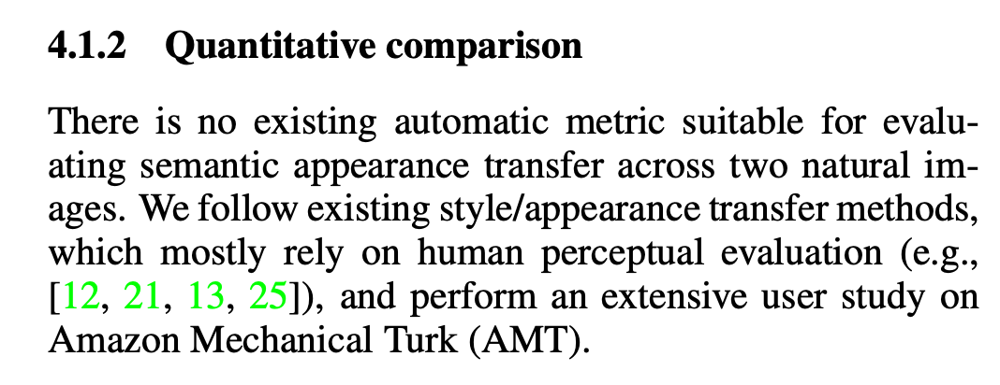
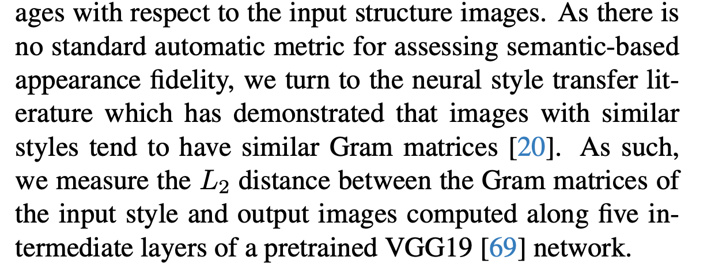

## 2024.02.21

## TODO

* 之前的idea继续打磨，论文研读，跑代码，思考这些论文的问题
  * 调通Fastcomposer代码
    * 测试case 牛顿和爱因斯坦在握手
  * 思考InstantID能否拓展到Car数据上。
* 选题，剪视频

## Doing

## Done
* 今天的Arxiv更新
* 看一下论文，准备给老师讲解思路，制作PPT
* 整理文件夹
* 阅读论文InstantID，查找人脸定制化的相关文章
## Backlog

## Notes

---

## 2024.02.22

## TODO

* 依次解决昨日讨论出的论文修改问题
  * User Study
  * 查找新指标+计算新指标
  * 平滑过度实验
* Arxiv整理
* PaperABC更新
  * InstantID论文解读，录视频。
  * DiT系列论文阅读

## Doing

* 先解决平滑过度实验
  * 先研究一下代码
  * 目前已经开始跑上了

## Done

## Backlog

## Notes

对于平滑过度实验：

* 首先，不考虑$\delta$的影响，平滑过度的效果会随着微调步数的增加，而实现越来越接近参考图像。这是一个现象。

对于新指标：

* StyleDiffusion: Controllable Disentangled Style Transfer via Diffusion Models
  * SSIM
    * Structural Similarity Index (SSIM) to assess the content similarity
  * Style Loss
    * 从style layer中提取特征，计算均方误差。
  * CLIP Image Score
* Fine-grained Appearance Transfer with Diffusion Models
  * 文中提到，没有可直接利用的指标，因为Appearance没有真值。
* Splicing ViT Features for Semantic Appearance Transfer
  *   
  * Appearance的计算完全依赖于User Study
  * Structure的计算利用的是Mean IoU，这一点我们也采用了。 

找到了新指标了：

关于Shape的一致性，不需要找新指标，只需要使用Mean IoU即可。
关于Appearance的一致性，我们参考了Cross-Image Attention for Zero-Shot Appearance Transfer中使用的指标：Gram Matrics。
  

## 2024.02.23

## TODO

* 根据昨天查找到的新指标，写代码，完成计算过程。
* 根据昨天的过度实验，要修改论文
  * 增加对于可控程度的描述，比如可以通过权重大小控制属性的一致程度
  * 公式要添加权重
* 查找制作User Study的相关博客，熟悉制作过程和工具。
* 整理DiT系列论文，准备更新PaperABC
* 其他

## Doing
* 代码整理，ShapeInversion代码整理，之前太乱了。
  * 操他妈的，一不小心全删了。幸亏Github上有备份。直接从头整理
    * 推理代码没问题
    * 训练代码没问题

## Done
* 整理Arxiv
* 整理过度实验，备份好PPT

## Backlog

## Notes