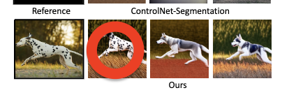
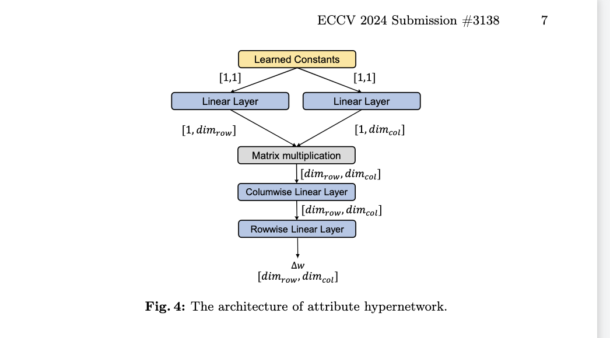
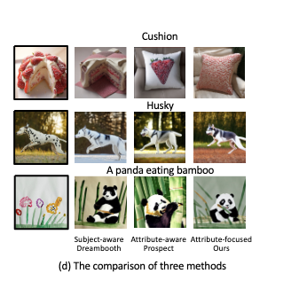
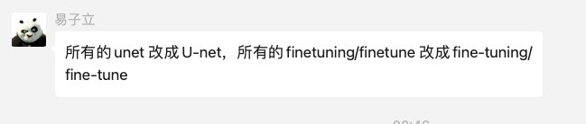

## 2024.03.05

## TODO

* 安排User Study

## Doing    

## Done
* Style的定量实验计算完成
* Style的定性画图完成
* 论文修改完成
  * style实验结果的论述分析 添加上去
  * 调整后文内容，与摘要，Intro措辞保持一致。
    * efficient and 高质量如何体现
    * 强调control
    * 同时也强调效率和生成质量上的平衡。
* 调整论文排版，限制14页内

## Backlog

## Note

论文TODO：

*   
  * 替换 1 2（斑点狗和狼） 生成图像
*   
  * 横向画法

论文Done

*   
  * 添加material shape style  
  * 子标题修改 comparisons of subject-driven, attribute-aware, attribute-focused personalization of T2I models

---

TODO
* 表格删除user study列
* 检查表 
* 检查图

  

简单调研一下四个科研方向：

LayerDiffusion：透明图，这个能干什么？未来？仅仅是替代Inpainting吗？

