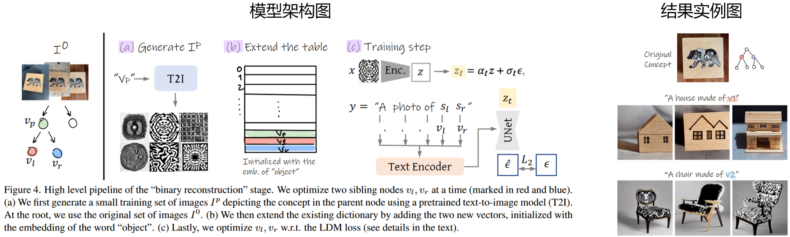
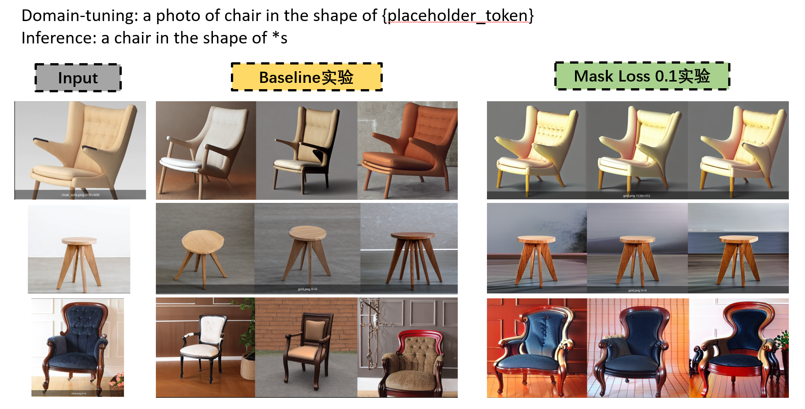
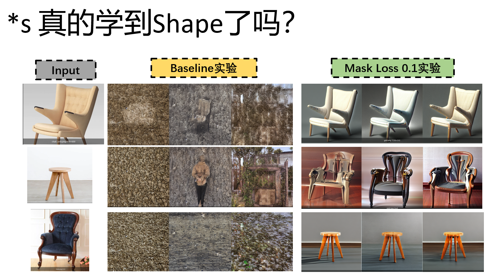

# **个人科研进展**

---

## **1、现阶段属性反转的一些工作**

 

**Concept Decomposition for Visual Exploration and Inspiration, Siggraph 2023 conference, Cohen-Or, Daniel**
 

* **可以实现给定example 图像不同属性的inversion**
  * **但是被反转出来的属性的含义不明确，无法显式指定。**

---

## **2、我们的Shape Inversion实现方案**

* 基于现阶段Inversion定制化的**SOTA架构**：
  * **E4T**: Encoder-based Domain Tuning for Fast Personalization of Text-to-Image Models
  * 

### **2.1 我们的设置**

 

**实验数据：**
* 数据集1，**100**张不同椅子的渲染图像。
* 数据集2，**86**张不同狗的图像

 

**Text prompt：**
  * **a *s chair ---> a chair in the shape of \*s**
    * 希望利用短语引导相关aspect的学习

**添加了一个Mask-CrossAttnMap引导的loss**
  

### **2.2 实验细节**
* 4张A40训练2小时

### **实验结果**
 

**对原图进行重建**

  

---

**\*s学到了什么**
 

---

**二次editing，结构保持的如何？**
  

  

---

**其他数据上的实验**
  

---
## **会议总结**

1. shape和mask的定义角度不一致，然后约束起来有点矛盾
   1. shape应该是无角度的，mask只是固定视角下的一个投影而已。所以你用mask约束，他必然只能得到这投影下的结果。
2. 一定要探究清楚E4T这些工作编辑的时候具有多样性的原因、我们的方法为什么编辑起来多样性有些差、
   1. 输入图像的复杂度，是否和输出的多样性有关系（diversity为什么缺失了）
   2. diversity这个东西 能不能设计一个模块，给弥补出来
   3. 比如输入比较复杂，输出的结果就很多样性，是不是因为模型拿捏不了图像了，所以就有多样性了
3. mask 作为输入 搞个encoder，然后提出S\*mask 和 S\* 的embedding做loss
4. shape是cross-category的，这个现象需要好好深入思考，然后总结趋势，最好能够设置一个特定的模块，进一步放大这个效果
5. 老师说这个做法可以总结为guided-concept learning 
6. pose 是不是也可以做。肯定是要做多个token的，还可以做pose，还可以做style
---

## **接下来要做的事情**
* 能否用多视角图像进行训练，弥补单视角mask的局限性：
  * 我们方法多样性差的原因，可能是我们过于受限于当前视角的mask图像信息了。
  * 如果我们能用多视角图像一起训练，所有的mask视角图像一起可能是shape的一个逼近的表达，以这个为条件进行训练。
  * 设计一个多样化信息弥补模块
    * 比如你可以弥补一些其他角度mask的信息，提升多样性
  * editing多样性可能和输入图像的复杂程度有关系
    * 太简单的图像可能就被模型拿捏了
    * 复杂点的图像，可能不就不会被拿捏
  * 是否和训练的时候 mask loss的weight有关系
    * 比如weight越大，多样性就越差
* mask 作为输入 搞个encoder，然后提出S\*mask 和 S\* 的embedding做loss
* shape是cross-category的，这个现象需要好好深入思考，然后总结趋势，最好能够设置一个特定的模块，进一步放大这个效果
* 做多个token，下一步是pose和appearance

