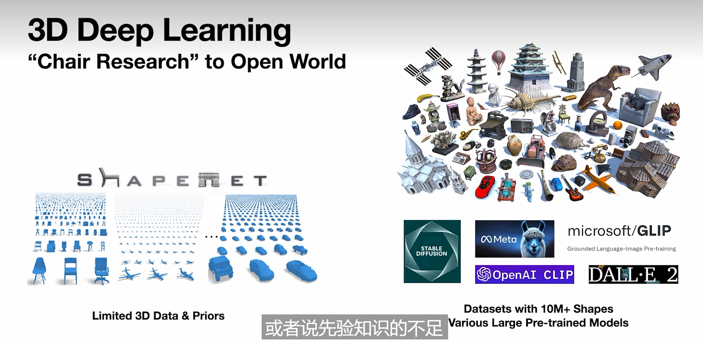
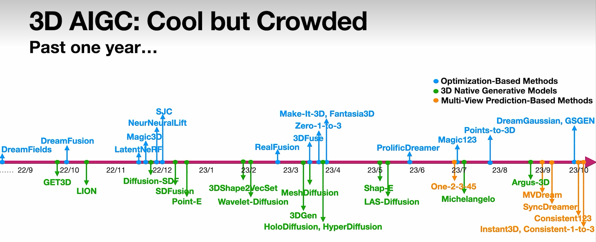
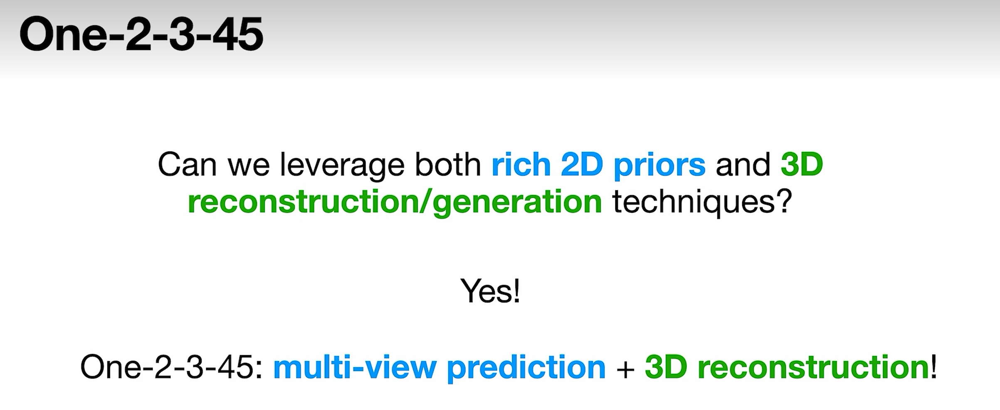
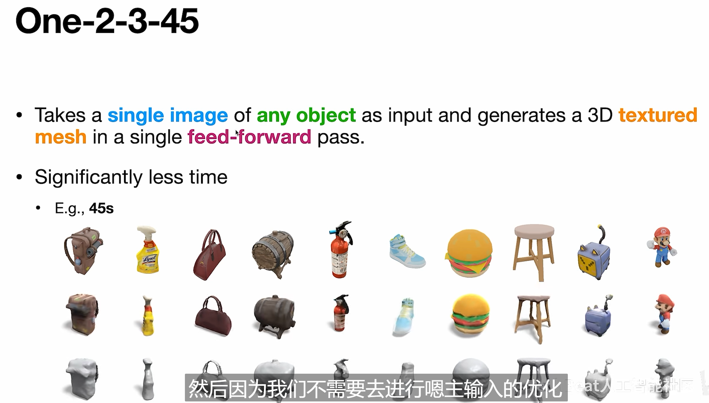
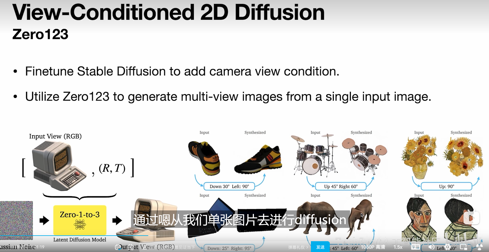
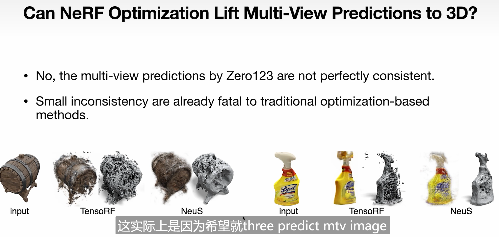
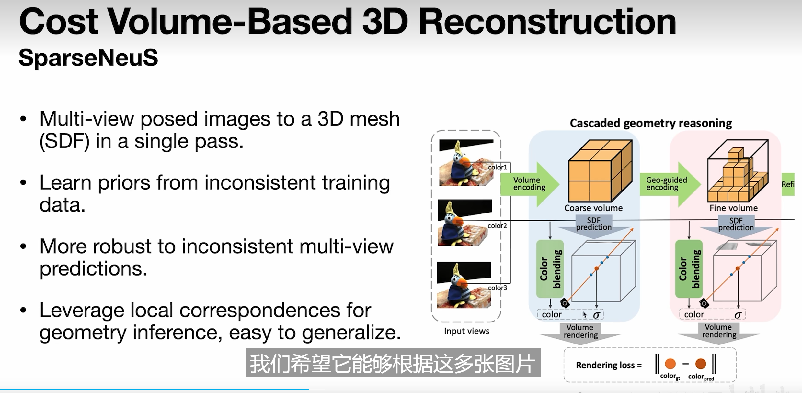
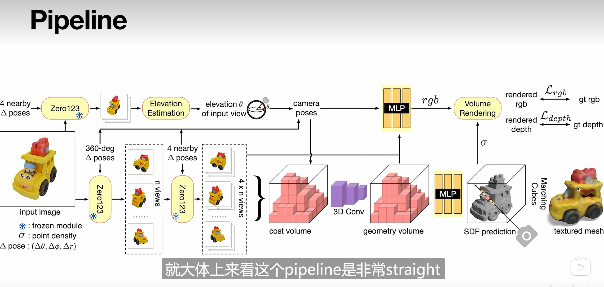

  

哈哈哈 "chair research"。

---

  

上图的分类有些东西：
1、要重点关注Multi-View Prediction-Based Methods

---

  

  

---

  

  

直接将0123模型的输出结果，也就是多视角图像，拿来训练NeRF，得到3D Mesh，发现效果并不好。一部分原因是：0123得到的多视角图像并不一致。

  

基于coarse-volume的方法都3D的不一致，有更好的应对。

---

  

