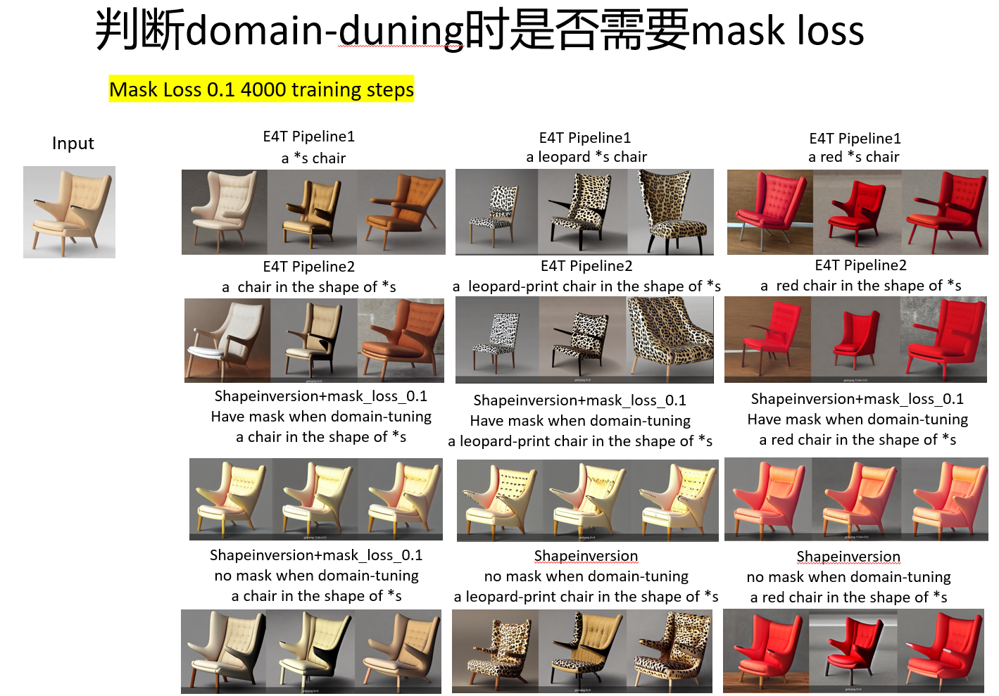
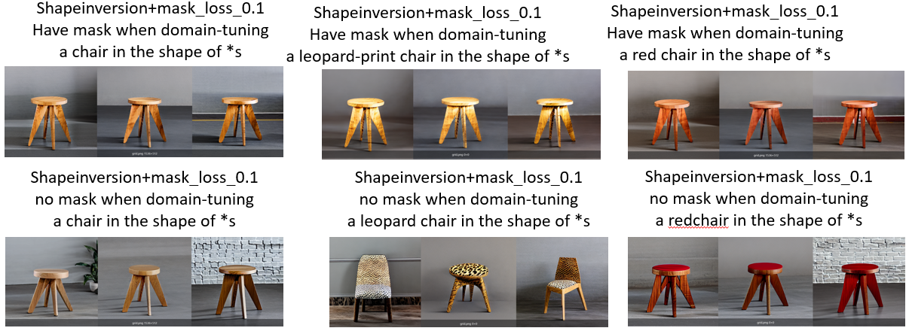

- [**实验概述**](#实验概述)
- [**实验代码及训练细节**](#实验代码及训练细节)
- [**实验现象总结与分析**](#实验现象总结与分析)
- [**实验结论**](#实验结论)

## **实验概述**
* 其实今天我在测模型的时候，突然想到E4T架构下，在pre-training之后，还需要对单图像进行domain-tuning。我在训练ShapeInversion的时候，同时引入了Mask loss Idea，而且Mask Loss Idea是在Pre-training和domain-tuning都存在的，而Mask Loss idea的作用是进一步强化*s表达shape。因此，在pre-training阶段添加Mask Loss，是合理的。**但是在单图像的domain-tuning的时候，可能就会严重过拟合到mask上，导致编辑能力变差。** 目前只能给出这样的解释。

## **实验代码及训练细节**
我们分别选取了之前cross-attention based mask loss的多次实验的预训练模型，分别是weight=0.1，0.5，1.0。
因为我们怀疑是domain-tuning阶段的Mask Loss导致的editing能力下降。因此，我们加载预训练模型（pre-training的时候是有mask loss的），并在domain-tuning的时候，直接去掉Mask Loss。

## **实验现象总结与分析**
  

  

## **实验结论**

