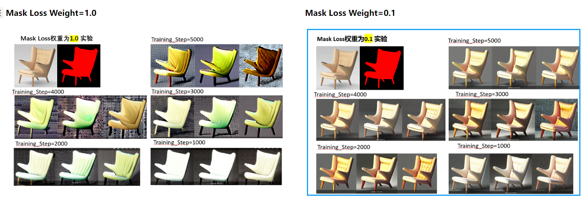
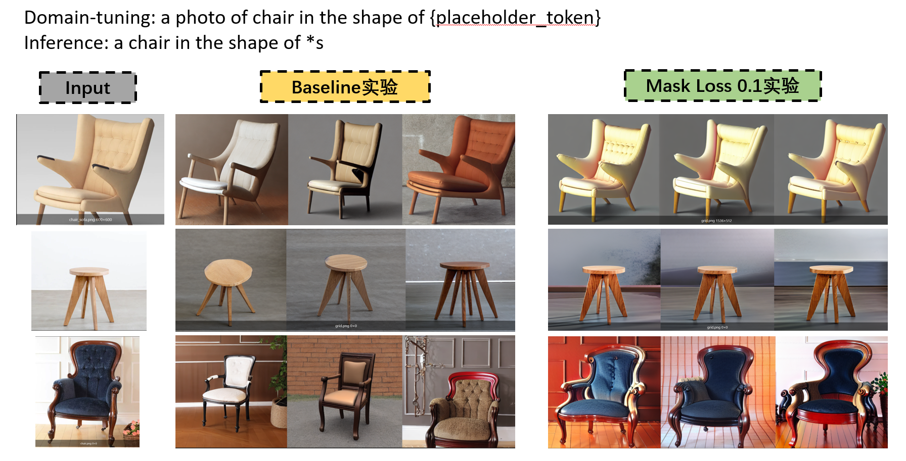
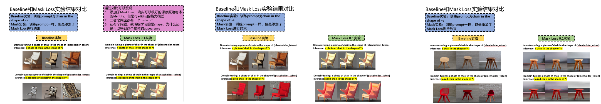
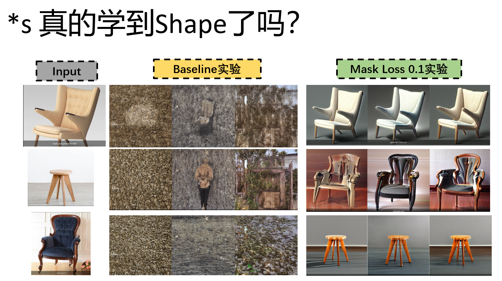
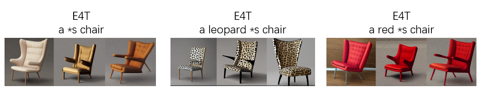
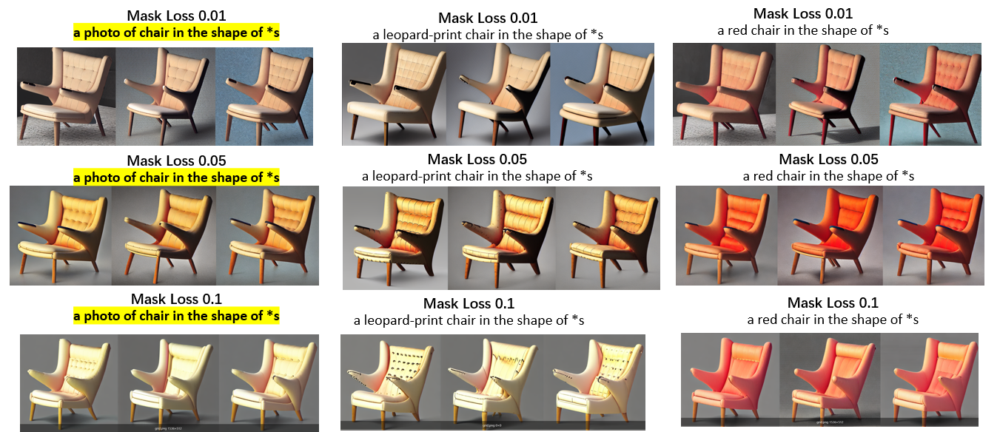
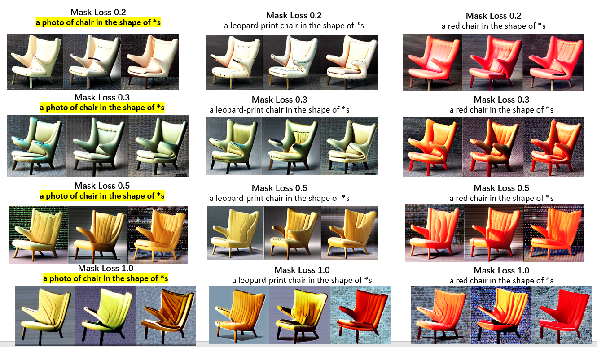

## **实验概述**
本实验是在[[Research.Experiments.ShapeInversion.e4t_baseline_exp]]的基础上，添加Mask Loss，同时研究不同weight下的Mask Loss，对实验的影响。
（注意baseline实验指的是，prompt是... chair in the shape of *s）

## **实验代码及训练细节**
1. Wandb训练细节及代码备份：[https://wandb.ai/wangye889905/shapeinversion_baseline_v2_mask_loss_idea?workspace=user-wangye889905](https://wandb.ai/wangye889905/shapeinversion_baseline_v2_mask_loss_idea?workspace=user-wangye889905)
2. github release代码备份：[https://github.com/wangyePHD/ShapeInversion/releases/tag/Mask_Loss_Idea](https://github.com/wangyePHD/ShapeInversion/releases/tag/Mask_Loss_Idea)

## **实验现象总结与分析**

### **实验一：Mask Loss Weight的影响**
  
通过以上实验结果图的对比，**可以发现，最适合的Mask Loss还是0.1。**

### **实验二：对原图的重建能力**
  
通过上图实验发现，有了Mask Loss进行约束，我们生成的物体的shape，是非常接近原始输入图像的。而Baseline的方法却不行。

### **实验三：Inversion得到的*s的编辑能力**

  
从上述实验结果来看，Mask Loss约束下的*s的编辑能力和原始的baseline相比，有所下降。所以从目前俩看，shape identity的保持和Editing的能力之间存在Trade Off。

### **实验四：\*s 真的学到了Shape信息了吗？**
我们这里采用直接将*s生成出来，看一下效果。
  

如果只是从结果上来看，Mask Loss实验得到的结果确实要比baseline的结果好太多。
但是我目前还是怀疑，*s中包含的信息不只是shape。

### **实验五：受限的editing能力和Mask Loss Weight有关系吗？**
我们分别训练了**weight=0.01, 0.05, 0.1, 0.2, 0.3, 0.5, 1.0**下的，对三个文本的生成能力。第一列是原始的base prompt：“**a photo of chair in the shape of \*s**”, 第二列是编辑文本1“**a leopard-print chair in the shape of \*s**”，第三列是编辑文本2 "**a red chair in the shape of \*s**"。
  
  
  

**分析如下：**
* 我们发现，Mask Loss weight过大的话，网络就会把*s学成mask的样子，而忽略了原始的图像内容，因此需要一个较小的weight获得一个trade off。我们发现0.1目前的效果还不错。
* 无论是哪个weight，我们发现第二列、第三列的编辑结果和E4T相比，edit的程度都受限制。尤其是豹纹这一列。
* limited editing能力可能还需要分析Mask Loss的机制

---
## **实验结论**

1. **Mask Loss能够很好的保持物体原始的结构**，相对于[[Research.Experiments.ShapeInversion.e4t_baseline_exp]]未使用Mask Loss来说，我们生成的物体的shape基本符合原始shape。

2. **Mask Loss Weight不能太大**，我们对比了两组0.1和1.0，发现0.1更好些，过大的weight，会导致模型过于专注于学习mask-shape，而忽略了本身物体的内容。

3. **Mask Loss虽然保持了很好的shape Identity，但是对于editing的自由度可能有一些牺牲。（有待进一步确定）**

