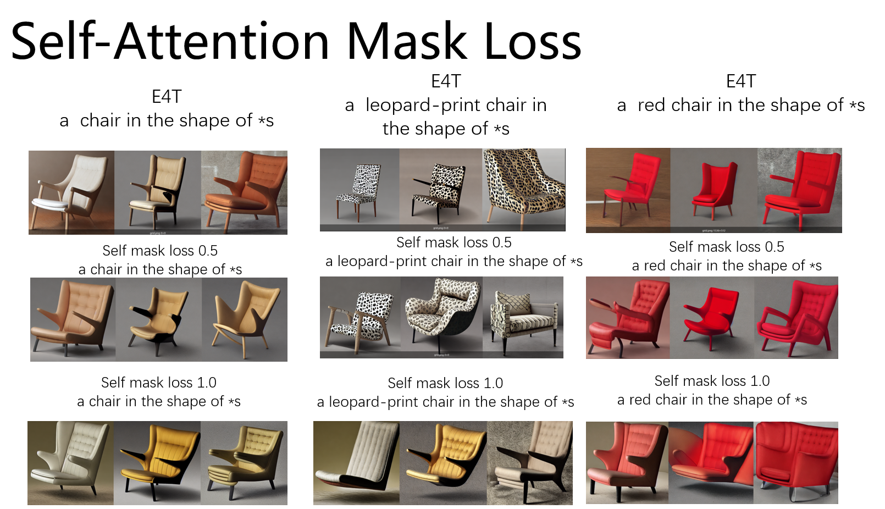

- [**实验概述**](#实验概述)
- [**实验代码及训练细节**](#实验代码及训练细节)
- [**实验现象总结与分析**](#实验现象总结与分析)
- [**实验结论**](#实验结论)

## **实验概述**
在本实验中，我们替换了之前实验[[Research.Experiments.ShapeInversion.mask_loss_idea]]中的cross-attention，而是使用了self-attention与mask构建loss。

## **实验代码及训练细节**
* 实验代码：[wandb本次实验代码备份](https://wandb.ai/wangye889905/shapeinversion_baseline_v3_mask_loss_idea/runs/txy0ni88/code?workspace=user-wangye889905)
* 训练细节：[wandb本次实验训练细节](https://wandb.ai/wangye889905/shapeinversion_baseline_v3_mask_loss_idea?workspace=user-wangye889905)

## **实验现象总结与分析**
  
* 从上图我们可以发现，self-attention 引导的mask loss，效果并不好。

## **实验结论**

* 对比cross-attention，我们发现self-attention不太适合做mask loss。
