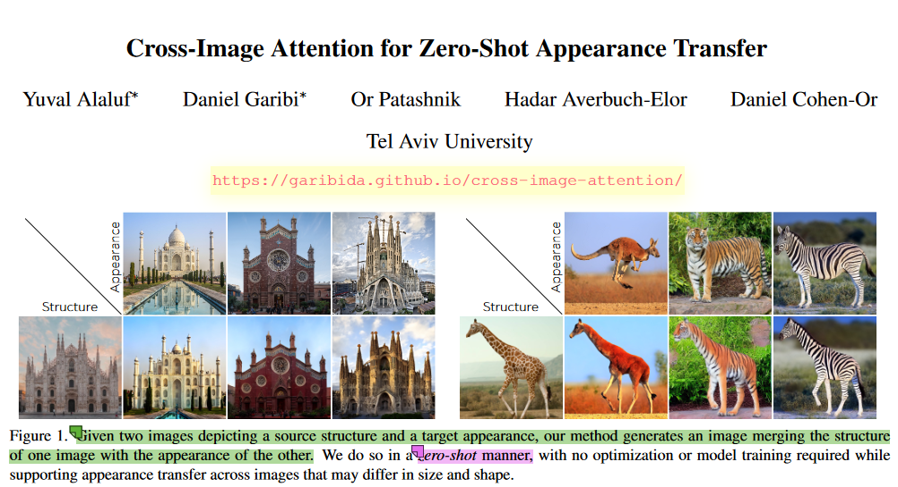
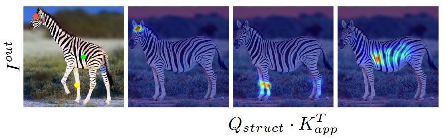

## In a word

本篇论文提出了Cross-Image Attention的方法来实现Zero-Shot的Appearance Transfer。
从实现的效果来看，模型的效果很鲁棒，对于不同size和shape的物体，或者是差别很大的cross-category都能得到很不错的效果。

  

## Motivation
总结来看，之前的工作都是需要训练一个非常复杂的generator。同时在做Appearance Transfer的时候，source和target的跨度不能太大。

## Method

  

最核心的内容，就是作者提出的Cross-Image Attention。这个东西是什么呢？请看下图：

  
我们简单总结一下，给定structure image和一个appearance image，我可以令K，V是Appearance Image，Q是structure image，然后他们做常规的Self-attention操作，可以发现，两张不同的图，长颈鹿和斑马的语义是能够对应起来的，比如脖子对脖子，腿对腿。

其次作者从论文MasaCtrl TokenFlow及Infusion中，观察到，只要固定住self-attention的k和v，SD的得到的图像的appearance是不发生改变的。这一点非常关键。

基于这个观察，作者就搞了Pipeline中的两个分支，上面的分支用来接收appearance target图，并得到K和V，注意这个KV是从appearance图像中提炼出来的，自然就能包含了外观信息。此外，下分支接收structure source 图像，得到Q，用来保持结构或者shape。

整个架构当然还包括其他小的component，这里不过多介绍。最主要的就是两点：
1. **两个图之间的cross-attention，是能够得到语义上的对应关系的**
2. **基于MasaCtrl等论文的观察，SD中freeze住self-attention的K和V，就能够保持appearance不变。**

## Insight

1. **两个图之间的cross-attention，是能够得到语义上的对应关系的**
2. **基于MasaCtrl等论文的观察，SD中freeze住self-attention的K和V，就能够保持appearance不变。**

## Results
略

## More

**一些相关的文献工作：**

**Translation相关：**

* Diffusion self-guidance for controllable image generation.
* Diffusion-based image translation using disentangled style and content representation
* Enabling drag-style manipulation on diffusion models
* Splicing vit features for semantic appearance transfer

**SD相关:**

* Masactrl: Tuning-free mutual self-attention control for consistent image synthesis and editing
* Tokenflow: Consistent diffusion features for consistent video editing
* Infusion: Inject and attention fusion for multi concept zero-shot text-based video editing