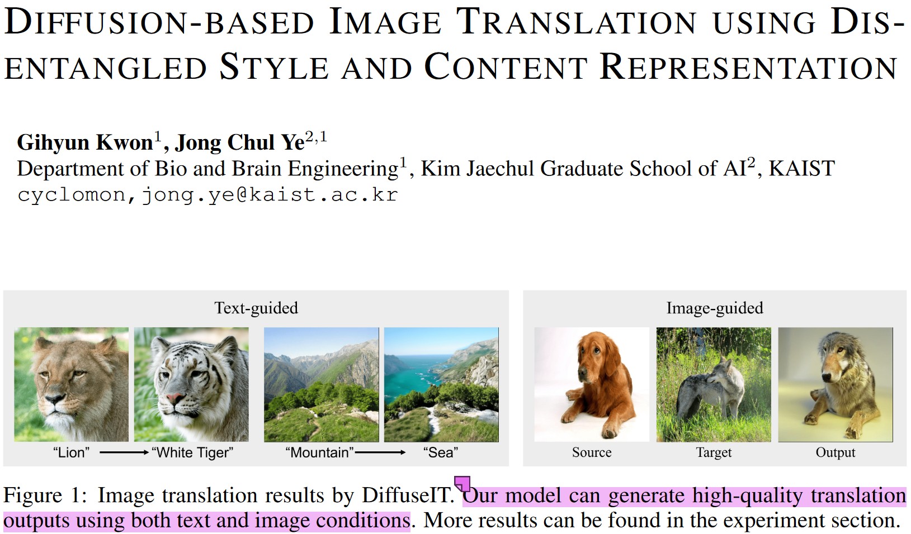
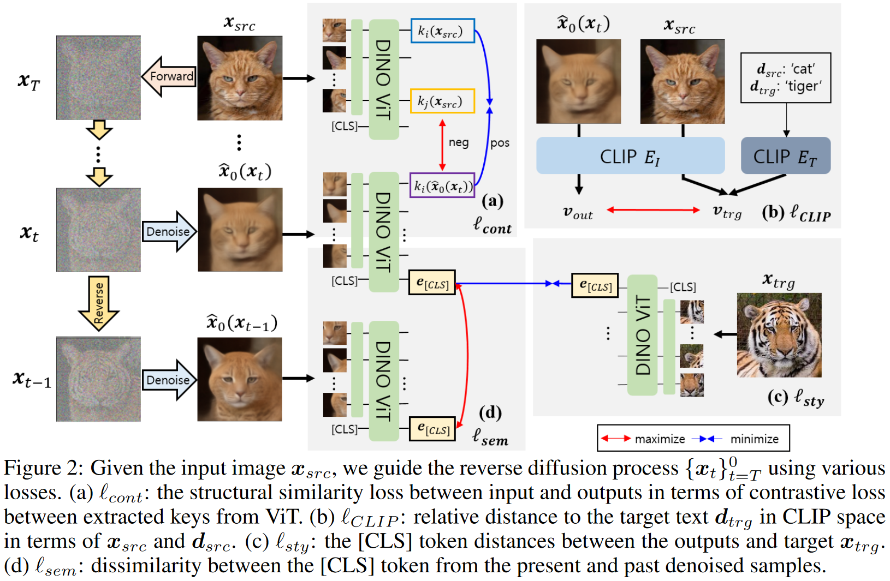
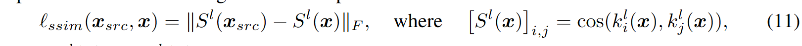
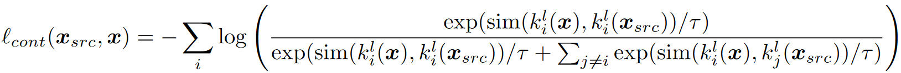
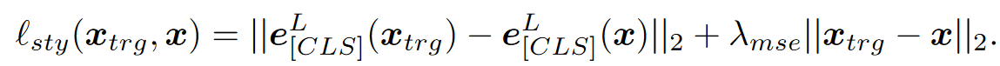
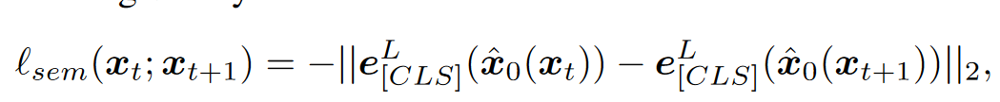
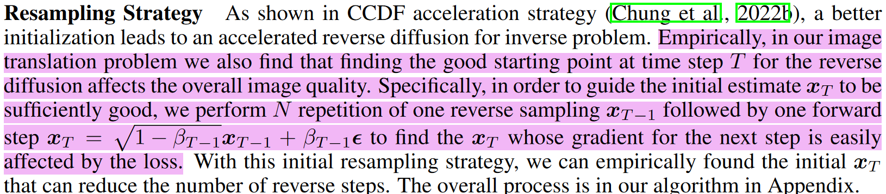

## In a word

这篇论文利用DINO-ViT，配合Diffusion Model，实现对Image的Style和Content的解耦，同时可以支持image-guided和text-guided Image Translation工作。

  

**this is the first unconditional diffusion model-based image translation method that allows both text- and image- guided style transfer without altering input image content.**

---

## Motivation

实际上，在这篇工作之前，基于Diffusion的Text-guided或者Target-image-guided的Image Translation效果还可以，同时不受限于特定的domain。但是这篇文章认为之前的工作在Reverse Inversion的时候很难保持原始图像的content。

**因此，本篇论文提出a novel diffusion-based unsupervised image translation method, 可以使用解耦出来的content和style representation。**

---

## Method

  

其实本工作最核心的就是4个损失函数。下面分别介绍一下：

**Structure Loss**

其实Structure Loss是inspired by [[Splicing ViT|Research.Paper.Notes.Image_Translation.Splicing ViT Features for Semantic Appearance Transfer]], 在Splicing ViT文章中，使用了key的self-similarity矩阵作为图像structure的表达，然后比较生成图像和structure image之间的结构相似程度，如下：

  

这篇文章在此基础上稍微进阶了一下，他的观点是structure的一致性应该建立在patch-level，核心思想就是：不同时刻下生成图像和原图像在相同patch上结构应该一致，其他应该不一致。显然就是要利用对比学习。

  

**Style Loss**

Text-guided 略。专门总结一下Semantic Style Loss for Image-guided Image Translation。

style loss其实也是在[[Research.Paper.Notes.Image_Translation.Splicing ViT Features for Semantic Appearance Transfer]]工作的基础上，进行的拓展。
其实就是在原始的CLS loss的基础上，添加了一项mse loss。
  

**Semantic Divergence Loss**

作者希望能够加速采样生成的过程，于是在生成的时候，引入了如下损失，核心思想就是希望不同的时间不之间的CLS 差异变大，而Structure保持一致。能够加速采样过程。

  

**Resampling Strategy**

we also find that finding the good starting point at time step T for the reverse diffusion affects the overall image quality。

  

---

## Insight

其实整体来看，insight并不多，主要还是受到了[[Splicing ViT|Research.Paper.Notes.Image_Translation.Splicing ViT Features for Semantic Appearance Transfer]] 的启发。

## **一起来看一下审稿意见吧**

Paper Decision：

This paper was reviewed by four knowledgeable referees. The reviewers found the contributions sound (VSVg) and simple (9VMA), the paper clearly written (VSVg, swjc, 9VMA), the qualitative results impressive/pleasing (VSVg, CBU), and the experiments rather convincing (9VMA, swjc, CBU4). The reviewers raised concerns w.r.t. the novelty (VSVg, 9VMA), the comparisons with methods which do not use pre-trained models (VSVg), the missing comparisons with losses based on different representations (CBU4), and the limitations (which were not discussed) (VSVg). The authors engaged in discussion with the reviewers and adequately addressed all their concerns. After discussion, **some reviewers still find the novelty limited (combination of existing techniques) but they do agree that this paper is the first to show great results with those techniques, and has the potential to stimulate further research in this direction.** Therefore, the reviewers lean towards acceptance. The AC agrees with the reviewers and recommends to accept. The AC strongly encourages the authors to include the reviewers feedback in the final version of their manuscript - in particular, toning down statements w.r.t. achieved diversity, including the limitations (failure cases) discussion in the main body of the paper, and adding the reported results without the pixel-wise l2 loss.

有一些reviewer认为这篇工作的创新度较低，但是他们认可这篇工作是first work，也认为未来可能会促进一部分研究。

Reviewer1：
1.  Although results are very impressive on the animals and landscapes dataset, **the technical novelty of the paper is very constrained**. In the Figure 2, **almost all the components have been explored in the previous work.**
2.  **What are the failure cases of the proposed method? It is important to mention the failure cases in the main text and show more results in the supplementary material.** (很看重failure case)
3.  The paper is clearly written with a good amount of details. **While the results look impressive, the novelty is a bit limited as mentioned in the review**. The paper contains sufficient details for a domain expert to reproduce. However, it would be great if the code can be open-sourced in the future.

（6: marginally above the acceptance threshold）

---

Reviewer2：
有点水，就不总结了。

---

Reviewer3:

这位reviewer提了一个关于**如何评价structure一致性的实验**：

总结来说就是，利用Segmentation的mask来评估，跟我想一块去了。
The goal of keeping content structure unchanged can be verified by segmentation experiments rather than user studies. For example, you can train a segmentation model on the target domain and then test it on the images generated from the source domain. Since the content structures are preserved, the predicted mask would be close to the mask of source images.

The idea is simple, and the methodology is described clearly, which makes it easy to follow. The experimental studies are sufficient. The novelty of this paper should be above the borderline.

6: marginally above the acceptance threshold

---

Reviewer4：

It seems that the contribution of this paper is to propose L_cont and L_sem to represent the content and style information. However, it is not clear why such representation is superior compared with alternatives (e.g., VGG-based ones[1]). It will be interesting if the authors could have a thorough comparison.

Overall, the presented idea looks new, and the performance is promising. The authors have also conducted significant experiments to support their claims. Therefore, I vote for acceptance at this stage.

8: accept, good paper

---

**总结来看，这篇文章能中，第一点效果好，第二点写的清楚，第三点创新虽然不足，但是也有一些创新。第四，审稿人还是很nice的**