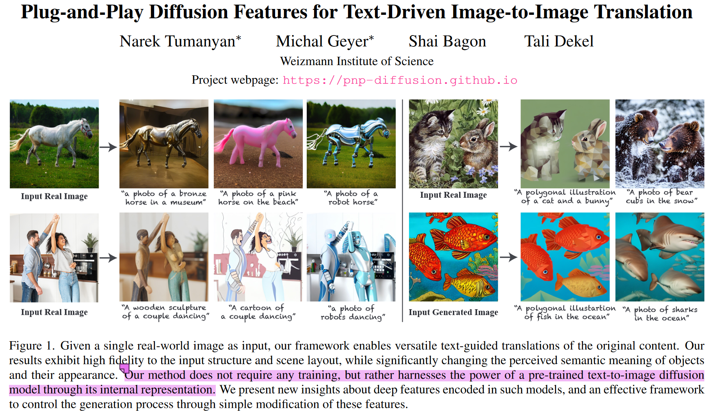
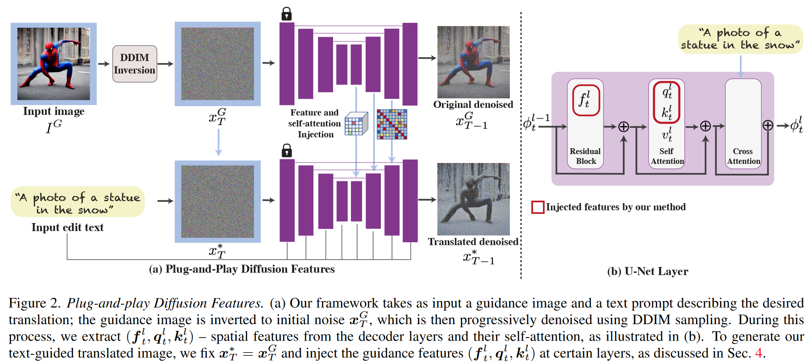
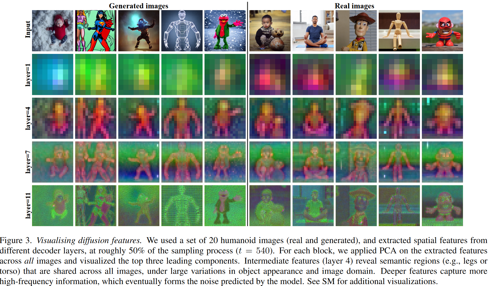
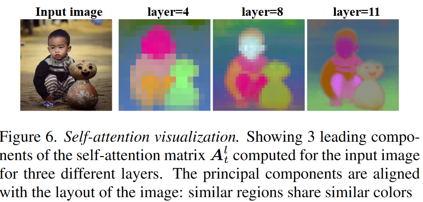
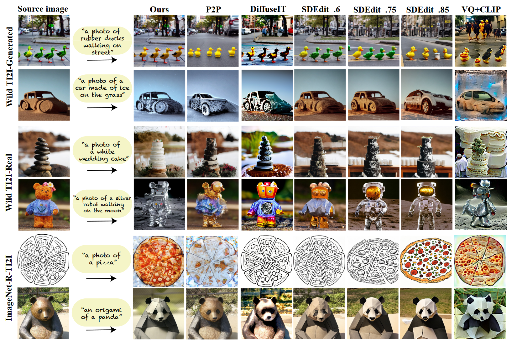

## In a word

本文深入地分析了Stable Diffusion内部representation的作用，提供了关于**如何通过利用内部spatial feature和self-attention机制来控制图像结构不变的insight**。从而实现了不需要训练，便可实现Text-guided Image Translation。

  

## Motivation

作者希望在做Translation的时候，使用原图保持structure，然后文本提供appearance的修改。实现text-guided image2image translation。

## Method

  

实际上方法，真的很简单。简单一句话总结，就是构建双路branch，一路用来做原图的DDIM inversion，并从inversion noise的sampling阶段提取spatial feature和self-attention信息，然后注入到下面的分支中。用来保持下面分支的结构。下面的分支接收文本prompt，来修改图像外观信息。

## Insight

  

（1）**spatial features extracted from intermediate decoder layers encode localized semantic information and are less affected by appearance information（Unet的decoder的中间层其实就是ResNetBlock的输出包含了丰富的语义信息，且不容易受到appearance的影响）**

 

（2）**self-attention representing the affinities between the spatial features, allows to retain fine layout and shape details (self-attention描述了空间特征之间的相似程度，因此，可以表示layout和shape信息).**

## Results
  

## More

**简单记录一下我的启发：**

> 实际上这篇论文的创新大吗？解法新吗？ 我不认为解法很新，也不认为创新很大。但是为什么这篇论文能中呢？我认为主要有三点：
* 第一，效果好。
* 第二，论文排版，作图清晰，读起来一气呵成
* 第三，提供了有用的insights。我觉得这个才是最重要的。
* 那我以这个标准来要求自己，只要我的工作能提供这个领域没有的insight，我的效果好，我写的好。ok，我自己就满意了。  

