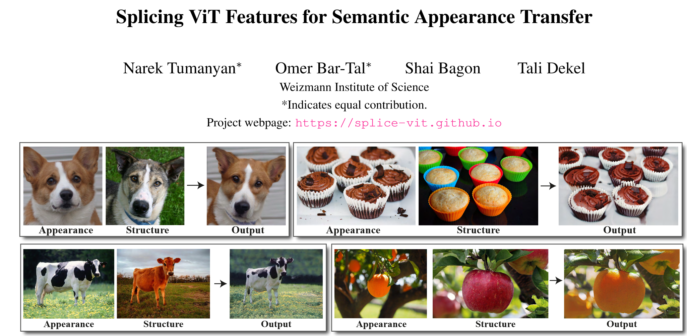
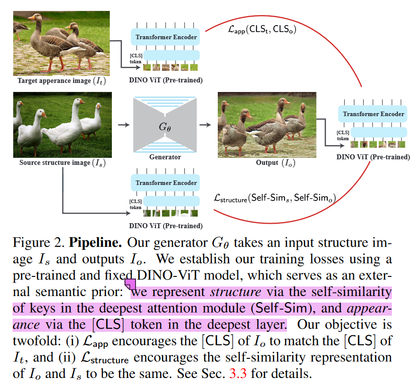
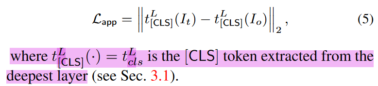
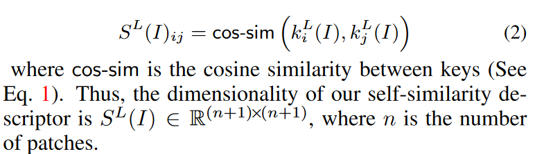
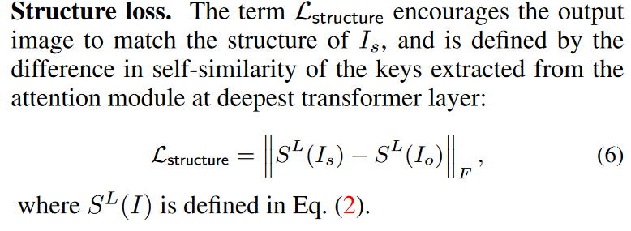
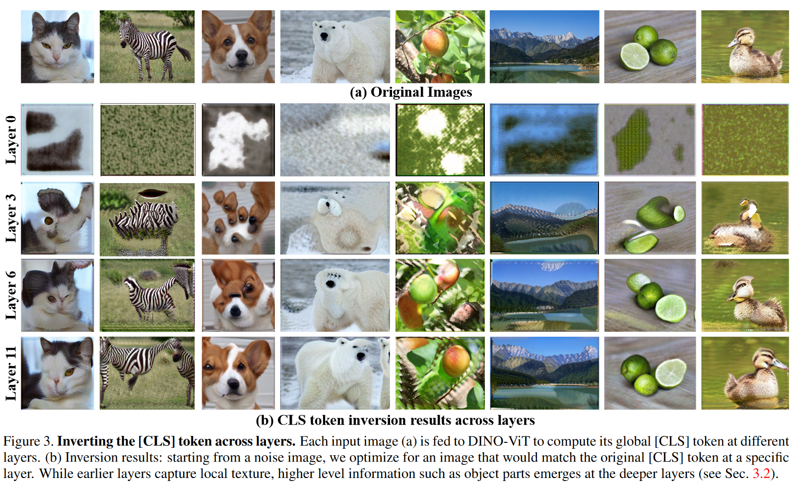
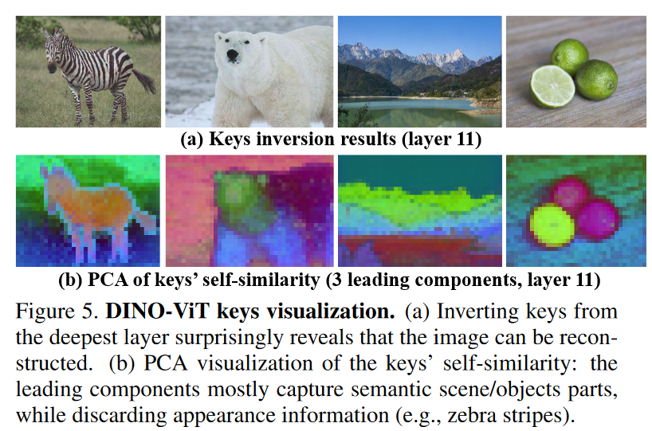
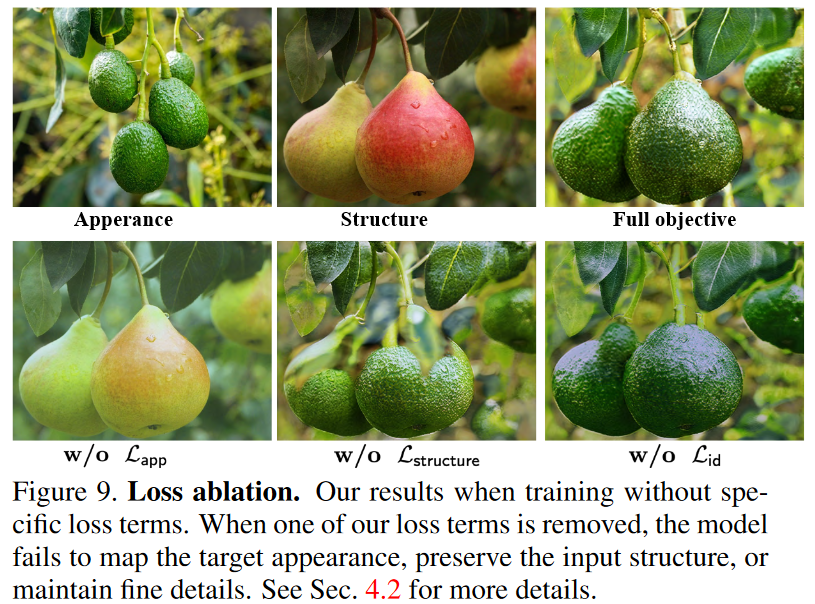
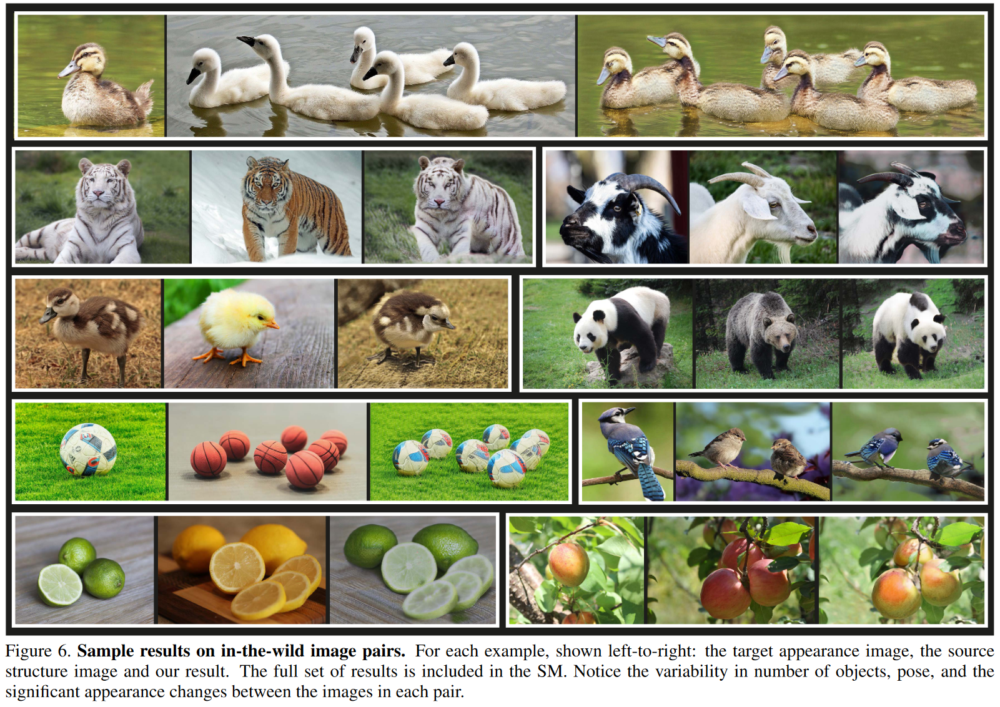
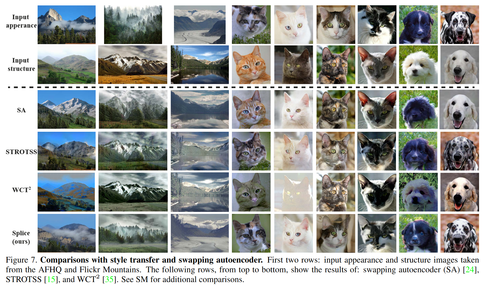

## In a word
本文解决的是如何将target图的appearance迁移到source图上，同时保持source图的结构不变。也就是所谓的Appearance Transfer。
  

## Motivation

在之前，基于GAN的方式去做Domain-Transfer或者Image-to-Image Translation, 都需要去收集pair-domain的数据来训练GAN，这样的方法受限于特定的domain。

后续出现了image-to-image translation methods trained on a single example，这种方法利用了low-level的visual information。

Neural Style Transfer（NST）这种方法实际上是利用预训练的网络例如VGG，来编码global-style。

semantic style transfer是将appearance信息，在语义相关的区域上进行transfer。

作者希望解决上述问题，提出了一个pair-example的Appearance Transfer方法。

## Insight

本文最终要的Insight是关于DINO-ViT的：
* DINO-ViT的CLS token representation实际上是对visual appearance的强大表示。不仅包含了纹理信息
* DINO-ViT的deepest layer的输出特征能够提供强大而丰富的semantic information

## Method

  

本文的方法比较直观。input是[target image，source image]，target image用来提供appearance，source image来提供structure。利用一个生成器，输出一个output图像，包含了原图的structure和target的appearance。

1. 目标图输入DINO-ViT，提取deepest layer的CLS特征，作为Appearance的表达。
2. 原图输入至生成器，生成一张图，也输入至DINO-ViT，同样得到CLS特征，
3. 基于上述特征，直接做Loss，用来监督appearance的一致性。

**Loss appearance如下：**

  

接下来就是structure如何保持的问题了。什么样的representation能表示structure呢？
1. 首先要对局部的texture非常鲁棒
2. 同时能够保存一些布局的信息、形状信息、能够感知物体及其周围的语义信息

作者这边给出的结论是：“直接利用DINO-ViT的Deepest layer spatial feature，其实就是最深一层的输出特征，来计算一个self-similarity矩阵作为structure的表达”。

具体就是取deepest layer的K Matrix，假如图像有20个patch，加上一个CLS，就是21。最终可计算一个21*21的self-similarity 矩阵。用这个矩阵来描述自身的structure信息。

  

然后，就可以利用上述来约束两张图之间的structure。

  

## Experiment

作者首先利用实验分析了一下CLS和self-similarity的特点：

  

首先是上图，通过Feature Inversion技术可视化了多层的CLS的特征的可视化结果，可以看到CLS确实关注到了appearance信息。

  

这是利用PCA对self-similarity key matrix进行可视化的结果。可以看到，确实关注到了structure的信息。

接下来看一下消融实验：

  

## Results

  

  

## Cons

其实这样的方法是依赖于DINO的，如果DINO在某些数据上的性能不好，那该方法就不work了。

## More

* **Neural Style Transfer**: represents content and an artistic style in the space of deep features encoded by a pre-trained classification CNN model (e.g., VGG). While NST methods have shown a remarkable ability to globally transfer artistic styles, their content/style representations are not suitable for region-based, semantic appearance transfer across objects in two natural images
* **Feature Inversion**: visualization techniques previously used in the context of CNN features

the global token (a.k.a [CLS] token) provides a powerful representation of visual appearance, which captures not only texture information but more global information such as object parts, and 

(ii) the original image can be reconstructed from the deepest features, yet they provide powerful semantic information at high spatial granularity.

