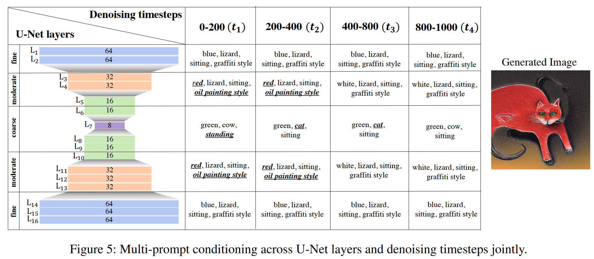

  

## In a word
之前的Textual Inversion技术，比如经典的[[Research.Paper.Notes.Textual Inversion.An Image is Worth One Word Personalizing Text-to-Image Generation using Textual Inversion]]中使用的方式，给定一个字符，利用重建降噪损失不断优化该字符的embedding表示，最终实现利用该字符表示当前图像中的Concept。

与上述技术截然不同的是，P+利用了多个embedding，分别注入UNet的不同层中，实现了多属性的Textual Inversion。

  

## Motivation

之前的方法，比如Textual Inversion或者Dreambooth，都只能做global concept的inversion，没有办法实现某种子属性或者子概念的inversion。
如何才能实现sub-concept的inversion呢？

## Method

作者的一个最直观的想法就是说：SD中UNet的每一cross-attention layer层在生成过程中扮演的角色是不一样的。 于是作者做了一个简单的实验来验证这一观点：

  

可以发现，类似于red或者green这样的颜色信息是在fine outer layers生成的，也就是resolution较高的层。而诸如content或者形状都是在coarse inner layers产生的。也就是mid-block的区域。

这一直观的发现，促使作者设计了P+ Space:

  

那么后续的优化目标和Textual Inversion是一致的，都是在给定Textual 条件下，实现noise的估计。只不过在P+中，需要多个token同时被优化。一旦优化成功，不同的p就学习到了不同的sub-concept。

  

## Insight

  

其实P+的结论可以从另外一篇文章 [[Research.Paper.Notes.Textual Inversion.An Image is Worth Multiple Words: Multi-attribute Inversion for Constrained Text-to-Image Synthesis]] 中，进一步的体会：

  

这张图其实不仅从cross-attention layer的角度，还从timestep的角度，协同论述了一下不同的属性是在哪个阶段哪个layer产生关系的。

**object: coarse层**

**pose或者latout：coarse层**

**color 或者 style：moderate层**

（省略timestep阶段）

## Results

和其他方法的对比：

  

子属性的混合：

  

  

## More

在这里链接一下其他相关的文章：

* [[Research.Paper.Notes.Textual Inversion.An Image is Worth Multiple Words: Multi-attribute Inversion for Constrained Text-to-Image Synthesis]]
* [[Research.Paper.Notes.Textual Inversion.ProSpect: Expanded Conditioning for the Personalization of Attribute-aware Image Generation]]