- [**Wandb简介**](#wandb简介)
- [**Wandb都能做什么呢？**](#wandb都能做什么呢)
  - [**可视化**](#可视化)
  - [**多实验对比**](#多实验对比)
  - [**云端存储**](#云端存储)
  - [**实验报告**](#实验报告)
- [**如何使用Wandb呢？**](#如何使用wandb呢)
  - [**注册账户**](#注册账户)
  - [**安装Wandb**](#安装wandb)
  - [**开始使用**](#开始使用)
- [**Pytorch+Wandb+argparse实现高效实验管理**](#pytorchwandbargparse实现高效实验管理)

---

## **Wandb简介**

[Wandb](https://wandb.ai/site)是一个高效的、功能丰富的人工智能实验管理平台，是帮助我们训练深度学习、机器学习模型的科研利器。基于Wandb，你可以高效的管理你的实验，对比多个实验，可视化实验结果，总之，有了Wandb之后，我们进行和管理实验的效率将会提高10倍以上。

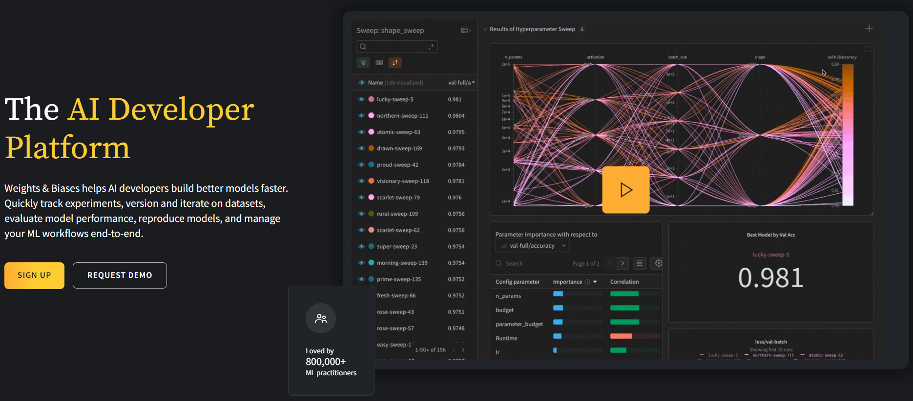  

---

## **Wandb都能做什么呢？**

### **可视化**
* Wandb可以可视化你想可视化的一切事物，比如基础的Loss曲线，Acc曲线，学习率变化曲线等，同时还可以进阶监视参数梯度的信息，掌控模型训练。(下图：左图为loss曲线，右图为模型参数的梯度直方图)

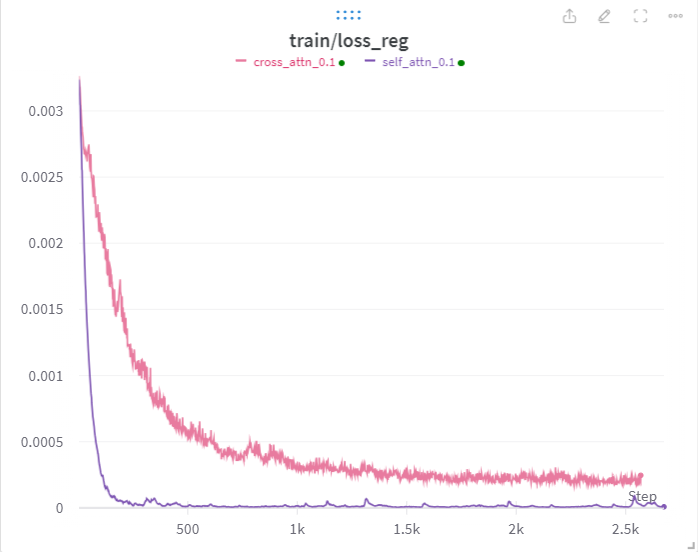| 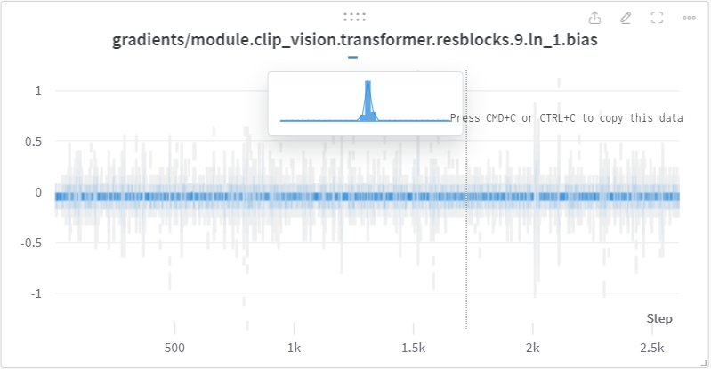  
---|---


### **多实验对比**
* 多实验对比的应用场景例如：**当你使用不同的参数训练一个模型，需要比较各自参数设置下的模型的性能**，这个时候，Wandb就非常有用了。如下图所示。
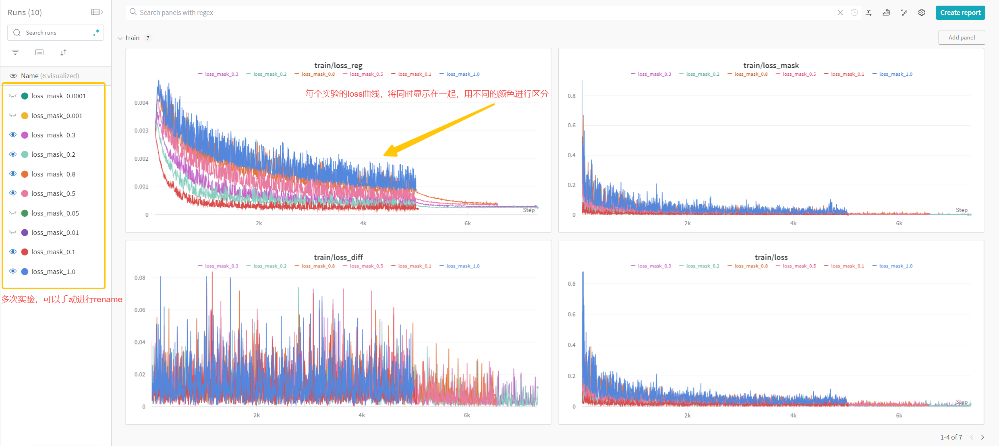  

* 除了对比训练曲线外，你还可以对比多次实验的参数配置。想象一种情况，你跑了很多参数的实验，每个实验的参数都是在本地存储，很容易混乱。但是，有了Wandb之后，一切都变得清晰可见。
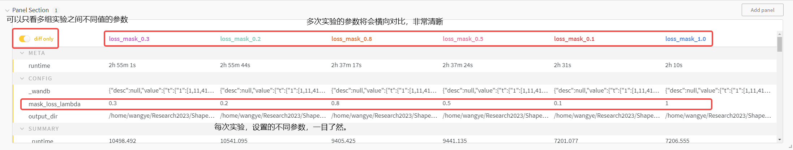  

### **云端存储**
* 这个功能是Wandb最实用的功能之一。想象一下，你跑了N组实验，每次实验的代码都是不同的，参数也是不同，很容易混乱掉，而无法复现出最好的实验结果。Wandb可以完全避免掉这样的问题，因为Wandb可以将你每次实验的参数、日志、代码、甚至硬件信息全部储存到云端，这样你无需刻意管理代码及参数的备份，只要你想复现出上次实验的结果，你就可以找到wandb上对应的实验，然后下载代码，100%复现你的实验。** (放心，每人云端的空间是100GB，够用)**

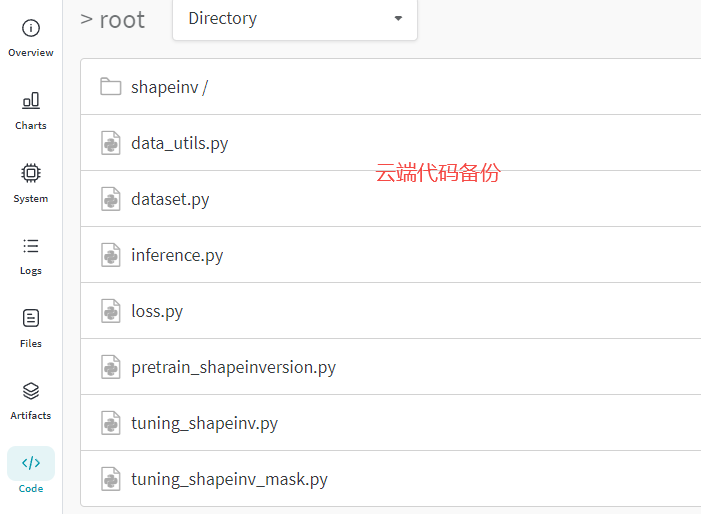|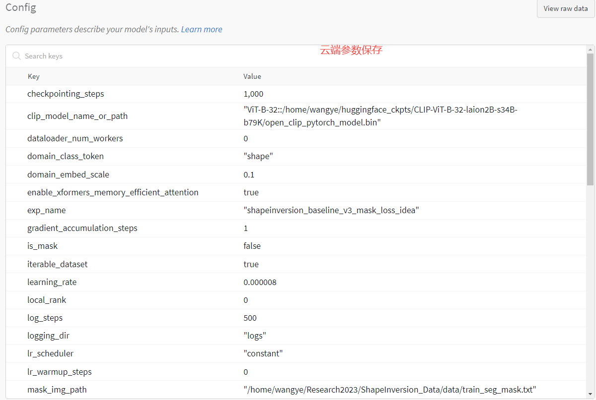|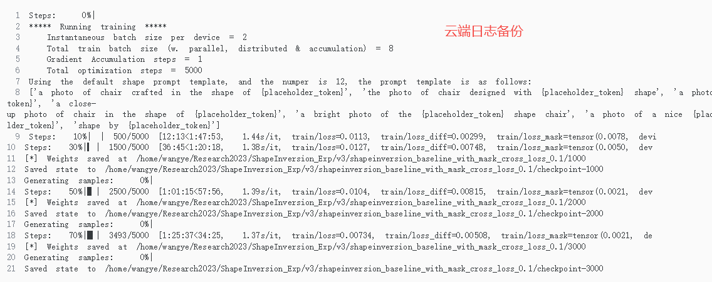 
---|---|---

### **实验报告**
* 这个功能的核心，就是能够让你在Wandb的网站上，为每个实验都创建一个report markdown文档，你可以在云端编写，非常酷炫。不过我个人还是习惯在本地写实验总结和分析。

---

## **如何使用Wandb呢？**

> 以下教程参考了wandb官网文档，可[点击访问](https://docs.wandb.ai/quickstart)

为了使用Wandb，你需要做以下几步：
1. 注册账户
2. 安装Wandb
3. 开始使用

### **注册账户**
请访问[链接](https://wandb.ai/site)，进行注册。
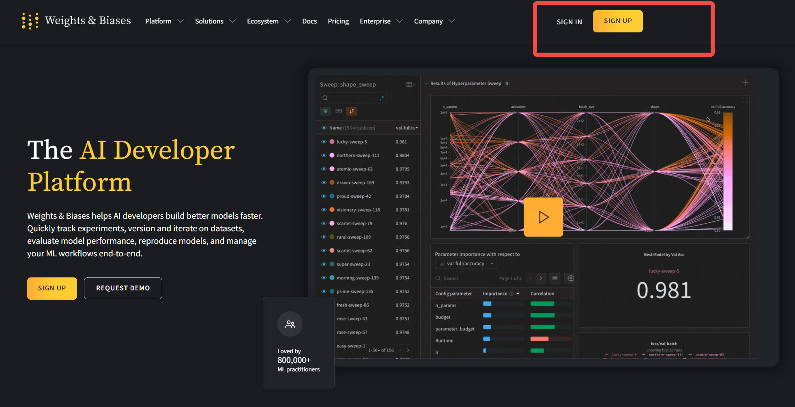  

 
### **安装Wandb**
傻瓜式安装：
```bash
conda activate your env
pip install wandb
```

### **开始使用**
```python
# train.py
import wandb
import random 

wandb.login()

epochs=10
lr=0.01

run = wandb.init(
    # 此处设置你的项目名
    project="my-awesome-project",
    # 此处配置需要Wandb帮你记录和track的参数
    config={
        "learning_rate": lr,
        "epochs": epochs,
    })

offset = random.random() / 5
print(f"lr: {lr}")

# 模拟训练的过程
for epoch in range(2, epochs):
    acc = 1 - 2 ** -epoch - random.random() / epoch - offset
    loss = 2 ** -epoch + random.random() / epoch + offset
    print(f"epoch={epoch}, accuracy={acc}, loss={loss}")
    wandb.log({"accuracy": acc, "loss": loss})
```
请在命令行运行此脚本：
```bash
python train.py
```
首先，Wandb会提示你login，你需要根据提示中得链接，copy到你的apikey，然后复制粘到此即可。
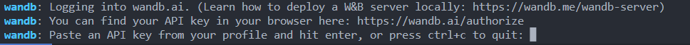  
成功后，如下图。
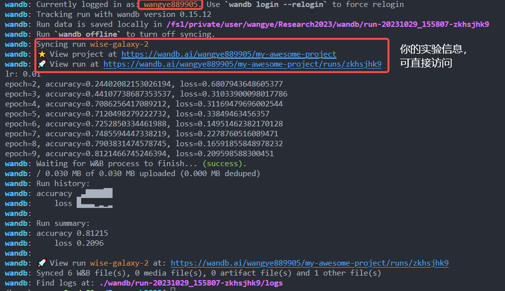  

OK，现在可以打开链接看一下我们的实验是怎么被记录的。
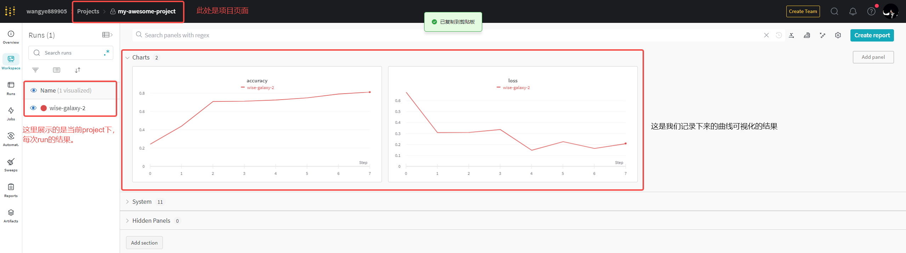  

接下来，我们跑多次实验，看一下可视化的结果如何，我们重复运行三次上述脚本。
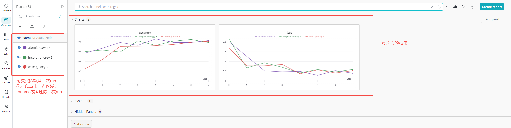  


<font color="red">**请注意，project和run是有区别的，project是一个总体的概念，比如你要验证学习率对模型的影响，这个时候你可以建立一个project，比如lr_project。为了验证lr的影响，你需要设置不同的lr，来跑实验，这里每个lr对应的实验，在Wandb中被称为是一次run。**</font>

注：访问[链接](https://wandb.ai/wangye889905/my-awesome-project?workspace=user-wangye889905)，可查看上述实验结果。

## **Pytorch+Wandb+argparse实现高效实验管理**
* Pytorch负责构建网络代码，训练等
* Wandb负责高效实验管理
* argparse负责灵活的实验参数配置

我们先通过伪代码的形式，感受一下具体的流程：
```python

# import the wandb,torch, argparse and others
import wandb
import torch
import argparse

# 登录
wandb.login()
# 初始化一个project，请指定project-name
wandb.init(project="new-sota-model")

# 添加实验参数
parser = argparse.ArgumentParser(description="Simple example of a training script.")
parser.add_argument("--mask_loss_lambda", type=float, default=1.0, help="Mask loss scale.")
parser.add_argument("--self_or_cross", type=float, default=1.0, help="1.0:cross-attention map, 0.0:self-attention map")
args = parser.parse_args()

# 将实验参数注册至wandb.config
wandb.config = vars(args)

# load你的模型和数据
model, dataloader = get_model(), get_data()

# 跟踪模型的梯度信息
wandb.watch(model)

# Training Loop
for batch in dataloader:
  metrics = model.training_step()
  # log metrics inside your training loop to visualize model performance
  wandb.log(metrics)

# 保存模型
torch.save(model)
```

接下来是完整的代码示例：

```python
from __future__ import print_function

import argparse
# workaround to fetch MNIST data
import os
import sys

import torch
import torch.nn as nn
import torch.nn.functional as F
import torch.optim as optim
import torchvision
import wandb
from torchvision import datasets, transforms


class Net(nn.Module):
    def __init__(self):
        super(Net, self).__init__()
        self.conv1 = nn.Conv2d(1, 10, kernel_size=5)
        self.conv2 = nn.Conv2d(10, 20, kernel_size=5)
        self.conv2_drop = nn.Dropout2d()
        self.fc1 = nn.Linear(320, 50)
        self.fc2 = nn.Linear(50, 10)

    def forward(self, x):
        x = F.relu(F.max_pool2d(self.conv1(x), 2))
        x = F.relu(F.max_pool2d(self.conv2_drop(self.conv2(x)), 2))
        x = x.view(-1, 320)
        x = F.relu(self.fc1(x))
        x = F.dropout(x, training=self.training)
        x = self.fc2(x)
        return F.log_softmax(x, dim=1)

def main():

    wandb.login()
    # 配置你的project name
    wandb.init(project="my_project")
    # 备份你的代码
    wandb.run.log_code('./',include_fn=lambda path: path.endswith(".py") or path.endswith(".ipynb"))
    
    
    # Training settings
    parser = argparse.ArgumentParser(description='PyTorch MNIST Example')
    parser.add_argument('--batch-size', type=int, default=64, metavar='N',
                        help='input batch size for training (default: 64)')
    parser.add_argument('--test-batch-size', type=int, default=1000, metavar='N',
                        help='input batch size for testing (default: 1000)')
    parser.add_argument('--epochs', type=int, default=10, metavar='N',
                        help='number of epochs to train (default: 10)')
    parser.add_argument('--lr', type=float, default=0.01, metavar='LR',
                        help='learning rate (default: 0.01)')
    parser.add_argument('--momentum', type=float, default=0.5, metavar='M',
                        help='SGD momentum (default: 0.5)')
    parser.add_argument('--no-cuda', action='store_true', default=False,
                        help='disables CUDA training')
    parser.add_argument('--seed', type=int, default=1, metavar='S',
                        help='random seed (default: 1)')
    parser.add_argument('--log-interval', type=int, default=10, metavar='N',
                        help='how many batches to wait before logging training status')
    args = parser.parse_args()
    use_cuda = not args.no_cuda and torch.cuda.is_available()

    # 将训练参数保存至wandb
    wandb.config.update(args)

    torch.manual_seed(args.seed)

    device = torch.device("cuda" if use_cuda else "cpu")

    kwargs = {'num_workers': 1, 'pin_memory': True} if use_cuda else {}
    train_loader = torch.utils.data.DataLoader(
        datasets.MNIST('./data', train=True, download=True,
                       transform=transforms.Compose([
                           transforms.ToTensor(),
                           transforms.Normalize((0.1307,), (0.3081,))
                       ])),
        batch_size=args.batch_size, shuffle=True, **kwargs)
    test_loader = torch.utils.data.DataLoader(
        datasets.MNIST('./data', train=False, transform=transforms.Compose([
            transforms.ToTensor(),
            transforms.Normalize((0.1307,), (0.3081,))
        ])),
        batch_size=args.test_batch_size, shuffle=True, **kwargs)

    model = Net().to(device)
    optimizer = optim.SGD(model.parameters(), lr=args.lr,
                          momentum=args.momentum)
    
    # 检测模型参数的梯度信息
    wandb.watch(model)
    
    global_step = 0
    for epoch in range(1, args.epochs + 1):
        # training
        model.train()
        for batch_idx, (data, target) in enumerate(train_loader):
            data, target = data.to(device), target.to(device)
            optimizer.zero_grad()
            output = model(data)
            loss = F.nll_loss(output, target)
            loss.backward()
            optimizer.step()
            global_step +=1
            if batch_idx % args.log_interval == 0:
                print('Train Epoch: {} [{}/{} ({:.0%})]\tLoss: {:.6f}'.format(epoch, batch_idx * len(data), len(train_loader.dataset),batch_idx / len(train_loader), loss.item()))
                training_log = {
                    "train/loss": loss.detach().item(),
                }
            # wandb 可视化训练损失（此处仅展示保存训练曲线）
            wandb.log(training_log, step=global_step)    
        
        
        model.eval()
        test_loss = 0
        correct = 0

        example_images = []
        with torch.no_grad():
            for data, target in test_loader:
                data, target = data.to(device), target.to(device)
                output = model(data)
                # sum up batch loss
                test_loss += F.nll_loss(output, target, reduction='sum').item()
                # get the index of the max log-probability
                pred = output.max(1, keepdim=True)[1]
                correct += pred.eq(target.view_as(pred)).sum().item()
                example_images.append(wandb.Image(
                    data[0], caption="Pred: {} Truth: {}".format(pred[0].item(), target[0])))

        test_loss /= len(test_loader.dataset)
        print('\nTest set: Average loss: {:.4f}, Accuracy: {}/{} ({:.0%})\n'.format(
            test_loss, correct, len(test_loader.dataset),
            correct / len(test_loader.dataset)))
        
        test_log = {
            "Test/Examples": example_images, # 保存测试图像
            "Test/Accuracy": 100. * correct / len(test_loader.dataset), 
            "Test/Loss": test_loss}
        # 保存test可视化内容
        wandb.log(test_log, step=global_step)


if __name__ == '__main__':
    main()

```