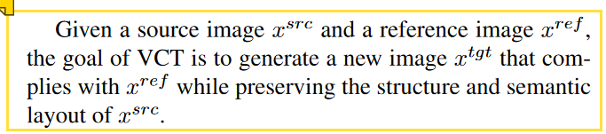
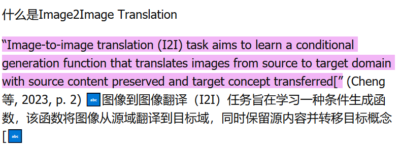

### **重要紧急**
- [x]  每日Arxiv
- [x]  每日论文阅读
  - [x]  HYPERFIELDS: TOWARDS ZERO-SHOT GENERATION OF NERFS FROM TEXT
  - [x]  Instant3D: Fast Text-to-3D with Sparse-view Generation and Large Reconstruction Model
  - [x]  ATT3D: Amortized Text-to-3D Object Synthesis
    - [x]  上述3篇论文泛读完毕
  - [x] INTEGRATING VIEW CONDITIONS FOR IMAGE SYNTHESIS 阅读完毕，笔记已整理
  - [x] Reference-based Image Composition with Sketch via Structure-aware Diffusion Model, 阅读完毕，笔记已整理
- [ ] 总结现阶段的问题
- [ ] 整理Textual Inversion论文，文献树，笔记库
- [ ]  思考新实验的验证思路和下一步的计划
- [ ]  整理下周需要汇报的内容

### **不重要紧急**

- [ ] 无

### **重要不紧急**

- [ ] FlowUs长期事项

### **不重要不紧急**
- [x]  Daily Notes模板更新一下
- [ ]  markdown base64图像存储
- [ ]  FlowUs剪藏内容尝试一下

## **工作笔记**

* **2023年10月28日10:53:07**：关注到了Text-NeRF-Mapping的三篇论文，这三篇论文都是目前最新的文章，一篇ICCV23，两篇ICLR24在投。分别是：
  *  HYPERFIELDS: TOWARDS ZERO-SHOT GENERATION OF NERFS FROM TEXT
  *  Instant3D: Fast Text-to-3D with Sparse-view Generation and Large Reconstruction Model
  *  ATT3D: Amortized Text-to-3D Object Synthesis
  *  上述文章结合我和yibo最近思考的In-Context Learning想法，感觉有很多可做的事情。今天可以稍微总结一下。
* **2023年10月28日13:25:53**: INTEGRATING VIEW CONDITIONS FOR IMAGE SYNTHESIS，又是一篇多模型组合的文章。可以认为是在Paint-by-Example的基础上，在一致性、和谐、视角可控的进一步提升。我看实验中，还比较了一个工作：Paint-by-Sketch, 这个文章可以实现sketch和reference image联合指导的图像编辑。所以说多条件联合指导，应该也是一个很好地科研点。
* **2023年10月28日14:00:05：** 思考现阶段的问题：
  * **我们要做什么？**
    * 我们想做**Training-efficient** **Reference指导**下的**图像style**和**shape**的**editing**。在这里我们先不考虑文本的事情，上述这个topic目前也是没有人做的。具体的例子就是，对于我家的沙发，我喜欢市场中另外一款沙发的shape，能否将这个shape应用到我的sofa上。或者我看到一张海报的style很好看，能否将其应用到我的沙发上呢。
    * 在这个基础上，我们是否还可以引入Text的联合指导。或者引入instruction，更加的灵活。
  * **我们怎么做？**
    * 为了实现Training efficient，我们没有采取和Paint-By-Example或者PAIR-Diffusion这样的方法类似的架构（retraining Stable Diffusion），我们的想法是所有的问题都在文本modal去解决，于是我们提出利用Textual Inversion去得到target object的shape（这一点之前就没人做过），一旦我们拿到target object的shape token，我们就可以利用该token去修改或者edit source object。
      * 主要分如下几步：
        * 高效的shape inversion
        * 高效的style inversion
        * 基于inversion的物体shape editing
        * 基于inversion的物体style editing
  * **我们现在做了什么**
    * 首先，我们目前初步实现了Shape Inversion。
    * 其次，我们实现了text-guided的物体style编辑架构
  * **为实现目标，我们还需要做什么？**
    * 验证shape inversion的有效性、高效性
    * 思考如何同时inversion shape和appearance
    * 基于得到的inversion shape和appearance实现合成图像的editing
    * 基于得到的inversion shape和appearance实现真实图像的editing
  * 基于上述分析，我觉得目前还是要比现阶段的inversion方式进行总结和消耗，找到问题所在。
* **2023年10月28日14:35:05 Shapeinversion架构分析**:
  * [[Research.Experiments.ShapeInversion.mask_loss_idea_analysis]]

* **2023年10月28日16:56:41 我们的想法和Image2Image translation的区别**
  * 根据General Image-to-Image Translation with One-Shot Image Guidance这篇论文中叙述的那样，Translation并不改变source image的structure和semantic layout。但是要把target图上的concept反映到source图上。
  * 而我们的想法是提取target图上的感兴趣物体的shape，来修改source图的shape。
  *   
  *   

## **问题记录**

## **今日总结**

