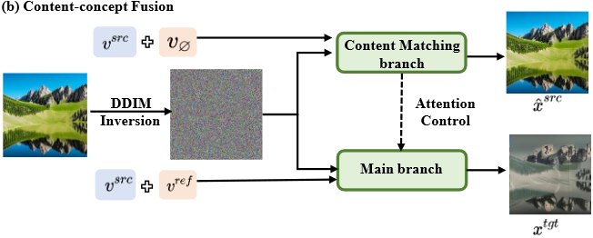

<!--
Based on the journaling method created by Intelligent Change:
- [Intelligent Change: Our Story](https://www.intelligentchange.com/pages/our-story)
- [The Five Minute Journal](https://www.intelligentchange.com/products/the-five-minute-journal)
-->

## **待做事项**

### **重要紧急**
- [x]  每日Arxiv
- [x]  每日论文阅读
  - [x] General Image-to-Image Translation with One-Shot Image Guidance 
- [x]  完成4个番茄钟学习
- [x]  测试更多的例子，观察editing的能力
- [x]  写代码+跑一组self-attention--Mask的实验 
- [x]  Wandb使用方法总结
- [x]  self-attention和mask-attention的实验总结与分析
- [ ]  Image-translation论文整理
- [ ]  Image Editing论文整理
- [ ]  Text Inversion论文整理
- [ ]  bitsandbytes 调研 这是个啥玩意
  - [ ]  https://mp.weixin.qq.com/s/QKSa3anGP4JYPDfn9_coDg
- [ ]  写周报

### **不重要紧急**

- [ ] 无

### **重要不紧急**

- [ ] 总结Inversion文献和Example-based Image Editing文献

### **不重要不紧急**

- [ ] 无

## **工作笔记**
* 我们目前用的是xattn-map或者sattn-map直接和mask做MSE Loss。这个做法可能有些不太合适，或者说太hard。想办法改进一下。

* 之前跑的Mask Loss的实验，关于Mask真值的选取，代码写错了。今天在写self-attention loss的时候，才发现，目前所有实验重新跑了。淦！
* **2023年10月29日14:46:37 新baseline设计:** 我发现我读了General Image-to-Image Translation with One-Shot Image Guidance 这篇论文之后，有了一些关于结构设计的思路。这篇论文的结构如下：
  
  * **我们可以效仿上图，也构造双分支架构，分别是source image generation branch，下面的分支是sub-concept inversion branch，反转出来的sub-concept可以作为条件注入source分支，所以需要adapter网络或者是dual-attn架构，然后根据不同降噪阶段（早中晚），分别注入不同的cross-attention或者self-attention，比如早期注入shape相关信息，晚期注入style相关的信息。**

* **2023年10月29日21:29:42 Domain tuning的秘密：**
  * 其实今天我在测模型的时候，突然想到E4T架构下，在pre-training之后，还需要对单图像进行domain-tuning。我在训练ShapeInversion的时候，同时引入了Mask loss Idea，而且Mask Loss Idea是在Pre-training和domain-tuning都存在的，而Mask Loss idea的作用是进一步强化*s表达shape。因此，在pre-training阶段添加Mask Loss，是合理的。**但是在单图像的domain-tuning的时候，可能就会严重过拟合到mask上，导致编辑能力变差。** 目前只能给出这样的解释，具体请看实验：

## **问题记录**

## **今日总结**
