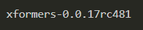
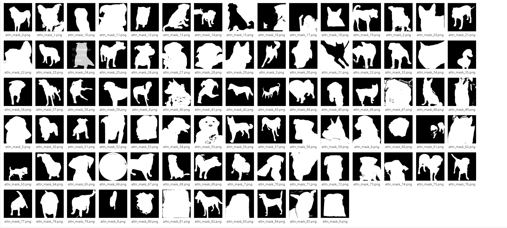
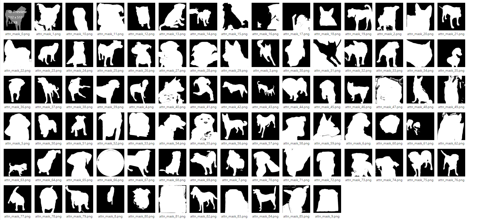
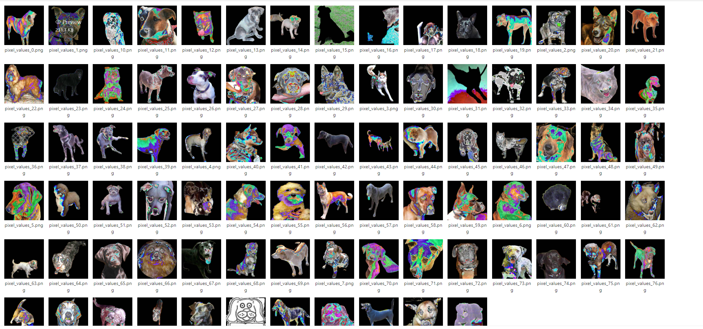

<!--
Based on the journaling method created by Intelligent Change:
- [Intelligent Change: Our Story](https://www.intelligentchange.com/pages/our-story)
- [The Five Minute Journal](https://www.intelligentchange.com/products/the-five-minute-journal)
-->

## **待做事项**

### **重要紧急**
- [x]  每日Arxiv
- [x]  每日论文阅读
- [ ]  实验安排
  - [ ]    
  - [ ] Xformer 真的会影响性能？
    - [ ] 自身的原因
    - [ ] 还是batch太大的原因呢
      - [ ] baseline代码一样，换成batch=2也不行

### **不重要紧急**

### **重要不紧急**

### **不重要不紧急**

## **工作笔记**

* XFormers 性能的影响？
  * 是否是batch size造成的
    * 不是batch_size造成的影响，同样的代码，同样的batchsize=2设置，其余参数都一样，使用了XFormers就是无法得到好的结果。
  * Student-model保持一样的参数能跑出来吗？
    * 同样跑不出来，得到的结果都很糊。
  * 两次实验验证之后，还是不要用XFormers了，总是会引入一些不可预料的问题。

  

  

  

## **问题记录**

1.
2.
3.

## **今日总结**

1.
2.
3.
